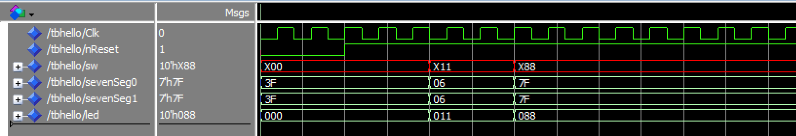
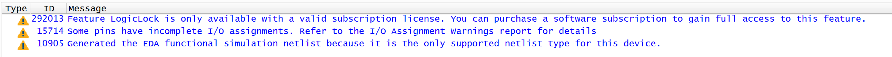
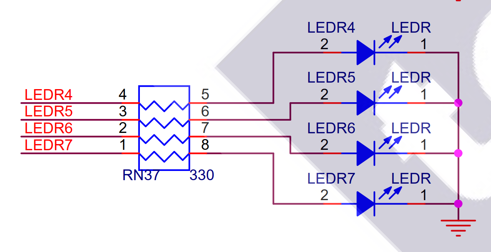
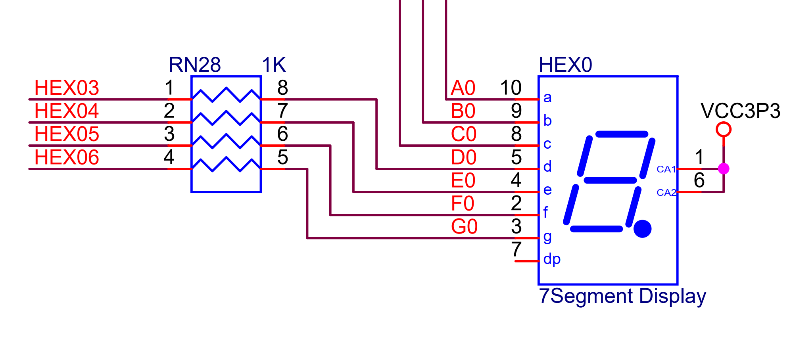
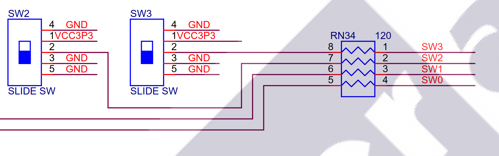
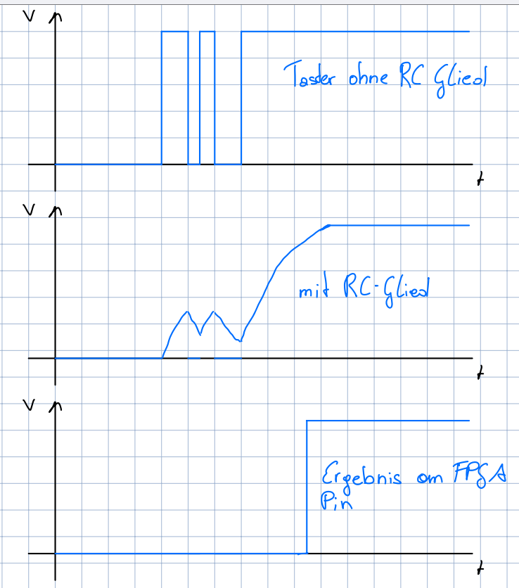

# Übung 1 – Aufgabe 2  

### a) Verschieben der Hex-Anzeige  
- Die **Pins** für das linke Paar der Anzeigen müssen in die **QSF-Datei** hinzugefügt werden.  
- Die Definitionen für die rechte Anzeige können entfernt werden.  
- Im **PCB Adapter** muss in der *Entity* statt `HEX0` bzw. `HEX1`  `HEX4` bzw. `HEX5` eingefügt werden.  
---

### b) Änderung von **LED9 auf LED8**  
- In der **Architektur der Hello-Unit** muss das Blinken vom **9. Element des Vektors** auf das **8. Element** geändert werden.  

---

### c) Ergänzung von **SW9**  
- Beim **Conditional Concurrent Signal Assignment** wird in der Condition der **Taster SW9** ergänzt.  
- Bedingung: `SW9 = '0'`, nur dann darf die LED aufleuchten.  

---

### d) Umschalten zwischen LED8 und LED9 mit **SW8**  
- Mit **SW8** kann das Blinken zwischen **LED8** und **LED9** umgeschaltet werden.  
- Realisiert analog zu Punkt **c**:  
  - Condition des Signal Assignments mit Abfrage auf `SW8 = 1` bei einer LED und bei der andern auf `SW8 = 0`.  
  - Dadurch ist immer nur **eine von beiden LEDs aktiv**.  

---
### e) Simulation
-In der nachstehenden Graphik ist die Waveform abgebildet. 

  
---
---
### f) Synthese
- Schaltplan PCB Adapter
  .png)
- Schaltplan Entity Hello DE1
  .png)
- Schaltplan Entity Hex 2 Seven Seg
  .png)
- Warnings:
  
---
# Übung 1 – Aufgabe 3  
---

### a) LEDs  
- **Einzelne LED**:  

  - Im Schaltplan ist die LED abgebildet. Die Kathode ist dauerhaft an **GND** angeschlossen.
  - Durch `1`-Pegel (3.3V) am Pin wird die LED eingeschaltet. (positive Logik)

- **7-Segment LED**:  
 
  - Verschaltung nicht direkt erkennbar, aber aus Pinbezeichnungen ableitbar.  
  - `CA1` und `CA2` = *Common Anode 1/2*.  
  - Für eine genaue Info muss das **Datenblatt der 7-Segment-Anzeige** untersucht werden.  
  - Bestätigung im **User Manual des DE1-SoC-Boards**.  

---

### b) Strom und Leistung  

**LEDs:**  

- Spannung am Widerstand:  
  $$
  U_R = 3.3V - 1.6V = 1.7V
  $$

- Strom:  
  $$
  I = \frac{1.7V}{330\Omega} = 5.15\,mA
  $$

- Leistung:  
  $$
  P_R = 1.7V \cdot 5.15mA = 8.75\,mW
  $$
  $$
  P_{LED} = 1.6V \cdot 5.15mA = 8.24\,mW
  $$

---

**7-Segment Anzeige:**  
- Spannung am Widerstand:  
  $$
  U_R = 3.3V - 1.6V = 1.7V
  $$

- Strom:  
  $$
  I = \frac{1.7V}{1000\Omega} = 1.7\,mA
  $$

- Leistung:  
  $$
  P_R = 1.7V \cdot 1.7mA = 2.89\,mW
  $$
  $$
  P_{SEG} = 1.6V \cdot 1.7mA = 2.72\,mW
  $$

---

### c) Konfliktfälle bei Schaltern 

Durch Verwenden des Pins am Schalter als Output können hier Konflikte in den Pegel des Pins und dem des Schalters erzeugt werden. 
Hier entsteht ein Fehlerfall z.B. dass der Taster auf 3V3 geschaltet ist und der Pin des FPGA auf GND. Somit liegt am Widerstand 3.3V an.
Strom durch den Widerstand: 3.3V / 120E (entnommen aus dem Schaltplan) = 27.5mA.
D.h. Im Fehlerfall können 27.5mA sinked oder sourced werden, abhängig vom Fehlerfall.

---

### d) Belastungsgrenzen des FPGA  

Aus dem Absolute Maximum Ratings des FPGA Chips vom Datenblatt kann entnommen werden, 
dass ein Pin Maximal 25mA sinken und 40mA sourcen kann. 
Aus dieser Information lässt sich schließen dass im Fehlerfall, indem der Pin auf GND geschaltet wird und der Schalter auf 3V3 hängt, der FPGA Chip zerstört wird. 
Wird jedoch der Pin auf 3V3 geschaltet und der Schalter steht auf GND wird der FPGA nicht zerstört da der Strom unter der Maximalgrenze liegt. 
Im Normalfall, also wenn der Pin auf Input konfiguriert ist, fließt nur ein sehr geringer Strom.
Da ein input Pin einen hochohmigen Zustand annimmt, und nur die Input Kapazität aufgeladen werden muss.

---

### e) Entprellung der Tasten  
Das Entprellen der Tasten basiert auf einem RC Tiefpassfilters. Dieser Schluckt die kurzen Pulse die durch das Prellen entstehen.
Der 74HC245 Bidirektionale Bus Tranceiver wird hier durch Beschaltung des DIR und OE Pins auf 
einen unidirektionalen Transmitter reduziert. Also Input Ax und Output Bx.
Um nun eine steile Flanke am FPGA Pin zu generieren wird diese langsame Flanke an den 74HC245 input angelegt. 
Der 74HC245 erzeugt nun eine steile Flanke für den FPGA.
Dies ist wichtig damit sich der Spannungswert am Pin nur für eine kurze Zeit im undefinierten Bereich befindent, also zwischen High und Low.
Wichtig hierbei ist, dass die Zeitkonstante des RC-Glieds länger als die Prell-Zeit des Tasters ist.
Ansonsten werden die Prell Impulse von Taster nicht geschluckt und der 74HC245 gibt diese am Ausgang wieder.
