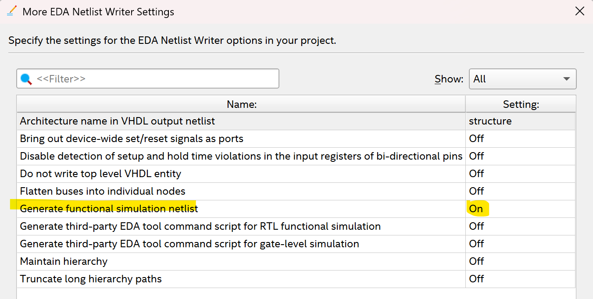
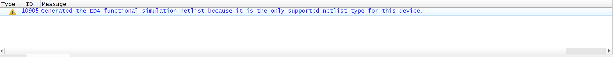
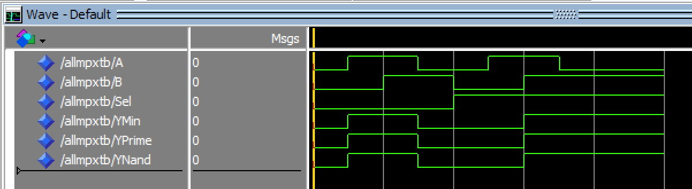
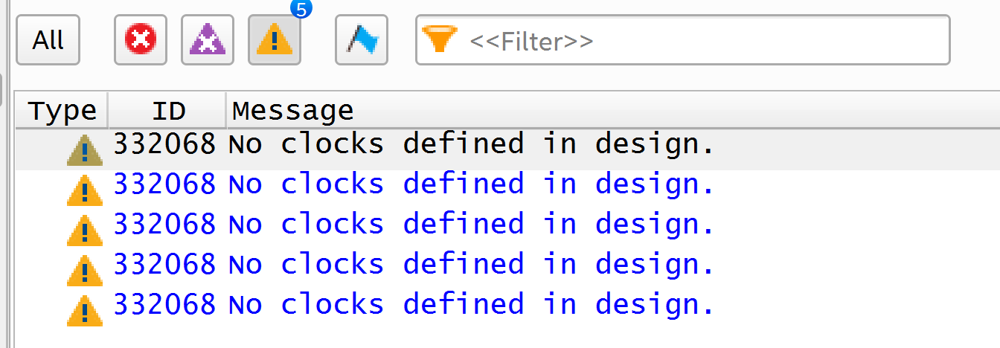
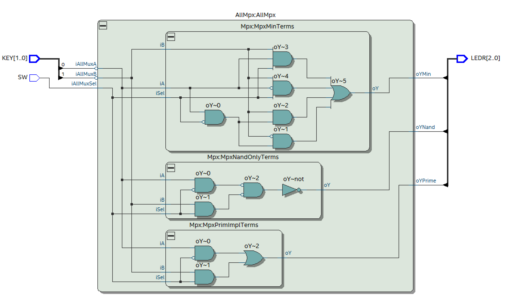
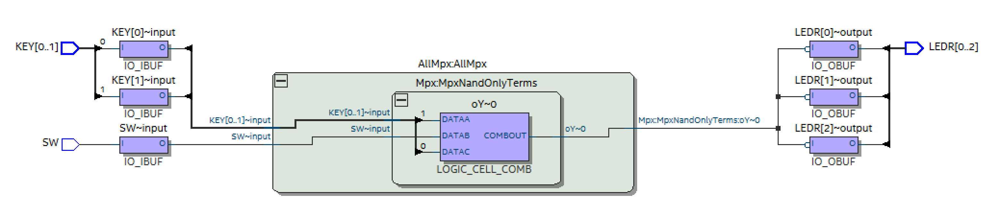
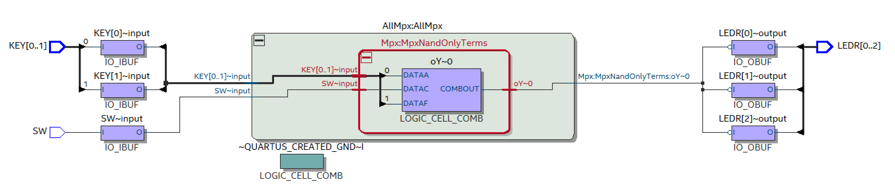
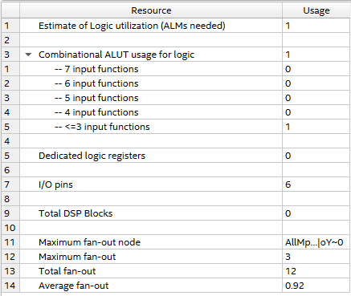
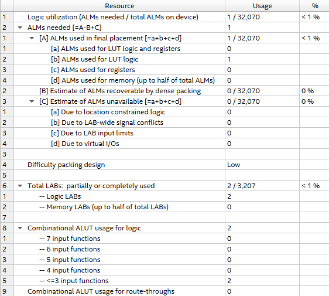

# Übung 2 Simon Offenberger S2410306027  
## Aufgabe 1 Pimp your .qsf

### Rekonstruktion QSF
Durch die Rekonstruktion des QSF Datei durch Quartus hat sich diese in ihrem Aufbau verändert.
Die ist in den folgenden Abbildungen gezeigt. (links = vor der Rekonstruktion durch Quartus)

  
  

  
  

Hier wird festgestellt, dass sich der Text im Header der Datei ändert.
Da die QSF Datei ursprünglich mit Quartus II generiert wurde, wird dieser Text entsprechend angepasst.
Auch die Pin-Assignments werden angepasst und in Gruppen aufgeteilt.
Hier entstehen folgende Abschnitte in der QSF Datei:
- Pin & Location Assignments
- Classic Timing Assignments
- Analysis & Synthesis Assignments
- Fitter Assignments
- EDA Netlist Writer Assignments
- Power Estimation Assignments
- EDA_TOOL_SETTINGS(eda_simulation)

Nach diesen Abschnitten folgt noch ein Bereich der Top-Level-Entity (PCB Adapter).

In der QSF sind nun auch Informationen zur Maximalen und Minimalen Temperatur des FPGAs zu finden.
Auch die Information zur Top-Level Architektur und den verwendeten FPGA sind vorhanden.

### Warning in der QSF
In der QSF Datei ist folgende Warning von Altera/Intel vorhande:
> 2) Intel recommends that you do not modify this file. This
     file is updated automatically by the Quartus Prime software
     and any changes you make may be lost or overwritten.

### Assignment Editor nach Rekonstruktion
Im Assignment Editor wurde nun die Rekonstruierte QSF Datei sichtbar.
Hier ist für jeden Pin die Location, also der Pin des FPGA Chips und 
der Name des PCB-Adapters ersichtlich.
Hier ist aufgefallen, dass dies für jedes Element eines Vektors einzeln passieren muss.
Der Grund dafür liegt daran, dass jedes einzelne Element des Vektors an unterschiedlichen Ports ausgegeben werden muss!

### Wildcards
Diese können verwendet werden um in den Assignments eine Einstellung auf mehreren Ports zu übernehmen.
Hierbei werden die Zeichen * und ? verwendet.

Neben den Wildcards gibt es noch die Möglichkeit Einstellungen auf einen gesamten Vektor vorzunehmen.
Hier sieht der Syntax in der QSF Datei folgendermaßen aus:
>set_instance_assignment -name CURRENT_STRENGTH_NEW 16MA -to HEX4

Dieses Assignment wird auf alle Elemente des Vektors HEX4 angewandt.

### Warnings
Die in der Übungsangabe gegebenen Anleitung und die Warning "EDA Netlist Writer Settings.." zu beheben funktioniert im Quartus Prime Light 24 nicht, da die beschriebene Einstellung nicht exakt exisitert.

Die Warning ist noch immer vorhanden:

## Aufgabe 3 Multiplexer
Zur Implementierung der Multiplexer wird als erstes die Wertetabelle eines Multiplexers erstellt.
Hierfür werden die Eingänge iA, iB, und iSel verwendet.
Als Ausgang wird oY benützt.

| iA | iB | iSel | oY |
|:--|:--:|--:|--:|
|0|0|0|0|
|1|0|0|1|
|0|1|0|0|
|1|1|0|1|
|0|0|1|0|
|1|0|1|0|
|0|1|1|1|
|1|1|1|1|

### KV Diagramm

| iA\iB        |  00 |  01 |  11 |  10 |
| :----------- | :-: | :-: | :-: | :-: |
| **iSel = 0** |  0  |  0  |  1  |  1  |
| **iSel = 1** |  0  |  1  |  1  |  0  |

Aus diesem KV Diagramm lassen sich nun die Terme für die Implementierung des Multiplexer mit allen Mintermen ablesen.
Gleichung für Multiplexer Minterm:
$$
oY =
(\overline{iSel} \cdot \overline{iB} \cdot iA)
+ (\overline{iSel} \cdot iB \cdot iA)
+ (iSel \cdot iB \cdot \overline{iA})
+ (iSel \cdot iB \cdot iA)
$$

Durch die Minimierung ergibt sich für den Muliplexer Prime Implicant folgende Gleichung:
$$
oY = (\overline{iSel} \cdot iA) + (iSel \cdot iB)
$$

Durch das Anwenden des DeMorgen wird nun der letzte Multiplexer  mit nur NAND Gatter implementiert, dieser hat folgende Gleichung:
$$
oY = \overline{ \big( (\overline{\overline{iSel} \cdot iA}) \cdot (\overline{iSel \cdot iB}) \big) }
$$

### Simulation
Für die Simulation wurde ein Simul-Process verwendet um die instanziierte Entity mit Testdaten zu versorgen.
Ein Postponed Verify Process übernimmt hier die Aufgabe der Prüfung der Ausgänge der Multiplexer.

In der folgenden Abbildung ist die Waveform zu sehen:

### Warnings der Synthese

In der obigen Grafik sind die Warnings der Synthese abgebildet. Hier tritt eine Warning mehrmals auf: Diese weist darauf hin, dass im gesamtem Projekt kein clock definiert ist. Dies ist so gewollt da es sich um ein rein kombinatorisches Design handelt.

### Synthese RTL Viewer
In der folgenden Grafik ist das Ergebnis der Synthese im RTL-Viewer abgebildet.

Hier ist klar ersichtlich, dass es sich um 3 unterschiedliche 
Architektures in den Entities handelt.
Es ist auch ersichtlich, dass die Architektures in ihrem Grundsätzlichem Aufbau, abgesehen von Optimierungen, nicht verändert wurden. In dieser Darstellung ist die Variante mit dem Prim-Implikanten mit den wenigsten Gatter realisiert worden.

### Synthese Technologie Map 
- Technologie Map Post Mapping

- Technologie Map Post Fitting

Unter genauer Betrachtung der Technologie Map der beiden Schritte Post Mapping und Post Fitting ist kein wesentlicher Unterschied zu erkennen.
Der einzige Unterschied besteht darin, dass Quartus die Eingänge der Logic_Cell verändert hat. Dies lässt darauf schließen, dass der Fitter das Verbinden zwischen den Logic_Cells realisiert bzw. optimiert. Außerdem ist aus der Betrachtung der Technologie Map ersichtlich, dass nur 1 Multiplexer realisiert wurde. Aus dieser Beobachtung lässt sich schließen, dass Quartus in der Synthese die Funktionalität des VHDL Codes ermittelt und diese dann möglichst effizient in die FPGA Hardware umsetzt. 
Dadurch kann die Funktionalität auch mit nur einer ALM (Adaptive Logic Module) abgebildet werden. Dies wird auch unter der Betrachtung der Ressource Summery sichtbar.

-Ressource Usage Analysis & Synthesis

-Ressource Usage Fitter

Aus dieser Ressource Summery wird die Vermutung bestätigt.
Für die Realisierung der 3 Multiplexer wird nur 1 ALM verwendet.
Weiters ist auch ersichtlich, dass die Ressource Usage Summery des Fitters eine genauere Auskunft darüber gibt wie viele Ressourcen des FPGAs noch zur Verfügung stehen und welche benötigt wurden. 
Im unteren Bereich der Ressource Usage Summery des Fitters ist noch zu sehen, dass der Multiplexer mittels 2 ALUTs (Adaptive Look-Up Table)  innerhalb einer ALM realisiert wurde.

###
