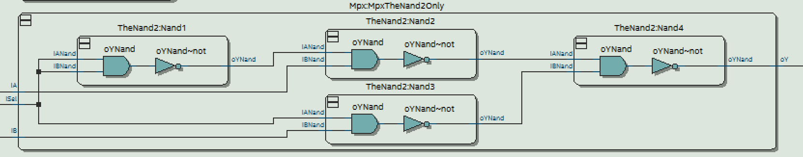
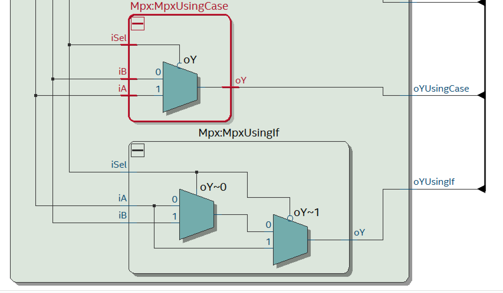
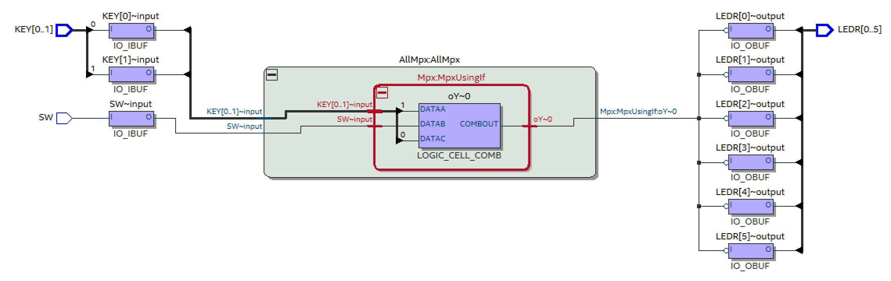
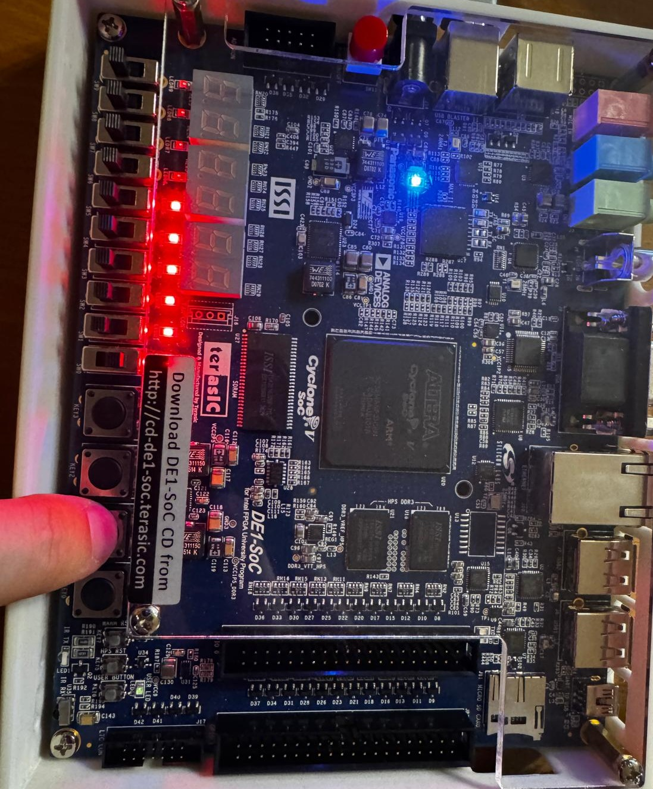
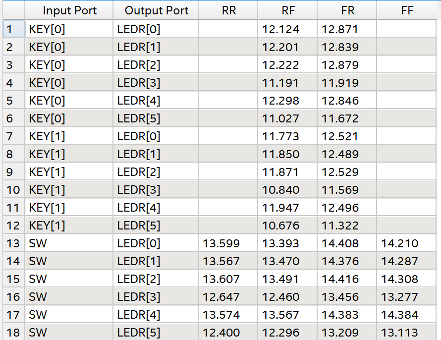
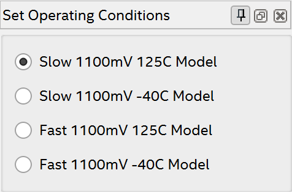
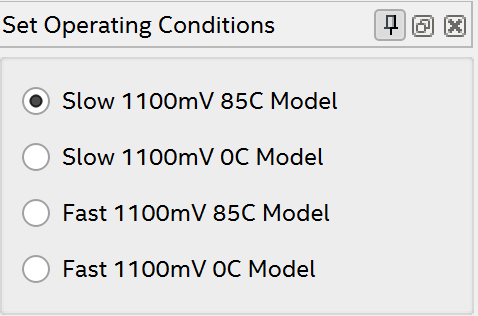

# Übung 3 Simon Offenberger S2410306027  
## Aufgabe 1 MUX mit Entity TheNand2
Als erstes wurde die Entity The Nand 2 inklusive einfacher Nand Verknüpfung in der Architektur implementiert. Mittels dieser Entity wurde danach der Multiplexer aufgebaut und wie in Übung 2 zur Architektur AllMyMuxes hinzugefügt.
### RTL Viewer

### Technology Map Viewer (Post Mapping)

Hier fällt wie in der vorigen Übung auf, dass die Realisierung wie in der Beschreibung im RTL-Viewer ersichtlich ist. Hier sind alle Instanzen der Entity TheNand2 ersichtlich. Jedoch werden die verschiedenen Implementierungen durch die Synthese wegoptimiert, da alle die gleiche Funktionalität abbilden.

## Aufgabe 2 MUX: Schneller beschreiben
Nun folgen zwei weitere Implementierungen des Multiplexer, mittels if then else und case statements.
### Implementierung mittels Case
Da zunächst nur die Werte '1' und '0' für iSel berücksichtigt werden sollen, entsteht bei der Compilation der Architektur UsingCase folgender Error.
>Error (suppressible): C:/.../Mpx-UsingCase-RTL-a.vhd(16): (vcom-1339) Case statement choices cover only 2 out of 9 cases.

Dies weist darauf hin, dass nicht alle Möglichkeiten abgedeckt wurden. Deswegen lässt sich die Testbench nicht simulieren!
Deswegen wurde die Architektur um die fehlenden Werte von STD_ulogic erweitert. Hier wurde die schwache '1' also 'H' gleich wie die '1' implementiert. Gleiches wurde mit dem Pegel 'L' für die schwache '0' vollzogen. 
Ein Pegel von 'U' bewirkt, dass der Ausgang auch diesen Wert annimmt. Bei allen anderen Werten nimmt der Ausgang den Wert 'X' an. Dies soll eine Fehlfunktion des Multiplexers signalisieren. Selbe Definition wurde für die Implementierung mittels if-then-elsif-else gewählt.

Werden diese Pegel nicht berücksichtigt wird immer der Wert der im when others-> steht bzw. im else Zweig der if steht ausgegeben.

### Simulationsergebnisse Waveform
.png)
.png)
Hier ist das Verhalten bei iSel = 'U' bzw. iSel = 'X' zu sehen.

### RTL Viewer

Hier ist ein klarer Unterschied zwischen den zwei Implementierungen Case Statements und IF zu erkennen.
Das Case Statement erzeugt einen Multiplexer im RTL Viewer mit 2 Inputs 1 Select Leitung und 1 Ausgang.
Im gegensatz dazu erzeugt die Beschreibung mittels if zwei Multiplexer. Dies ist notwendig, da beim if-elsif-else die Reihenfolge der Abfrage für das Ergebnis entscheidend ist, dies wird mittels der 2 Multiplexer dargestellt.

### Technologie Map Viewer

In der Technologie Map ist wieder nur eine Implementierung des Multiplexers zu erkennen. Also wurden alle anderen 5 Multiplexer wegoptimiert.

### Synthese Warnings

In der Synthese sind zusätzlich zu den Warnings weil kein clock definiert wurde noch weitere Warnings zu den Schwachen Pegel 'H', 'L' bzw. 'U' vorhanden. Hier wird die Warning ausgegeben, dass diese Pegel in der Synthese ignoriert werden. Dies ist auch logisch, da nur Pegel '1', '0' und 'Z' synthetisierbar sind und somit alle anderen für die Synthese irrelevant sind.

## Timinganalyse

In dieser Grafik sind die Propagation Delays zwischen den Input und Output Ports abgebildet. Hier sind jeweils 4 Spalten aufgezeichnet.
  
- RR: Input Rising -> Output Rising
- RF: Input Rising -> Output Falling
- FR: Input Falling -> Output Rising
- FF: Input Falling -> Output Falling

In den 4 Spalten sind alle Kombinationen in denen Propagationdelays auftreten aufgezeichnet.

Es fällt aber auch auf, dass nicht alle ausgefüllt sind.
Dies hängt wahrscheinlich damit zusammen, dass manche Übergänge im Design nicht vorkommen. Das heist im konkreten Design, dass kein Übergang von Rising Edge am Key[0] zu einer Rising Edge an der LEDR[0] führt.

Der Name für den Datasheet Report stammt wahrscheinlich daher, dass dieser ein art Datenblatt für das synthetisierte Design darstellt.

### Slow 85°C

- Maximale Durchlaufzeit (F: SW -> R: LEDR[2]): 14.416 ns
- Minimale Durchlaufzeit (R: KEY[1] -> F: LEDR[5]): 10.676 ns

### Slow 0°C

- Maximale Durchlaufzeit (F: SW -> R: LEDR[2]): 13.493 ns
- Minimale Durchlaufzeit (R: KEY[1] -> F: LEDR[5]): 9.704 ns

Durch Umstellen der Set Operation Conditions von 85°C auf 0°C lässt sich der Einfluss der Temperatur auf die Verzögerungszeiten ableiten. Hier ist ersichtlich, dass bei niedrigen Temperaturen die Verzögerungszeiten kleiner werden als bei höheren Temperaturen.

### Fast 85°C

- Maximale Durchlaufzeit (F: SW -> F: LEDR[4]): 10.200 ns
- Minimale Durchlaufzeit (R: KEY[1] -> F: LEDR[5]): 10.676 ns

### Fast 0°C

- Maximale Durchlaufzeit (F: SW -> F: LEDR[4]): 9.167 ns
- Minimale Durchlaufzeit (R: KEY[1] -> F: LEDR[5]): 6.520 ns

Durch die Betrachtung von Slow und Fast Model wird der schnellstmögliche bzw. der langsamste Wert der Auftreten kann wiedergegeben. 
Dies ist nützlich um zu Prüfen ob die Schaltung schnell genug ist, aber gleichzeitig muss oft auch geprüft werden ob die Schaltung nicht zu schnell ist. (Setup Zeiten, Hold Zeiten eingehalten werden).

### Propagation Delay C6

- Maximale Durchlaufzeit (F: SW -> R: LEDR[2]): 14.416 ns
- Minimale Durchlaufzeit (R: KEY[1] -> F: LEDR[5]): 10.676 ns

### Propagation Delay C7

- Maximale Durchlaufzeit (F: SW -> R: LEDR[2]): 16.054 ns
- Minimale Durchlaufzeit (R: KEY[1] -> F: LEDR[5]): 11.871 ns

Das Propagation-Delay wurde bei der längsten Zeit um 11.3% länger, bei der kürzesten Zeit um 11.1%.

Im Schnitt sind die Propagation-Delays um etwa 10% langsamer geworden.

### Propagation Delay A7

- Maximale Durchlaufzeit (F: SW -> R: LEDR[2]): 16.399 ns
- Minimale Durchlaufzeit (R: KEY[1] -> F: LEDR[5]): 12.240 ns

Die Verzögerungszeiten sind im Vergleich zu C7 kaum verändert. Jedoch verändern sich die Auswahlmöglichkeiten bei den Set Operation Conditions.
- Set Operation Contion A7
  

- Set Operation Contion C6
  

Hier ist der Temperaturbereich bei A7 deutlich größer als bei C7.

### Binning bei der Chip Herstellung
Dadurch dass die Chips mit der Endung C6,C7,A7,I7 ... usw. nicht durch eigene Produktionsprozesse entstehen werden diese wahrscheinlich durch Sortierung der Chips in der Fabrik erreicht. Hier wird der Chip am Ende der Produktion hinsichtlich seiner Geschwindigkeit und Qualität charakterisiert und somit seine Klasse (C6,C7,A6 usw.) bestimmt.