# Übung 4 Simon Offenberger S2410306027  
## Aufgabe 1 Hierachie im Entwurf
### Design Partition
??
??
### Warum gibt es diese Feature nur in der Standardversion?
### Incremental Compile
Hierzu wurde im Internet auf der Webseite von Intel (Altera) nach dem Schlüsselwort **Incremental Compile** gesucht.
Hier wurde folgendes gefunden.
>In addition, the Intel® Quartus® Prime incremental compilation feature and the Intel® Quartus® Prime incremental routing feature allow for a fast turnaround time for your programming file, increasing productivity and enabling fast debugging closure. 

Dies lässt darauf schließen, dass diese Feature bei großen Designs einen Zeitvorteil beim Synthetisieren verschafft. Hier müssen nur die Teile des Design die verändert wurden neu synthetisiert werden und nicht das gesamte Projekt.  

### Logic Lock

> Logic Lock regions are floorplan location constraints. When you assign instances or nodes to a Logic Lock region, you direct the Fitter to place those instances or nodes within the region. A floorplan can contain multiple Logic Lock regions. 

Durch die Recherche wird klar, dass sich mit diesen Feature das Layout des Designs im Chip steuern lässt. Hier kann z.B. vorgegeben werden in welchem Bereich des Chips sich welche Komponenten des Designs befinden.

Dies könnte von nutzen sein um sicherzustellen, dass Teile des Designs über mehrere Iterationen, also während des Designprozesses, sich an der gleichen stelle befinden.

Hier vermute ich, dass dies für die Fixierung von Timings vonnöten sein kann. 
Die Timings während meiner Meinung auch vom Layout im Chip beeinflusst.

## Functionality Sharing bei einem Multiplexer
### RTL Viewer N=8
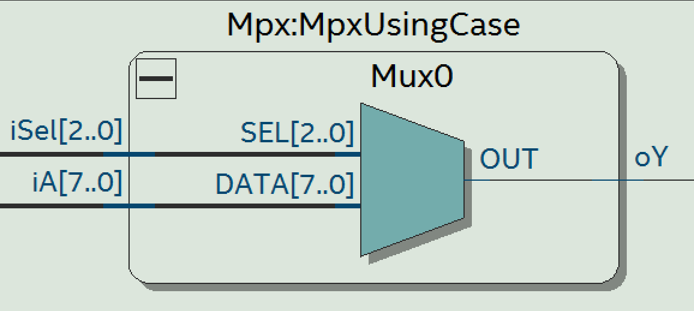
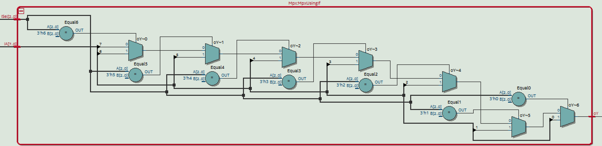

Im RTL Viewer ist ein klarer Unterschied zwischen den 2 Implementierungen der Multiplexer ersichtlich. Dies wird auch durch Betrachtung des Unterschieds von **case-statements** zu **if-elsif-else** klar. Denn beim **if-elsif-else** ist die Reihenfolge in der die Abfragen ausgeführt werden relevant. Wohingegen beim Case Statements die Reihenfolge nicht vorgegeben wird.

### Technologie Map N=8
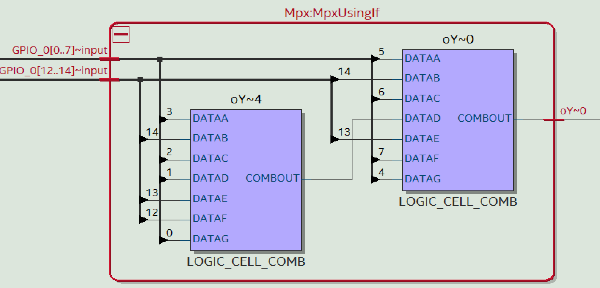
Hier zeigt sich die Umsetzung der beiden Multiplexer wiedermal mit nur einer Schaltung. Also wurde der 2. Multiplexer wegoptimiert.
Hier werden für die Realisierung des Multiplexers 2 7-Input LUTs verwendet.

### Timing Slow N=8
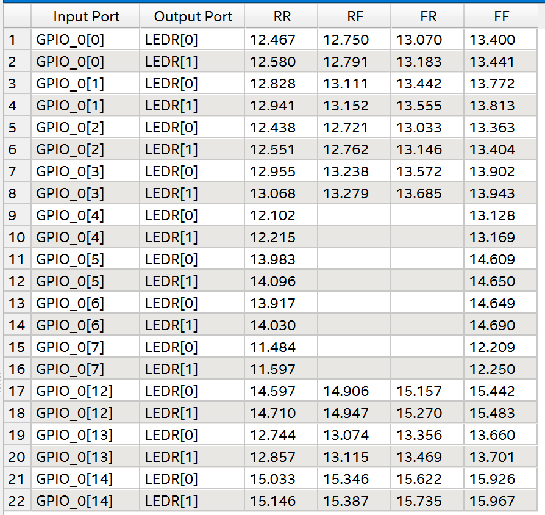

### Timing Fast N=8
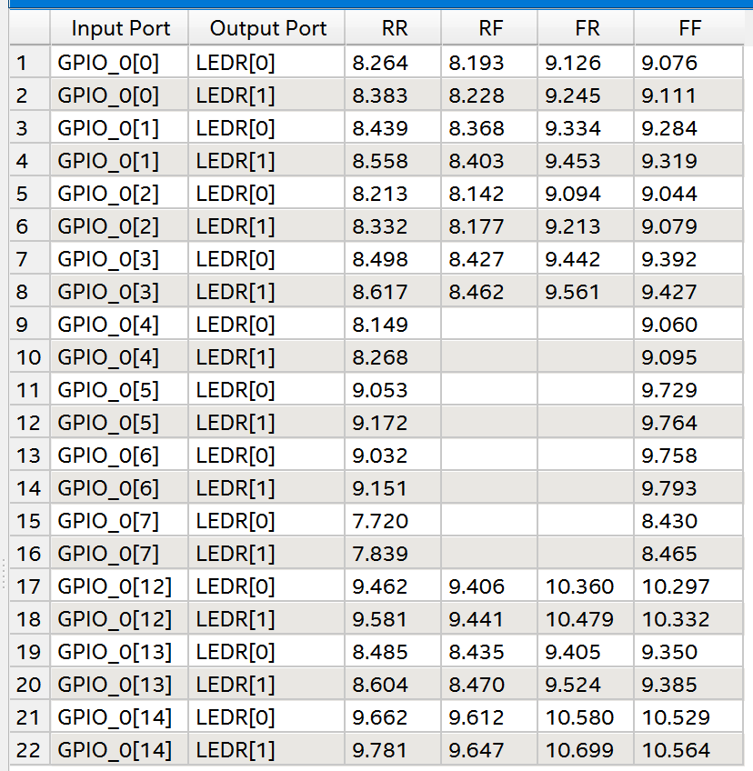
### RTL Viewer N=12
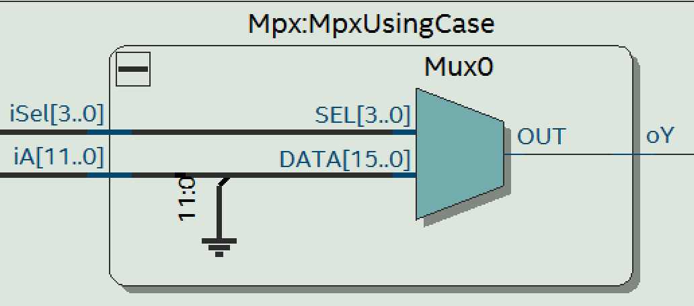
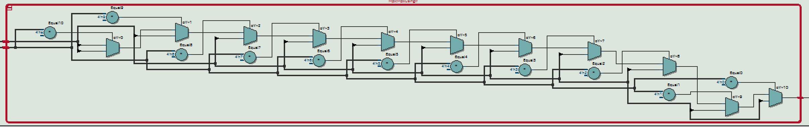

Hier ist der Unterschied zwischen **if-elsif-else** und **case** noch extremer zu erkennen. 
Die Umsetztung mittels **if-elsif-else** scheint viel komplexer zu sein als mit **case**.

### Technologie Map N=12
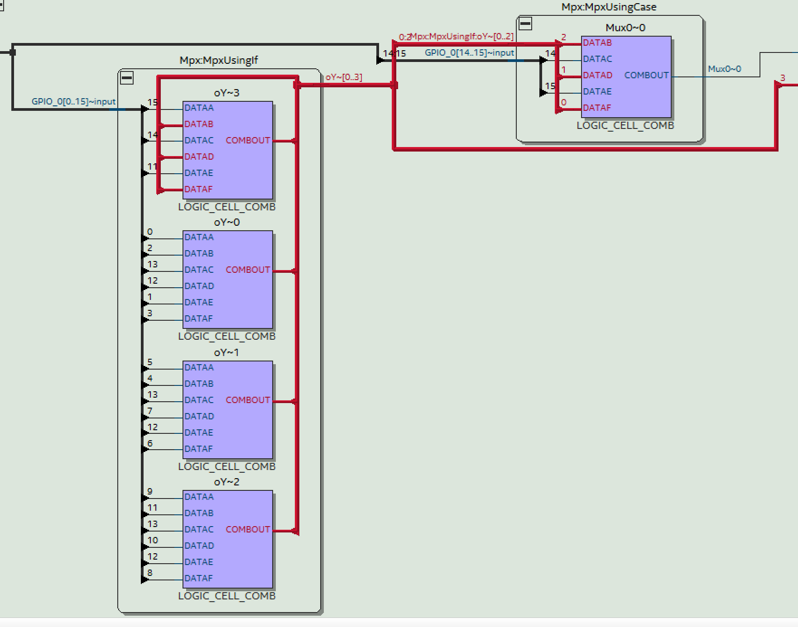
In der Technologie Map ist etwas interessantes zu erkennen. Hier werden beide Entities umgesetzt, jedoch nur Teile von jeder. Hier ist zu erkennen, dass 3 Leitungen vom Teil **UsingIf** zum Teil **UsingCase** verbunden sind und Eingänge dessen LUT darstellen. Weiters ist noch zu erkennen, dass die Ausgänge von von **UsingIf** rückgekoppelt werden auf Eingänge vom gleichen LUT.

### Timing Slow N=12
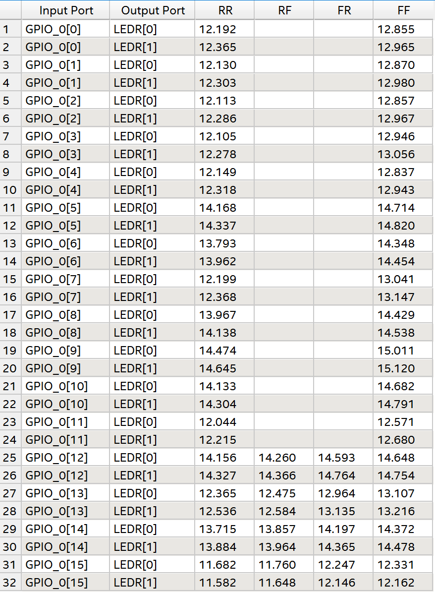

### Timing Fast N=12
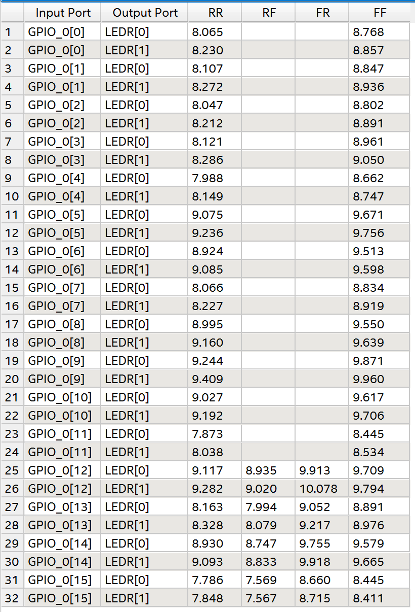

### Vergleich der Timings
Durch den Vergleich der Timings der Variante mit **N=8** zu **N=12** ist nur ein minimaler Unterschied in der Verzögerungen zu erkennnen.
Die langsamste Zeit bei N=8 beträgt 15.9ns und bei N=12 15.1ns.
Die schnellste Zeit bei N=8 = 7.7ns und bei N=12 7.7ns.
Trotz der Rückkopplung im Technology Map Viewers ergibt sich kein großer Unterschied zwischen den Timings!

### Allgemeines Multiplexer Model
Ein allgemeines Multiplexer Model lässt sich mittels if-elsif-else bzw. case nicht umsetzen, denn hier müsste man jede Kombination von der Select Leitung in einem Eigenen if bzw. when Zweig auffassen. Auch jede Bit Anzahl der Select Leitung müsste berücksichtigt werden. Dies führt mit Sicherheit zu Compile errors! (length missmatch).

### Allgemeine Version ohne IF / Case
Dies ist in der Unit **MuxUniversal** zu finden!

## Schaltplan DE1-SOC
### Decoupling
Die Kondensatoren die auf Seite 8 der Schaltplans zu finden sind, dienen der Stabilisierung der Versorgungsspannungen. Da die Komponenten am Board pulsartige Ströme ziehen, würde die Versorgungsspannung lokal einbrechen. (Wegen Leitungs-Induktivitäten bzw. Widerständen). Die Kondensatoren stellen für diese pulsartigen Ströme den Strom zur Verfügung und glätten die Strompulse für die Zuleitungen der Versorgungsspannungen.
Besonders viele dieser Kondensatoren findet man auf der Rückseite des FPGA Chips am Board.
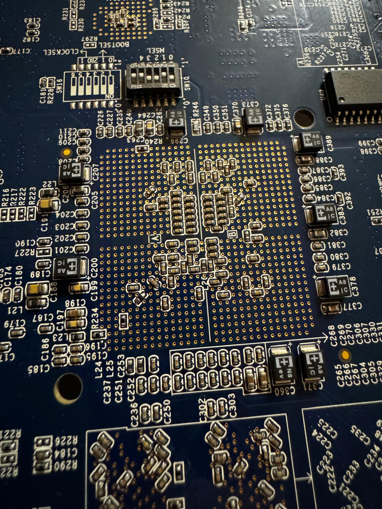
### GPIO Buchsen
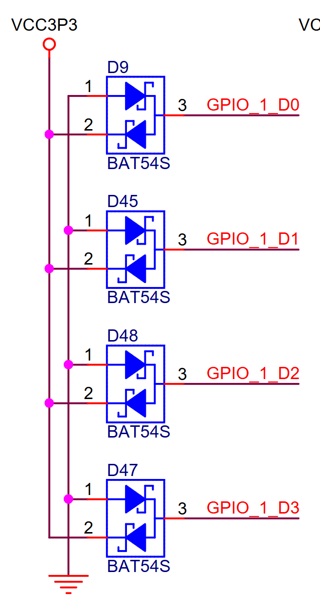

Schutz vor Über bzw. Negativer-Spannung bieten die Doppel Schottky Dioden BAT54.
Hier wird die obere Diode (zwischen GPIO_D und VCC3P3) leitend wenn eine Spannung größer als VCC3P3 + Vf anliegt. Die untere Diode wird leitend wenn eine Spannung niedriger als -Vf an GPIO_D anliegt. Somit wird durch die Dioden ein so hoher Strom fließen bis die Spannung auf VCC3P3 + Vf bzw. auf -VF gesunken bzw. angestiegen ist.

Schutz vor zu hohem Strom bieten die Serien Widerstände von 47 Ohm.
Maximaler Strom = 3.3V / 47 Ohm = 70 mA.
Dieser ist jedoch größer als der Strom von den Absolute Maximum Ratings!
Also würde ein Kurzschluss den FPGA zerstören!
### Infrarot LED
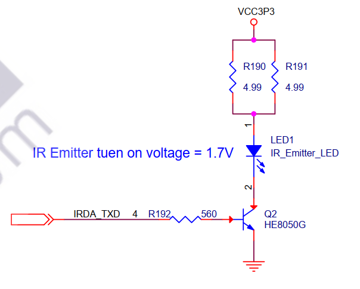
Leitungsumsatz in den beiden Widerständen:

$I = \frac{V_{CC3P3} - V_f - V_{CE}}{R} = \frac{3.3\,\mathrm{V} - 1.7\,\mathrm{V} - 0.2\,\mathrm{V}}{2.5\,\Omega} = 560\,\mathrm{mA}$

Gesamte Leistung an den Widerständen:

$P_R = R \cdot I^2 = 2.5\,\Omega \times (0.56\,\mathrm{A})^2 = 0.784\,\mathrm{W}$

Leistung je Widerstand beträgt nun Gesamtleistung/2 (Widerstand *2 aber Strom /2) also: 0.392W

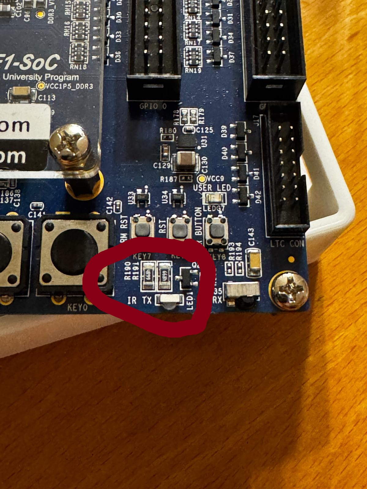

Diese Widerstände sind oben abgebildet. Diese sind deutlich größer als der Großteil der Widerstände am Board.
Die Widerstände sind von der Bauform 1206, diese Bauform kann typisch 0.25W an Dauerleistung abgeben. 
Aus der Berechnung wurde eine Leistung von 0.392W ermittelt, also darf die LED nicht dauerhaft eingeschaltet sein, da sonst der Widerstand überhitzt.

Leistungsumsatz in der LED:

$P_{D} = V_f \cdot I = 1.7\,\mathrm{V} \times 560\,\mathrm{mA} = 0.952\,\mathrm{W}$

Die Led überhitzt einerseits nicht weil sie typischerweise nur pulsweise eingeschaltet wird. Eine IR-LED hat außerdem typischerweise einen Wirkungsgrad von etwa 30%. Also werden 70% der Leistung in Wärme umgesetzt. Dies entspricht hier etwa 0.7W. Ein dauerbetrieb der LED würde wahrscheinlich auch hier zu einer Überhitzung führen.

### Spannungsversorgung DE1 Soc
Die Komponenten ab der Seite 27 dienen für die Bereitstellung der verschiedenen Spannungsebenen zu Versorgung des FPGAs und anderer Komponenten am Board. Hier werden auch Referenzspannungen, zB. für das DDR Interface erzeugt.
Dies Spannungsversorgung wird mittels Schaltreger bzw. Linear Spannungsregler realisiert.
Hier ist auffällig, dass die meisten dieser Spannnungsregler über einen PowerGood Output und einen Enable Input verfügen. 
Mittels dieser Steuerleitungen werden die Spannungsebenen in einer speziellen Sequenz aktiviert. Dies ist wichtig um die Funktion des FPGAs zu gewährleisten.

Folgende Spannungsebenen existieren am Board:
**1.1V, 3.3V, 5V, 1.5V, 2.5V, 9V, 1.2V, 1.8V, DDR3VREF**

