# Übung 5 Simon Offenberger S2410306027  
## Aufgabe 1 
Als erstes wurde die Entity nach ihrer Funktionalität analysiert.
Hier fällt auf das das inertial Delay verwendet wird.

- Code
>architecture PrimImp of FeedbackMux is
>
>  signal Yc, Yn            : std_ulogic;
>  signal nEn, Impl1, Impl2 : std_ulogic;
>  
>begin 
>
>  Yc <= Yn;
>
>  -- Model this:
>  --  Yn <= (Yc and not(iEn)) or
>  --        (iEn and iD);
>  -- like this:
>
>  -- generate negated inputs
>  nEn   <= not(iEn)       after 6 ns;
>
>  -- prime implicands
>  Impl1 <= iEn and iD     after 5 ns;
>  Impl2 <= Yc and nEn     after 5 ns;
>
>  -- combine prime implicands
>  Yn    <= Impl1 or Impl2 after 5 ns;
>
>  oQ <= Yc;
>  
>end architecture PrimImp;

Durch die Betrachtung des KV Diagramms und den wesentlichen Priminplikaten wird der kritische Übergang identifiziert.  

| iEn \ (Yc,iD) | 00 | 01 | 11 | 10 |
|:--------------:|:--:|:--:|:--:|:--:|
| 0              | 0  | 0  | 1  | 1  |
| 1              | 0  | 1  | 1  | 0  |

\[
Y_n = (Y_c \cdot \overline{iEn}) + (iEn \cdot iD)
\]

Hier wird klar, dass die Untere Zeile im KV Diagramm von einem Implikant und die obere Zeile von dem 2. Primimplikant.
Nun wird klar, dass durch den Übergang vom Unteren in den Oberen Implikant es zu einem Hazard bzw. zu einer Fehlfunktion kommen kann.

#### Testbench für Fehlfunktion.
Aus diesem Grund wird in der Testbench dieser Übergang provoziert, somit sollte in der Waveform eine Fehlfunktion festgestellt werden können. Erwartet wird auch ein statischer Hazard im Ausgangssignal.

.png)

.png)

Durch die Analyse der Waveforms wird festgestellt, dass kein statischer Hazard auftritt. Eine Fehlfunktion ist aber dennoch festzustellen. Hier wird durch den Übergang von EN=1 auf EN=0 auch Q auf 0 gesetzt, dies sollte aber laut KV-Diagramm nicht geschehen. Der Grund dafür liegt im interal Delay welches verwendet wird.

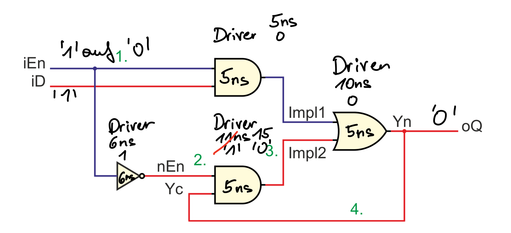

In der obigen Grafik werden die Driver für die Ausgänge der Gatter dargestellt. 
Hier wird klar, dass der richtige Wert durch den Wechsel von Yn aus den Driver des Und rejected wird!
Dadurch erscheint auch kein 1 mehr am Ausgang Q!

#### Delay Impl1 > nEn
Das Delay wurde auf folgendes geändert:

> nEn   <= not(iEn)       after 5 ns;
> Impl1 <= iEn and iD     after 7 ns;
> Impl2 <= Yc and nEn     after 5 ns;
> Yn    <= Impl1 or Impl2 after 5 ns;

- Waveform
  
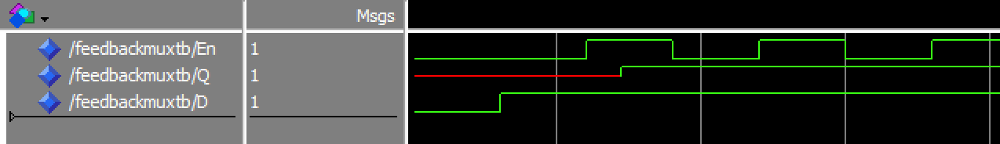

- Driver 

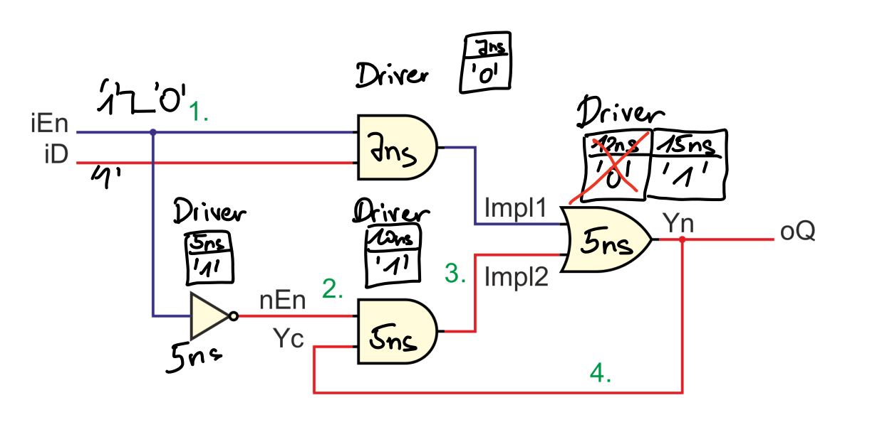

Durch die Betrachtung der Driver, wird klar warum es hier funktioniert.
Der Hazard wird durch das initial Delay im Driver vom OR-Gatter verworfen.

#### Delay Impl1 = nEn
Das Delay wurde auf folgendes geändert:

> nEn   <= not(iEn)       after 5 ns;
> Impl1 <= iEn and iD     after 5 ns;
> Impl2 <= Yc and nEn     after 5 ns;
> Yn    <= Impl1 or Impl2 after 5 ns;

- Waveform
  
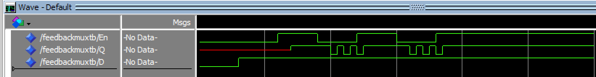

- Driver 

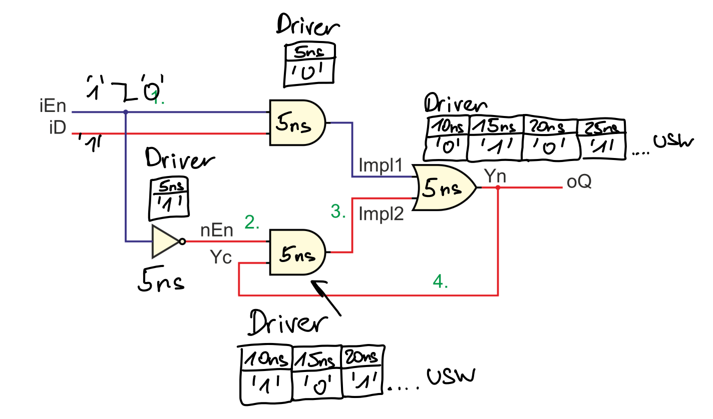

Hier ist in der Waveform eine Oszilation zu sehen. 
Diese hat dir Ursache, dass die Delays von NEN + folgenden AND und AND mit folgenden OR genau gleich ist. 

- wird stattdessen das Timing so gewählt:

>  nEn   <= not(iEn)       after 5 ns;
  Impl1 <= iEn and iD     after 5 ns;
  Impl2 <= Yc and nEn     after 5 ns;
  Yn    <= Impl1 or Impl2 after 6 ns;

- Waveform
  
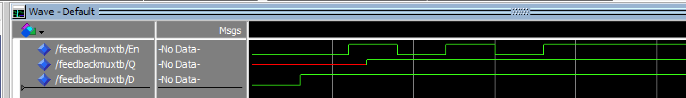

- Driver 

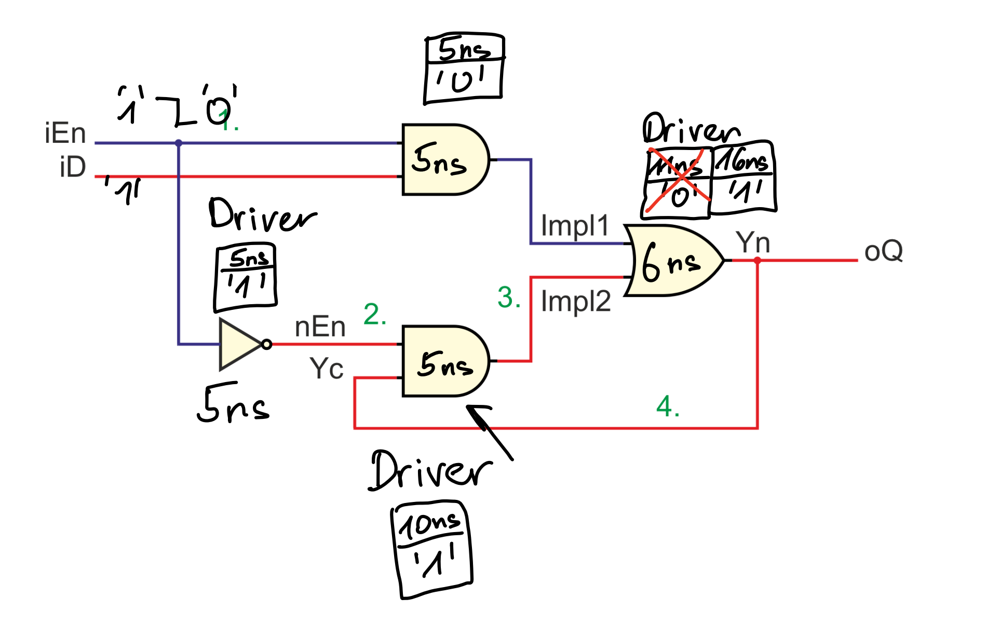

Hier entsteht keine Oszillation mehr.
Durch Betrachtung der Treiber wird dies auch klar, die Oszillation
war nur durch die oben angeführte Bedingung Zustande gekommen.
Nun gewinnt wieder die '1' am Ausgang

#### Delay Impl1 < nEn
Das Delay wurde auf folgendes geändert:

> nEn   <= not(iEn)       after 7 ns;
> Impl1 <= iEn and iD     after 5 ns;
> Impl2 <= Yc and nEn     after 5 ns;
> Yn    <= Impl1 or Impl2 after 5 ns;

- Waveform
  
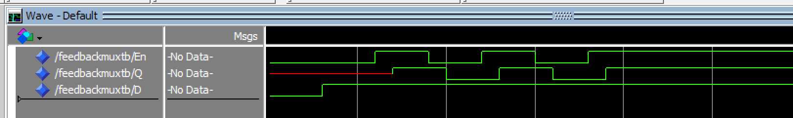

- Driver 

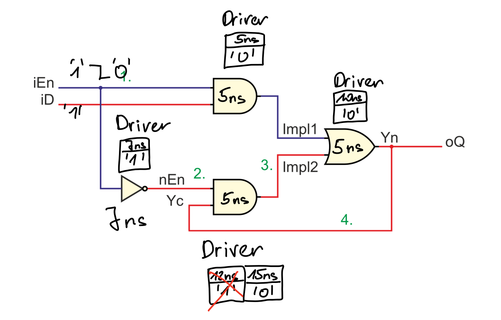

Hier setzt sich die 0 durch, die ist auch schon im ersten Teil der Aufgabe gezeigt. 

#### Delay Impl2 > Yn
Das Delay wurde auf folgendes geändert:

>  nEn   <= not(iEn)      after 6 ns;
  Impl1 <= iEn and iD     after 5 ns;
  Impl2 <= Yc and nEn     after 7 ns;
  Yn    <= Impl1 or Impl2 after 5 ns;

- Waveform
  
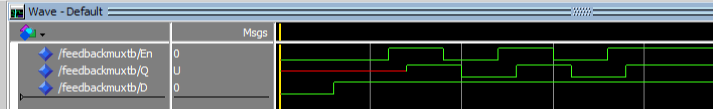

- Driver 

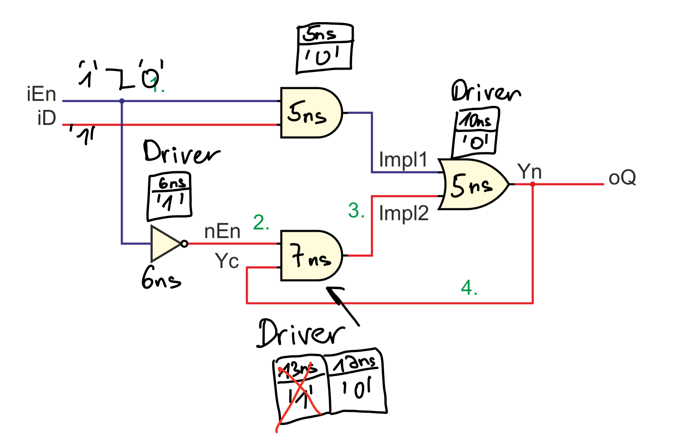

Hier setzt sich die '0' durch, da die '1' im Driver vom unteren AND rejected wird.

#### Delay Impl2 = Yn
Das Delay wurde auf folgendes geändert:

> nEn   <= not(iEn)       after 6 ns;
> Impl1 <= iEn and iD     after 5 ns;
> Impl2 <= Yc and nEn     after 5 ns;
> Yn    <= Impl1 or Impl2 after 5 ns;

- Waveform
  
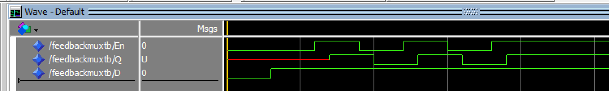

- Driver 

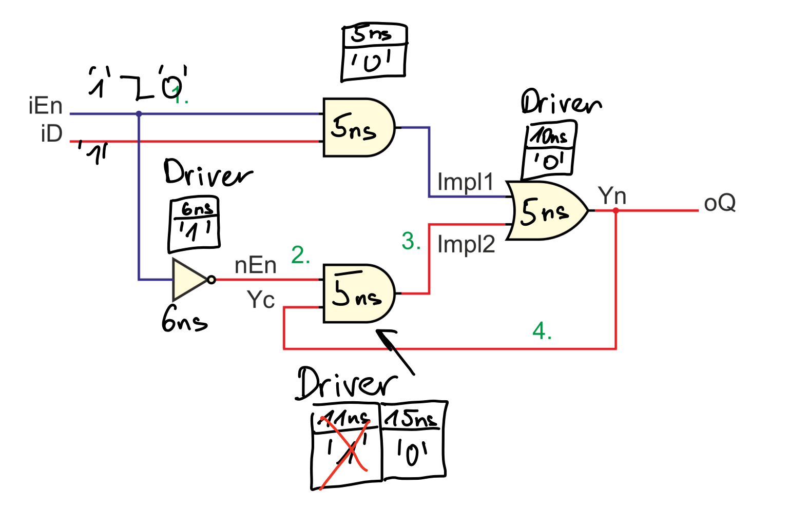

Hier zeigt sich das gleiche Fehlverhalten wie oben.

#### Delay Impl2 < Yn
Das Delay wurde auf folgendes geändert:

> nEn   <= not(iEn)       after 6 ns;
> Impl1 <= iEn and iD     after 5 ns;
> Impl2 <= Yc and nEn     after 5 ns;
> Yn    <= Impl1 or Impl2 after 7 ns;

- Waveform
  
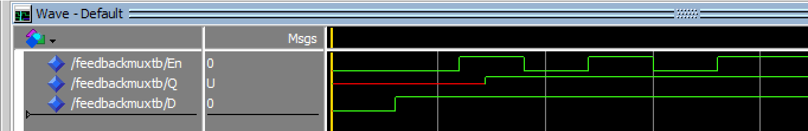

- Driver 

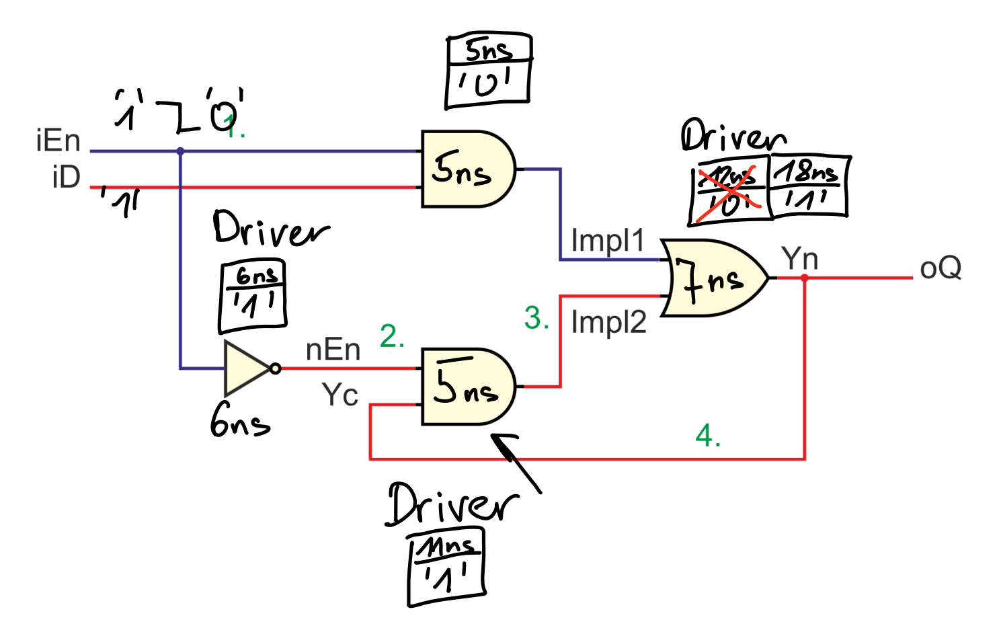

Hier setzt sich die '1' durch, da die '0' im Driver von OR rejected wird.

#### Hazardfree Architekture 

Hier wird nun das Verhalten der Hazardfree Architektur mit kritischen Verzögerungszeiten untersucht.

##### Delay Impl1 < nEN
- Waveform
  
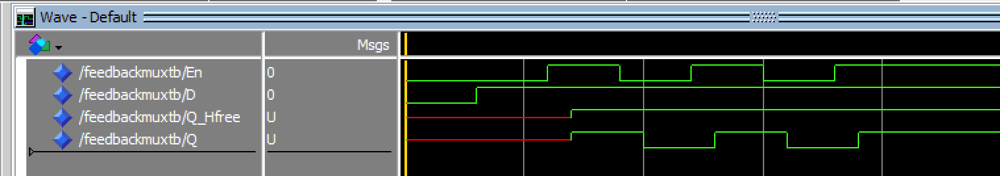

Hier zeigt sich ein Unterschied zwischen der Umsetzung mit den wesentlichen Primimplikanten und der Hazardfree Architektur.
Mit der Hazardfree Architekure wurde die Fehlfunktion behoben!.

##### Delay Impl2 > Yn
- Waveform
  
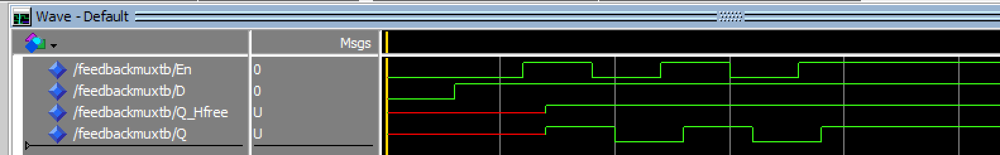

Auch in diesem Fall wurde die Fehlfunktion behoben, durch hinzufügen des 3. Primimplikanten.

## Aufgabe 2 Mehrkomponenten Übergänge

Für diese Aufgabe wurde eine weitere Architektur zur vorherigen Testbench hinzugefügt. In dieser Testbench werden alle wesentlichen Übergänge an den Eingängen der Entity **FeedbackMux** angelegt.
Die relevanten Übergänge sind folgende:

| iD | iEn |
|:--: |:--:|
| 1   | 1  | 
| 0   | 0  | 
| 0   | 1  | 
| 1   | 0  | 
| 1   | 1  | 
| 1   | 0  | 
| 0   | 1  | 
| 0   | 0  | 

Dies Übergänge werden mit verschiedensten Timings relativ zueinander and er Entity angelegt. 
Hier soll die Auswirkung des Timings von Merkomponenten Übergänge analysiert werden.

#### Simulationsergebnisse

##### Relativ Timing -10 ns
.png)
##### Relativ Timing -9 ns
.png)
##### Relativ Timing -8 ns
.png)
##### Relativ Timing -7 ns
.png)
##### Relativ Timing -6 ns
.png)
##### Relativ Timing -5 ns
.png)
##### Relativ Timing -4 ns
.png)
##### Relativ Timing -3 ns
.png)
##### Relativ Timing -2 ns
.png)
##### Relativ Timing -1 ns
.png)
##### Relativ Timing 0 ns
.png)
##### Relativ Timing +1 ns
.png)
##### Relativ Timing +2 ns
.png)
##### Relativ Timing +3 ns
.png)
##### Relativ Timing +4 ns
.png)
##### Relativ Timing +5 ns
.png)
##### Relativ Timing +6 ns
.png)
##### Relativ Timing +7 ns
.png)
##### Relativ Timing +8 ns
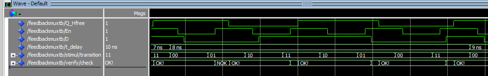
##### Relativ Timing +9 ns
.png)
##### Relativ Timing +10 ns
.png)

In den oben angeführten Waveforms sind alle Fehlfunktionen rot markiert.
Dies ist auch in der Ausgabe der Check Variable zu sehen.
Die Check Variable wird von einem Verify Process gebildet.
Dort wird in ideales Modell des Feedback Mux berechnet und der Ausgabewert mit dem vom realen Mux verglichen.

Aus den Waveforms lässt sich folgender Zusammenhang feststellen.

Bei einem Timing von -5 bis -1 tritt ein Funktionshazard beim Übergang von 01 auf 10 (ID/EN) auf. Durch die Annahme, dass En den Clock input darstellt lässt sich hier die Setup Zeit ablesen. 
Die Setupzeit beträgt hier 6 ns. (Setupzeit muss größer sein als die Zeit bei der Fehlfunktionen auftreten 5+1 = 6).

Weiters tritt ein Funktionshazard im Bereich von 0ns bis 3ns auf.
Jedoch ist hier der kritische Übergang 11 auf 00 (iD/EN).
Hier lässt sich auf eine Holdzeit von 4ns schließen.

#### Welcher Zusammenhang besteht zwischen der Verletzung dieser Zeiten und Mehr-komponenten Übergängen?
Bei Verletzung der Setup bzw. Holdzeit führt ein Mehrkomponenten übergang zwischen En und Id zu einem Funktionshazard. 

#### Handelte es sich beim kritischen Übergang, den Sie in der vorigen Aufgabe gefunden haben um einen Mehrkomponenten Übergang?

## Aufgabe 3 Schaltplan DE1-SOC
### Aufteilung des FPGA Chips im Schaltplan
Der FPGA Chip ist im Schaltplan in folgende Gruppen aufgeteilt
- Clocks
- IO Banks 3-8
- GND Pins
- Power Pins
- HPS Power
- Configuration
Der FPGA Chip wurde in Funktionale Gruppen aufgeteilt. Dies bewirkt eine bessere Lesbarkeit der Schematic. Hier wurden zb. Alle Versorgungs- und Gnd Pins auf ein Blatt dargestellt.
Würde dies nicht gemacht werden wäre der Schaltplan unübersichtlich.

Aufgaben der Blöcke
- Bank 3A -> USB
- Bank 3B -> DRAM Interface
- Bank 4A -> GPIOs
- Bank 5A & 5B -> 7 Seg Anzeige
- Bank 6A & 6B -> HPS DDR3 Interface
- Bank 7 -> I2C, JTAG, Ethernet, SD-Interface,HPS USB
- Bank 8A -> VGA
- Clocks 
- Power & GND
- Configuration

### Welches Bauteil soll gekühlt werden?
Es muss sehr wahrscheinlich der FPGA Chip gekühlt werden, da dieser die Lüftergeschwindigkeit steuert.
Außerdem verfügt der FPGA Chip über die höchste Leistungsaufnahme an Board.

### Transil Diode SM2T3V3A
- Kennlinie Transil Diode:
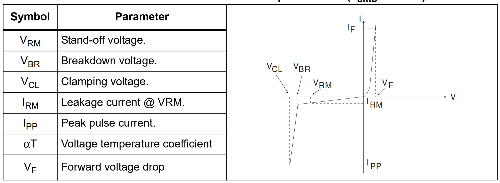
- Kennlinie Zener Diode:
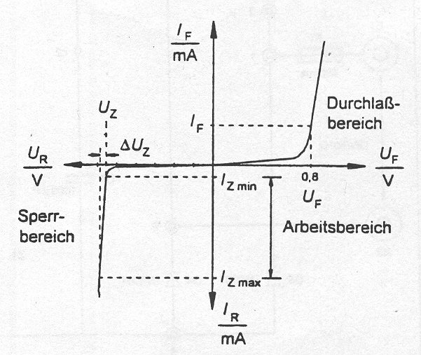
Unter der Betrachtung der beiden Kennlinien ist kein wesentlicher Unterschied der beiden Dioden zu erkennen. 
Ein Unterschied scheint durch die Betrachtung der ersten Kennlinie der Leckstrom zu sein.

**Unterschied zur Zenerdiode**
**Zweck**
- **Transil:** Schutz vor kurzzeitigen Überspannungs-Impulsen (ESD, EFT, Surge) (Pulse aus der EMV Prüfung); ausgelegt auf sehr schnelle Reaktion und hohe Pulsleistung.  
- **Zener:** Meist für Spannungsreferenz/-stabilisierung im Dauerbetrieb 

**Spezifikationen**
- **Transil:** Spezifiziert mit *VRM*, *VBR* (bei kleinem Prüfstrom) und *VCL* bei definiertem Pulsstrom/Pulsform. Ersichtlich aus den im Datenblatt angeführten Werten
- **Zener:** Spezifiziert mit Zenerspannung bei einem Teststrom (DC); nicht auf hohe Pulsleistungen ausgelegt.

### MOSFET FDV305N
Hierbei handelt es sich um einen N Kanal MOSFET.
Dieser übernimmt die Drehzahlsteuerung des Lüfters.
Diese Steuerung wird z.B Über PWM Ansteuerung des MOSFET realisiert.

### Steuerung der FAN_CTRL Leitung
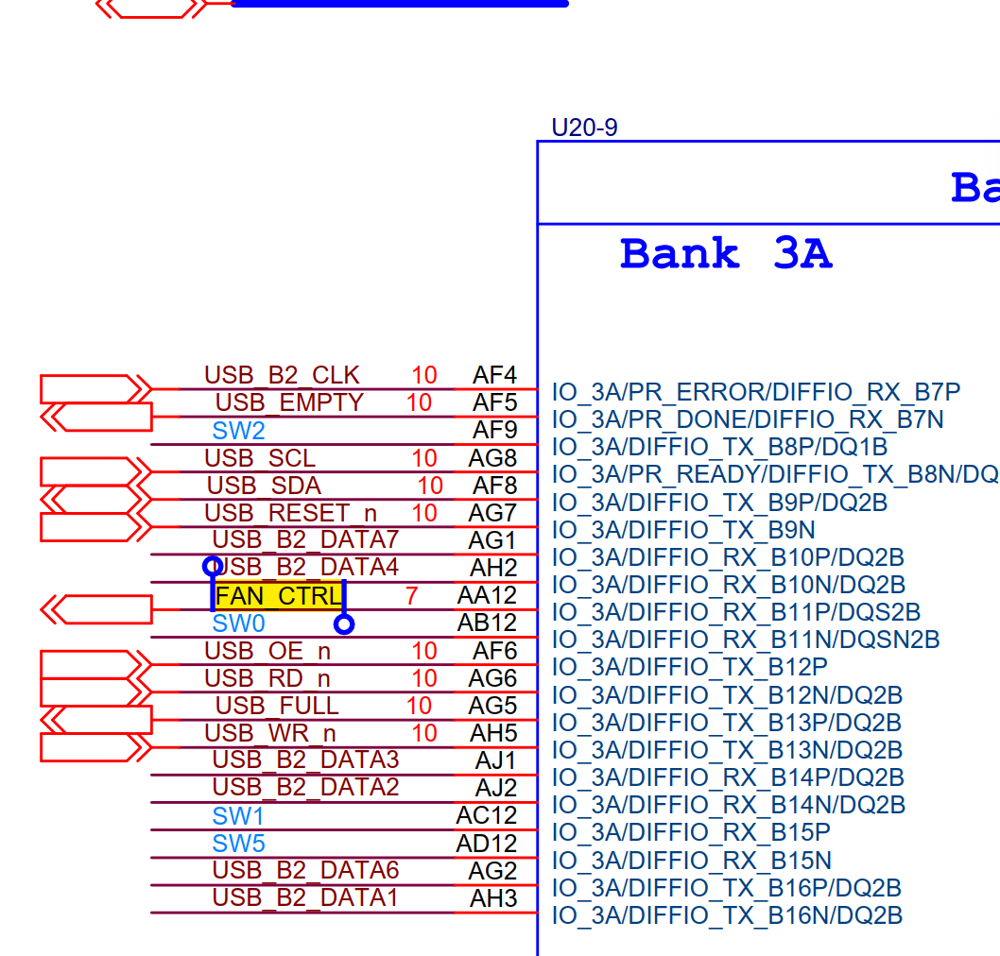
Die Leitung wird vom FPGA gesteuert.
Die Temperaturmessung könnte über einen internen Temperatursensor im FPGA bzw. im HPS realisiert werden. Denn dies ist ja das zu kühlende Bauelement.
Weiters könnte noch ein Temperatursensor mittels FPGA ausgelesen werden. z.B. über anstecken an den GPIO Header.

### Problem beim Einstecken des Lüfters
Es könnte sein, dass beim Einstecken des Lüfters ein ESD Schlag von einem Aufgeladenen Benutzer auf den Connector überspringt.
Diese ESD-Impuls muss nun vom Board abgefangen werden um sensible Bauteile zu schützen. Z.B. durch Transil Diode die das MOSFET Gate schützt.

### DNI?
**Do not Install**
Das bedeutet, dass dieses Modul auf dem PCB nicht bestückt ist.
Also können auch keine ESD Events durch Einstecken des Lüfters entstehen.

### Configuration DIP-Switch
Im folgenden Bild ist die Default Konfiguration des Dip Switches abgebildet. Hier ist unterhabl auch die Schaltung zusehen.
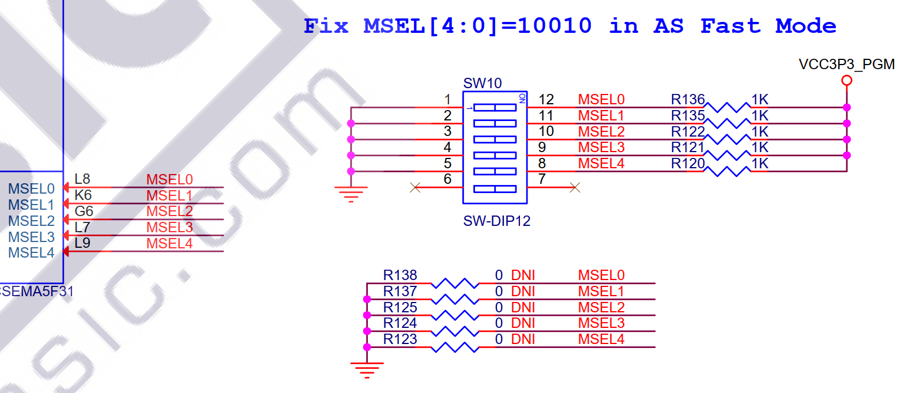
Durch Vergleich mit der Configuration am Board ist ersichtlich dass die Beschreibung am Schaltplan, **MSEL[4:0]=10010** nicht mit der am Board übereinstimmt. Die am Board eingestellte Stellung ist genau bitweise negiert! Dies impliziert, dass die Leitungen MSEL negative Logik haben, sie sind Low aktiv!
Aus diesem Grund wird auch durch ON Schalten des Dip Schalters eine logische '0' am Pin angelegt. Ansonsten wird der Pegel 'H' am Pin angelegt. 
Standard Config Werte an den Leitungen:
MSEL0: '0'
MSEL1: 'H'
MSEL2: '0' 
MSEL3: '0' 
MSEL4: 'H' 

### Widerstände R138 usw.
Diese Widerstände sind auch mit DNI versehen. Dies bedeutet diese sind unbestückt am Board.
Die Widerstände sind dazu gedacht, bei Nichtbestückung des Dipschalters die Konfiguration fix über diese Widerstände zu realisieren. 

### Konfiguration AS

Hier ist ein Auszug aus dem User Manual zur Konfiguration AS Mode.
Beschrieben ist hier, dass die Programmierung des FPGAs über das EPCS (Enhanced Programmable Configuration Serial Device) vollzogen wird bei der Einstellung MSEL[4:0]=10010.

### Konfigurations Pins
Auszug aus dem Cyclon V Handbook
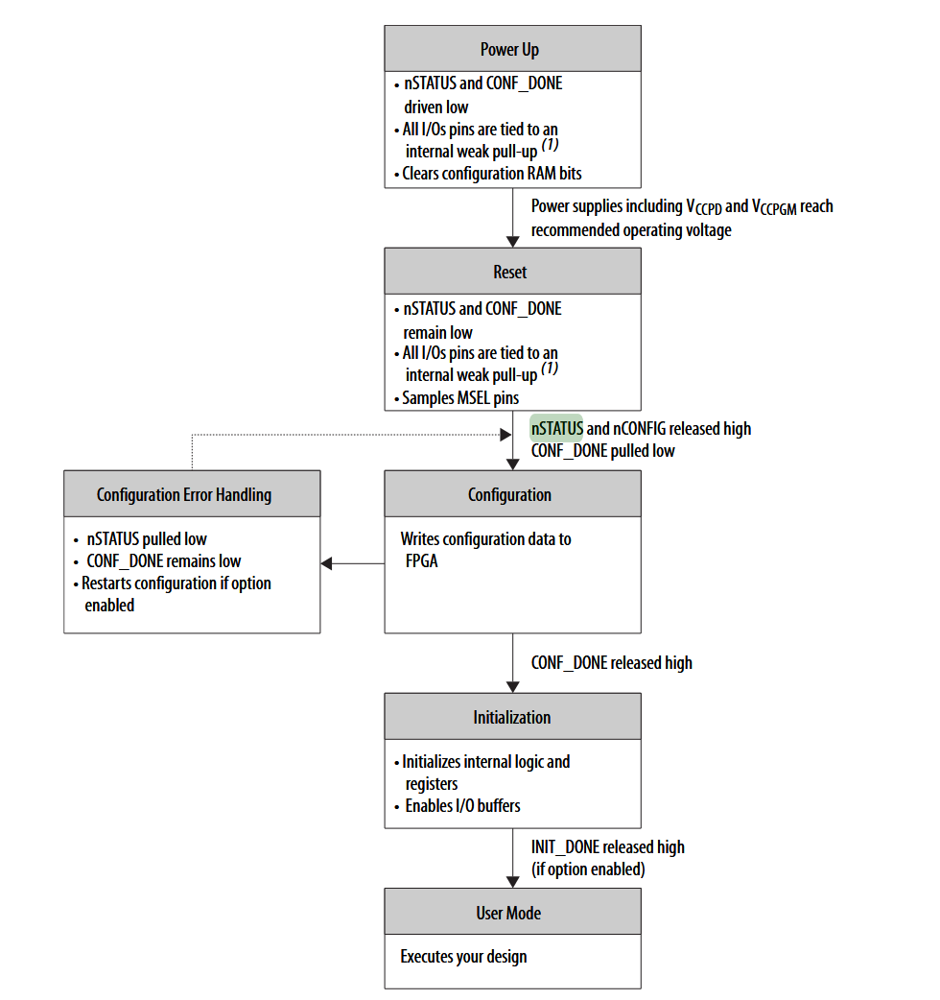

CONF DONE
- Funktion: Statusausgang für den Konfigurationsprozess.

- Beschreibung: Während der Konfiguration wird CONF DONE auf low gezogen. Nach der Konfiguration wird CONF DONE auf high freigegeben. Dies signalisiert, dass die Konfiguration abgeschlossen ist und die Initialisierung beginnt.

NSTATUS

- Funktion: Statusausgang und -eingang für Fehlererkennung und Reset.

- Beschreibung: Nach dem Einschalten wird NSTATUS auf low gehalten, bis die Power-on-Reset-Phase abgeschlossen ist. Während der Konfiguration wird NSTATUS auf low gezogen, wenn ein Fehler auftritt. Ein externer low-Pegel an NSTATUS kann den Konfigurationsprozess neu starten. NSTATUS ist ebenfalls bidirektional und sollte mit einem externen 10-kΩ-Pull-up-Widerstand an VCCPGM verbunden werden.

NCONFIG

- Funktion: Eingang für das Starten oder Neustarten der Konfiguration.

- Beschreibung: Ein low-Pegel an NCONFIG startet den Konfigurationsprozess neu.

    
NCE

- Funktion: Chip Enable-Eingang.

- Beschreibung: Ein low-Pegel an NCE aktiviert das FPGA für die Konfiguration. In der Regel wird NCE auf low gehalten, um die Konfiguration zu ermöglichen.