# Übung 5 Simon Offenberger S2410306027  
## Aufgabe 1 Latches and Flip Flops
### Architektur A

>  FF_or_Latch_A : process (iClk) is
>  begin
>    if (iClk = '1') then
>      oQ_A <= iD;
>    end if;
>  end process FF_or_Latch_A; 

#### RTL Viewer
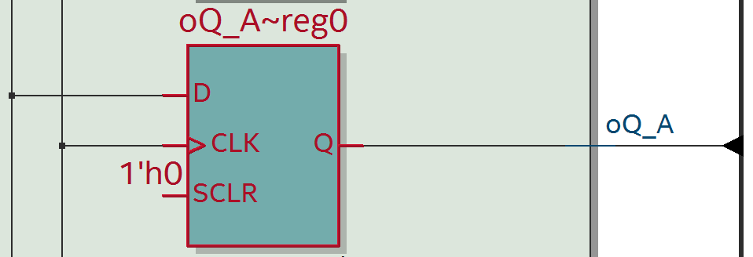

#### Technologie Map
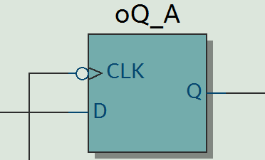

Hier ist im der Technologie als auch im RTL-Viewer ein FlipFlop entstanden.
In der Beschreibung ist dies auch verdeutlicht. Da der Process auf iClk sensitiv ist wird, dieser nur bei einem Event auf iClock aktiv. 
Mit der Abfrage nach iClk = '1' wird, die Steigende Flanke auf Clock dargestellt. Innerhalb vom IF wird nun der Wert von D nach Q übernommen. Aus diesen Gründen entsteht in der Synthese ein FlipFlop.
### Architektur B

>  FF_or_Latch_B : process (iClk, iD) is
>  begin
>    if (iClk = '1') then
>      oQ_B  <= not iD;
>    end if;
>  end process FF_or_Latch_B; 

#### RTL Viewer
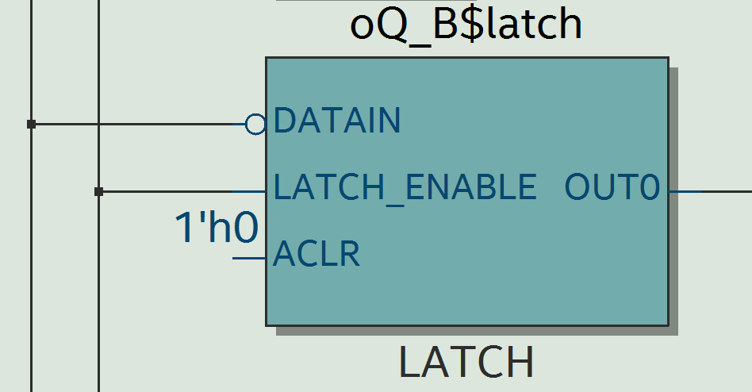

#### Technologie Map
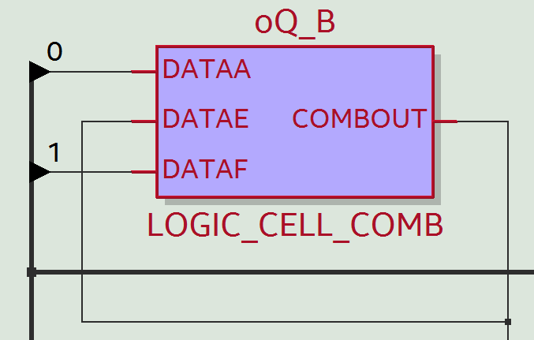

Hier ist ein Latch entstanden.
Der Grund dafür liegt in der Sensitivity Liste des Processes.
Dieser ist auf iClk und iD sensitiv.
Somit wird der Process aktiv bei Event auf iClk und iD.
Weil hier wiederum in der IF Anweisung nicht auf Clk'event geprüft wird entsteht ein Latch.
Denn in der Beschreibung wird auch der Wert von D übernommen wenn der Takt statisch 1 ist und D sich ändert.
Somit stellt der Takteingang den Enable-Eingang des Latches dar.
### Architektur C

>  FF_or_Latch_C : process (iClk) is
>  begin
>    if rising_edge(iClk) then
>      oQ_C  <= not iD;
>    end if;
>  end process FF_or_Latch_C; 

#### RTL Viewer
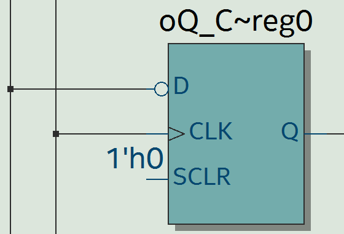

#### Technologie Map
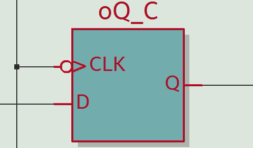

In der Architektur ist eine klassische Beschreibung eines FlipFlops zu sehen. 
Aus diesen Grund überrascht auch nicht, dass dieses auch so in Hardware ein Flipflop ergibt.
Denn es wird nur der Wert von D nach Q übernommen wenn eine Rising Edge am Takteingang vorliegt. Hier muss natürlich auch iClk in der Sensitivity Liste eingetragen ist.
### Architektur D

>  FF_or_Latch_D : process (iClk) is
>  begin
>    if (iClk'event and iClk = '1') then
>      oQ_D  <= not iD;
>    end if;
>  end process FF_or_Latch_D; 

#### RTL Viewer
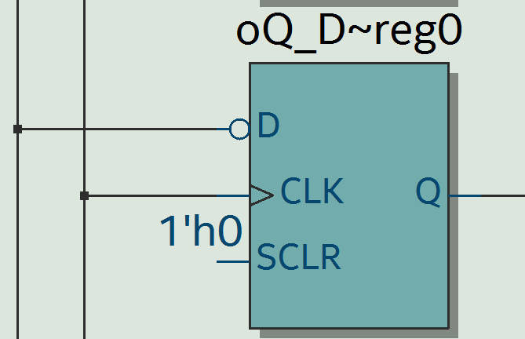

#### Technologie Map
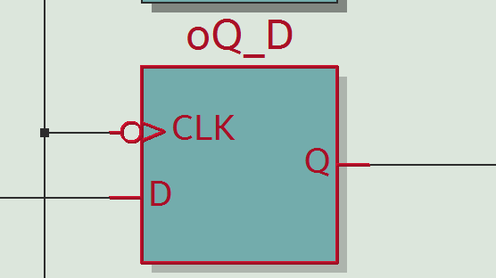

Hier ist im Grund die gleiche Implementierung wie in der Architektur C beschrieben. Nur hier wird für die Flankenüberprüfung nicht rising edge verwendet sondern explizit auf Event und Zustand 1 abgefragt. Stellt aber in der Synthese das gleiche Verhalten dar.
### Architektur E

>  FF_or_Latch_E : process (iClk, iD) is
>    
>  begin
>    if (iClk = '1') then
>      E <= not iD;
>    end if;
>    oQ_E  <= E;
>  end process FF_or_Latch_E; 

#### RTL Viewer
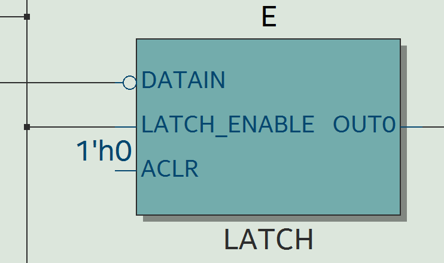

#### Technologie Map
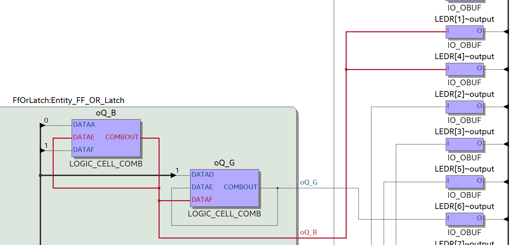

Hier entsteht ein Latch.
Da der Process auf iClk und iD sensitiv ist und in der IF Anweisung nur auf iClk = 1 geprüft wird.
Der Ausgang wird hier über den Umweg des Signals E an den Ausgang weitergegeben. Wobei der Wert von E auf Q erst bei dem nächsten Event auf Clk oder D übernommen wird.  Hier wird im Grunde die gleiche Funktionalität wie in der Architektur B beschrieben.
Dies wird durch den Technologie Map Viewer auch ersichtlich. Denn die Synthese hat dies erkannt und für beide Architekturen nur eine Implementierung in Hardware umgesetzt. Dies ist ersichtlich, da die Ausgänge LEDR[1] und LEDR[4] den geleichen Output des Latches oQ_B verwenden.
### Architektur F

>  FF_or_Latch_F : process (iClk) is
>    
>  begin
>    if (iClk = '1') then
>      oQ_F    <= F;
>      F <= not iD;
>    end if;
>  end process FF_or_Latch_F; 

#### RTL Viewer
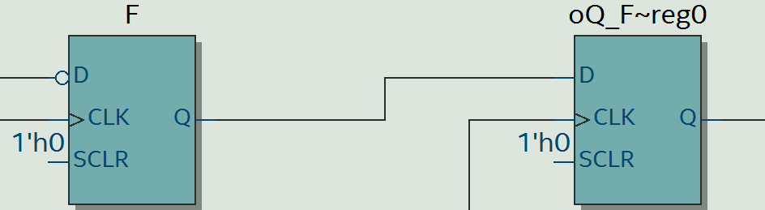

#### Technologie Map
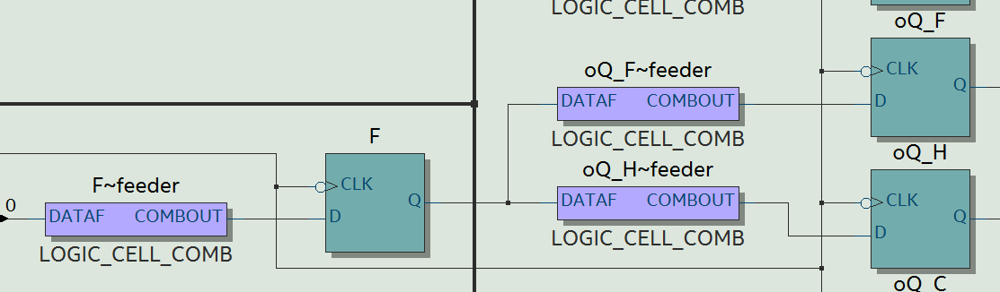

Hier entstehen 2 hintereinander geschaltete FlipFlops.
Durch die Analyse des VHDL Codes wird dies auch verdeutlicht.
Da in der Sensitivity Liste nur iClock vorhanden ist und in der If Anweisung auf IClk auf 1 geprüft wird.
Deutet das auf ein Flipflop hin, denn das innerhalb der If wird nur ausgeführt wenn iclk ein event hat und der Wert 1 ist.
Weiters wird innerhalb der IF Anweisung zuerst der Ausgang auf den Wert von F gesetzt und danach D nach F geschrieben. 
Dies deutet darauf hin, dass der Wert ID erst nach 2 Taktflanken am Ausgang Q erscheint. Außerdem wird das Signal iD noch negiert.
Dadurch entstehen hier 2 Flipflops.
### Architektur G

>  FF_or_Latch_G : process (iClk, iD) is
>    
>  begin
>    if (iClk = '1') then
>      G <= not iD;
>      oQ_G    <= G;
>    end if;
>  end process FF_or_Latch_G; 

#### RTL Viewer
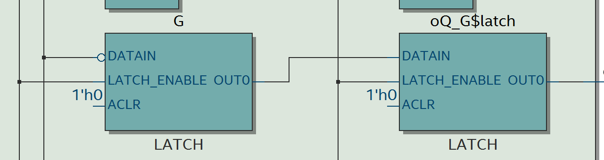

#### Technologie Map
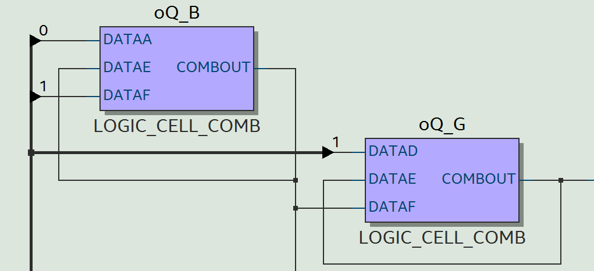

Hier entstehen 2 Latches hintereinander.
Im Technologie Map-Viewer ist hier Functionality Sharing zu beobachten. Denn für die Umsetzung der 2 Latches erzeugt die Synthese nur 1 zusätliches Latch und benutzt für das 2. Lacht das Latch der Architektur B.
Hier muss es sich um 2 Latches handeln, dann die beiden Zuweisungen D gets G und Q gets G sind nur aktiv wenn Clock = 1 ist, sprich das Enable beim Latch vorhanden ist. 
### Architektur H

>  FF_or_Latch_H : process (iClk) is
>    
>  begin
>    if (iClk'event and iClk = '1') then
>      H <= not iD;
>      oQ_H    <= H;
>    end if;
>  end process FF_or_Latch_H; 

#### RTL Viewer
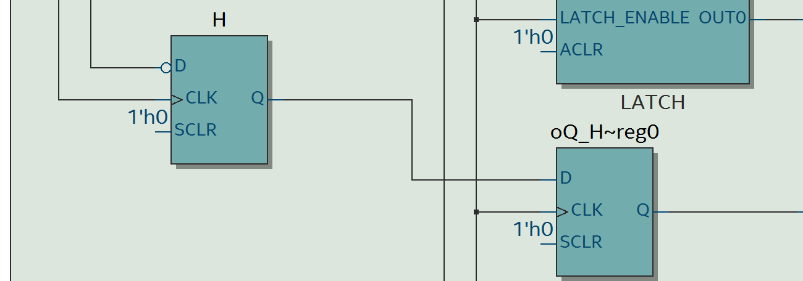

#### Technologie Map
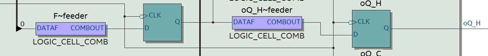

Hier ist in der Technologie Map wieder Functionality Sharing zu sehen. 
Es werden 2 FlipFlops umgesetzt.
Denn der Process ist nur auf Clock sensitiv und prüft in der IF nach einer Rising Edge am Clock.
Der Wert von iD erscheint erst nach 2 steigenden Flanken am Ausgang -> dies gibt einen Hinweis warum hier 2 Flipflops umgesetzt werden.
### Architektur I

>  FF_or_Latch_I : process (iClk) is
>    
>  begin
>    if (iClk = '1') then
>      oQ_I <= not iD;
>    elsif (iClk = '0') then
>      null;
>    end if;
>  end process FF_or_Latch_I;  

#### RTL Viewer
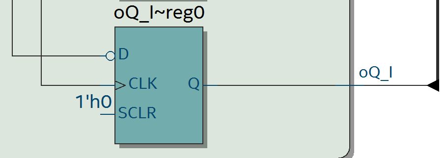

#### Technologie Map
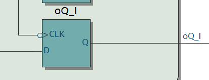

Null bedeutet in VHDL "nichts tun"!
Somit hat der elseIf Zweig in der Beschreibung keine Auswirkung.
In der Synthese entsteht ein Flipflop mit Inverter am Eingang.
Weil process nur berechnet wenn iClock ein Event hat und der Wert 1 ist.
Somit wird der Code innerhalb der If nur ausgeführt wenn eine Rising Edge am Clock auftritt.
## Aufgabe 1 Warnings und Critical Warnings

