# Übung 7 Simon Offenberger S2410306027  
## Aufgabe 1 FSM Lauflicht
### Architecture TwoProcessHandmade

>```vhdl
>architecture TwoProcessHandmade of RunningLight is
>  signal NextState : std_ulogic_vector(oState'range);
>  -- init state 
>  constant cStateAllOff : std_ulogic_vector(oState'range) := (others => '0') 
>begin
>
>-- Stateregister
>process (iClk,inResetAsync) is 
>begin
>  if(inResetAsync = not('1'))then
>    oState <= cStateAllOff;
>  elsif(rising_edge(iClk)) then
>    oState <= NextState;
>  end if;
>
>end process;
>
>-- Statetransition Process
>NextStateLogic: process (oState) is
>begin
>
>  NextState(2) <= (not oState(2) and not oState(1) and not oState(0)) or 
>                  (not oState(2) and     oState(1) and     oState(0));
>  
>  NextState(1) <= (    oState(2) and not oState(1) and not oState(0)) or
>                  (not oState(2) and               oState(0));
>
>  NextState(0) <= (not oState(2) and     oState(1)) or 
>                  (not oState(2) and     oState(0));
>
>end process;
>
>end architecture TwoProcessHandmade;


In dieser Architektur wurde das Lauflicht aus der Vorlesung mittels 2 Processes und der Zustandsüberführungsfunktion aus den KV-Diagramm realisiert.
Der oberste Process stellt hier das Stateregister dar.
Der untere Process ist ein rein kombinatorischer Process und dient zur Berechnung des nächsten States.

### Architecture TwoProcessWithCase

>```vhdl
>architecture TwoProcessWithCase of RunningLight is
>  signal NextState : std_ulogic_vector(oState'range);
>  -- init state 
>  constant cStateAllOff : std_ulogic_vector(oState'range) := (others => '0') 
>begin
>
>  -- State Register
>process (iClk,inResetAsync) is 
>begin
>  if(inResetAsync = not('1'))then
>    oState <= cStateAllOff;
>  elsif(rising_edge(iClk)) then
>    oState <= NextState;
>  end if;
>end process;
>
>-- State Transition Process
>NextStateLogic: process (oState) is
>begin
>  case oState is 
>    when "000" => NextState <= "100";
>    when "100" => NextState <= "010";
>    when "010" => NextState <= "001";
>    when "001" => NextState <= "011";
>    when "011" => NextState <= "111";
>    when "111" => NextState <= "000";
>    when others => NextState <= "XXX";
>  end case;
>end process;
>
>end architecture TwoProcessWithCase;

Hier ist der erste Process gleich wie in der ersten Beschreibung.
Die Kombinatorik für die Berechnung des nächsten States wurde hier mittels eines Case Statement realisiert.

### Architektur OneProcessWithCase

>```vhdl
>architecture OneProcessWithCase of RunningLight is
>  signal NextState : std_ulogic_vector(oState'range);
>
>  -- init state 
>  constant cStateAllOff : std_ulogic_vector(oState'range) := (others => '0') 
>  begin
>
>-- Stateregister and State Transfer Process
>process (iClk,inResetAsync,oState) is 
>begin
>
>  if(inResetAsync = not('1'))then
>    oState <= cStateAllOff;
>  elsif(rising_edge(iClk)) then
>    oState <= NextState;
>  end if;
>
>  case oState is 
>    when "000"  => NextState <= "100";
>    when "100"  => NextState <= "010";
>    when "010"  => NextState <= "001";
>    when "001"  => NextState <= "011";
>    when "011"  => NextState <= "111";
>    when "111"  => NextState <= "000";
>    when others => NextState <= "XXX";
>  end case;
>
>end process;
>
>end architecture OneProcessWithCase;


Hier wurde die Kombinatorik für die Stateüberführung in den Process des StateRegisters gegeben.
Hier muss der Process allerdings auch auf oState Sensitiv sein, damit sobald eine Änderung von oState vorliegt, der neue Zustand berechnet wird.
Persönlich finde ich die Beschreibung WithCase2Process am saubersten. 
Da hier Stateregister und Kombinatorik klar getrennt sind.

### Simulation und Verifikation

Die Funktionalität der beschriebenen FSMs wurde mittels einer automatischen Testbench nachgewiesen.

>```vhdl
>entity RunningLight_TB is
>end RunningLight_TB;
>
>architecture Testbench of RunningLight_TB is
>    signal Clk           : std_ulogic := '0';
>    signal State_Hand    : std_ulogic_vector(2 downto 0);
>    signal State_Case1P  : std_ulogic_vector(2 downto 0);
>    signal State_Case2P  : std_ulogic_vector(2 downto 0);
>    signal nResetAsync   : std_ulogic;
>begin
>
>Entity_RunningLight1 : entity work.RunningLight(TwoProcessHandmade)
>port map (
>    iClk         => Clk,
>    inResetAsync => nResetAsync,
>    oState       => State_Hand
>);
>
>Entity_RunningLight2 : entity work.RunningLight(TwoProcessWithCase)
>port map (
>    iClk         => Clk,
>    inResetAsync => nResetAsync,
>    oState       => State_Case2P
>);
>
>Entity_RunningLight3 : entity work.RunningLight(OneProcessWithCase)
>port map (
>    iClk         => Clk,
>    inResetAsync => nResetAsync,
>    oState       => State_Case1P
>);
>
>clkgen: clk <= not clk after 2 ns;
>  
>stimul: process is 
>begin
>    nResetAsync <= '0';
>    wait for 10 ns;
>    nResetAsync <= '1';
>    wait;
>end process;
>
>
>verify_RST: postponed process (nResetAsync) is
>begin
>
>    if(nResetAsync = '0') then
>        assert(State_Hand   = "000") report   "Failed Reset in Arch: TwoProcessHandmade!" severity failure;
>        assert(State_Case1P   = "000") report "Failed Reset in Arch: OneProcessCase!" severity failure;
>        assert(State_Case2P   = "000") report "Failed Reset in Arch: >TwoProcessCase!" severity failure;
>    end if;
>    
>end process;
>
>verify_Hand: postponed process (State_Hand) is
>    variable prevState : std_ulogic_vector(2 downto 0) := "000";
>begin
>
>    if(nResetAsync = not('0')) then
>        case prevState is
>            when "000"  =>  assert(State_Hand = "100") report "Wrong State in Arch: TwoProcessHandmade!" severity failure;
>            when "100"  =>  assert(State_Hand = "010") report "Wrong State in Arch: TwoProcessHandmade!" severity failure;
>            when "010"  =>  assert(State_Hand = "001") report "Wrong State in Arch: TwoProcessHandmade!" severity failure;
>            when "001"  =>  assert(State_Hand = "011") report "Wrong State in Arch: TwoProcessHandmade!" severity failure;
>            when "011"  =>  assert(State_Hand = "111") report "Wrong State in Arch: TwoProcessHandmade!" severity failure;
>            when others => null;
>        end case;
>    end if;
>    prevState := State_Hand;
>
>end process;
>
>verify_Case2P: postponed process (State_Case2P) is
>    variable prevState : std_ulogic_vector(2 downto 0) := "000";
>begin
>
>    if(nResetAsync = not('0')) then
>        case prevState is
>            when "000"  =>  assert(State_Case2P = "100") report "Wrong State in Arch: TwoProcessCase!" severity failure;
>            when "100"  =>  assert(State_Case2P = "010") report "Wrong State in Arch: TwoProcessCase!" severity failure;
>            when "010"  =>  assert(State_Case2P = "001") report "Wrong State in Arch: TwoProcessCase!" severity failure;
>            when "001"  =>  assert(State_Case2P = "011") report "Wrong State in Arch: TwoProcessCase!" severity failure;
>            when "011"  =>  assert(State_Case2P = "111") report "Wrong State in Arch: TwoProcessCase!" severity failure;
>            when others => null;
>        end case;
>    end if;
>
>    prevState := State_Case2P;
>
>end process;
>
>verify_Case1P: postponed process (State_Case1P) is
>    variable prevState : std_ulogic_vector(2 downto 0) := "000";
>begin
>
>    if(nResetAsync = not('0')) then
>        case prevState is
>            when "000"  =>  assert(State_Case1P = "100") report "Wrong State in Arch: OneProcessCase!" severity failure;
>            when "100"  =>  assert(State_Case1P = "010") report "Wrong State in Arch: OneProcessCase!" severity failure;
>            when "010"  =>  assert(State_Case1P = "001") report "Wrong State in Arch: OneProcessCase!" severity failure;
>            when "001"  =>  assert(State_Case1P = "011") report "Wrong State in Arch: OneProcessCase!" severity failure;
>            when "011"  =>  assert(State_Case1P = "111") report "Wrong State in Arch: OneProcessCase!" severity failure;
>            when others => null;
>        end case;
>    end if;
>
>    prevState := State_Case1P;
>
>end process;
>
>end Testbench;

Hier wird das Ergebnis der einzelnen Statemachines durch die Verify Processes geprüft.
Falls eine Fehlfunktion festgestellt wird, wird mittels der Assertion severity failure abgebrochen.
Die Verify Processes wurden nach Funktionalität bzw. nach den Entities aufgeteilt.
Hier wird ein Process dazu verwendet, das Resetverhalten der FSMs zu kontrollieren.
Die 3 anderen Processes überprüfen die Statetransitionen. 

#### Waveform

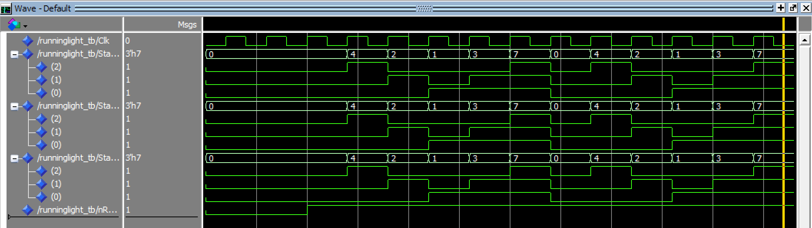

Da die Testbench nicht abgebrochen hat ist die Funktion gegeben.
Im Vorhinein wurde die Funktion der Verify Processes überprüft.
Hier wurde ein Fehler erzwungen um die Testbench zu testen

### Synthese TwoProcessHandmade

#### Boardadapter
>```vhdl
>architecture Struct of RunningLightHandmadeOnPCBDe1Soc is
>signal KeyPosLogic : std_ulogic_vector(KEY'range);   
>begin 
>
>-- Instantiate Entity
>EntityRunningLightHandmade : entity work.RunningLight(TwoProcessHandmade)
>port map (
>    iClk          => KeyPosLogic(0),         
>    inResetAsync  => KeyPosLogic(1),  
>    oState        => LEDR
>);
>
>-- Convert Negative Logic from the board to pos logic
>KeyPosLogic <= not KEY;
>
>end Struct; 

Hier wird für Testzwecke als Takteingang der Taster 1 verwendet. 

#### Compilation Report

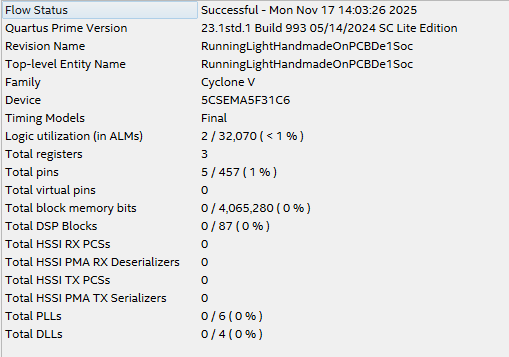

Aus dem Compilation Report ist ersichtlich, dass 3 Flipflops erzeugt wurden.
Die 3 Flipflop sind durch die 3 Bits des State Signals entstanden und bilden das Stateregister. 

#### RTL

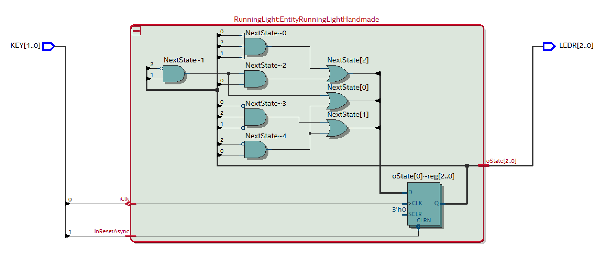

#### Technologiemap

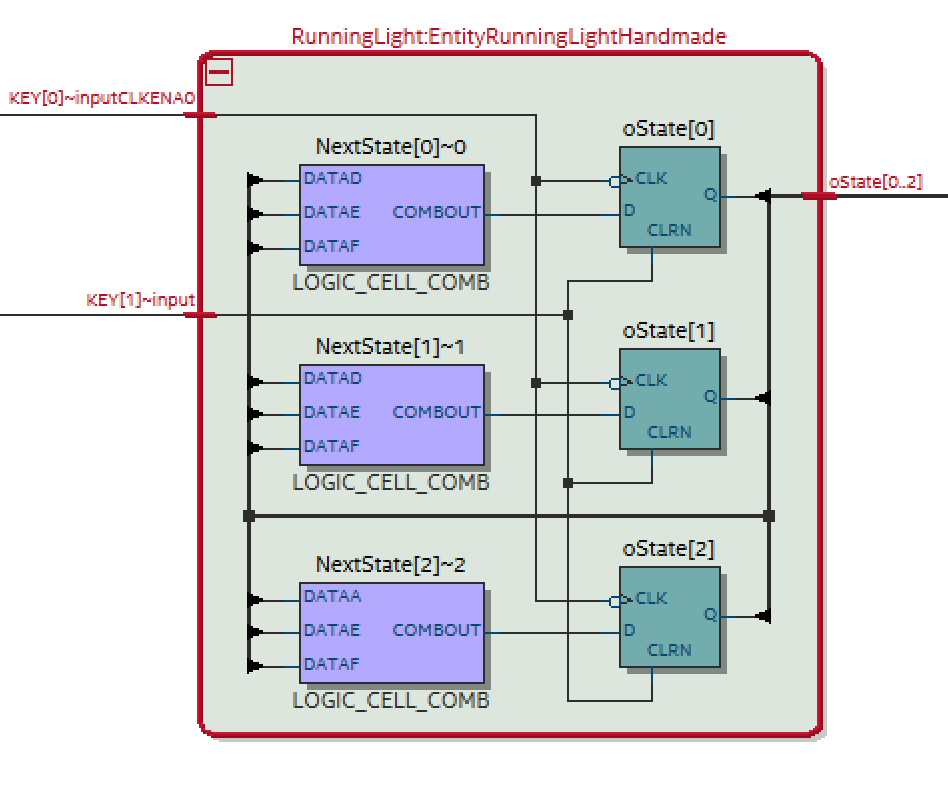

#### Warnings

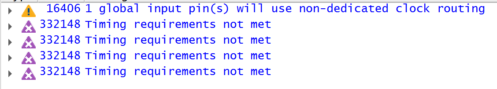

Bei den Warnings fällt auf, dass Quartus meldet, dass das vorgegebene Timing nicht erreicht wird.
Dies ist auch klar denn als Takt wird ein Taster input verwendet. 
Standardmäßig wird als Defaultwert des Target Taktes 1GHz verwendet! 
Hier entsteht auch die Warning dafür.

### Synthese TwoProcessCase

#### Boardadapter
>```vhdl
>architecture Struct of RunningLightCase2POnPCBDe1Soc is
>signal KeyPosLogic : std_ulogic_vector(KEY'range);   
>begin 
>
>-- Instantiate Entity
>EntityRunningLightCase2P : entity work.RunningLight(TwoProcessWithCase)
>port map (
>    iClk          => KeyPosLogic(0),         
>    inResetAsync  => KeyPosLogic(1), 
>    oState        => LEDR
>);
>
>-- Convert Negative Logic from the board to pos logic
>KeyPosLogic <= not KEY;
>
>end Struct; 

#### Compilation Report

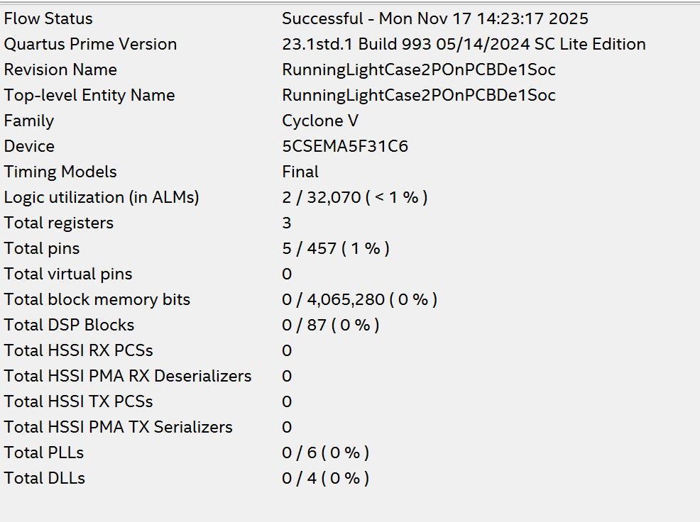

Auch hier sind 3 Register für den State entstanden

#### RTL

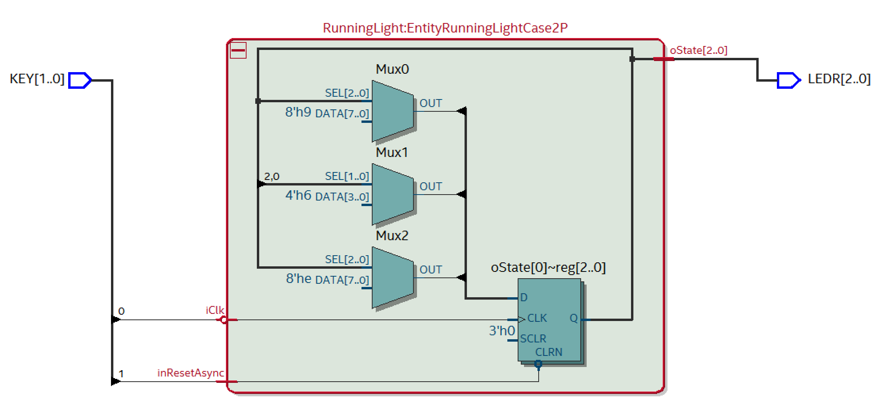

#### Techmap

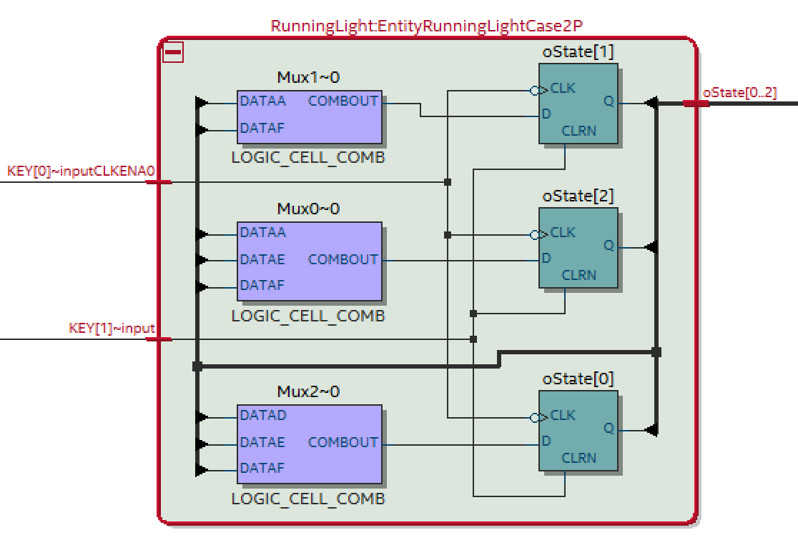

In der Technologie Map fällt auf, dass für die Realisierung des Muliplexers MUX1 nur 2 Inputs des LUTs verwendet werden. Hier wird vermutlich durch die Beschreibung mittels Case besser optimiert. (when others => Nstate <= 'XXX')

#### Warnings

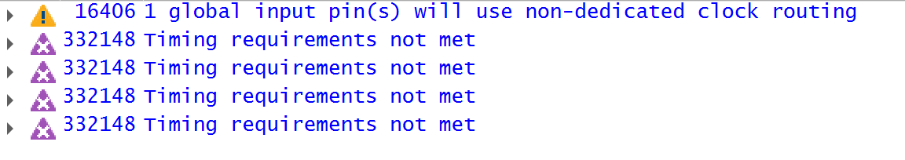

### Synthese OneProcessCase

#### Boardadapter
>```vhdl
>architecture Struct of RunningLightCase1POnPCBDe1Soc is
>signal KeyPosLogic : std_ulogic_vector(KEY'range);   
>begin 
>
>-- Instantiate Entity
>EntityRunningLightCase2P : entity work.RunningLight(OneProcessWithCase)
>port map (
>    iClk          => KeyPosLogic(0),         
>    inResetAsync  => KeyPosLogic(1),  
>    oState        => LEDR
>);
>
>-- Convert Negative Logic from the board to pos logic
>KeyPosLogic <= not KEY;
>
>end Struct; 

#### Compilation Report

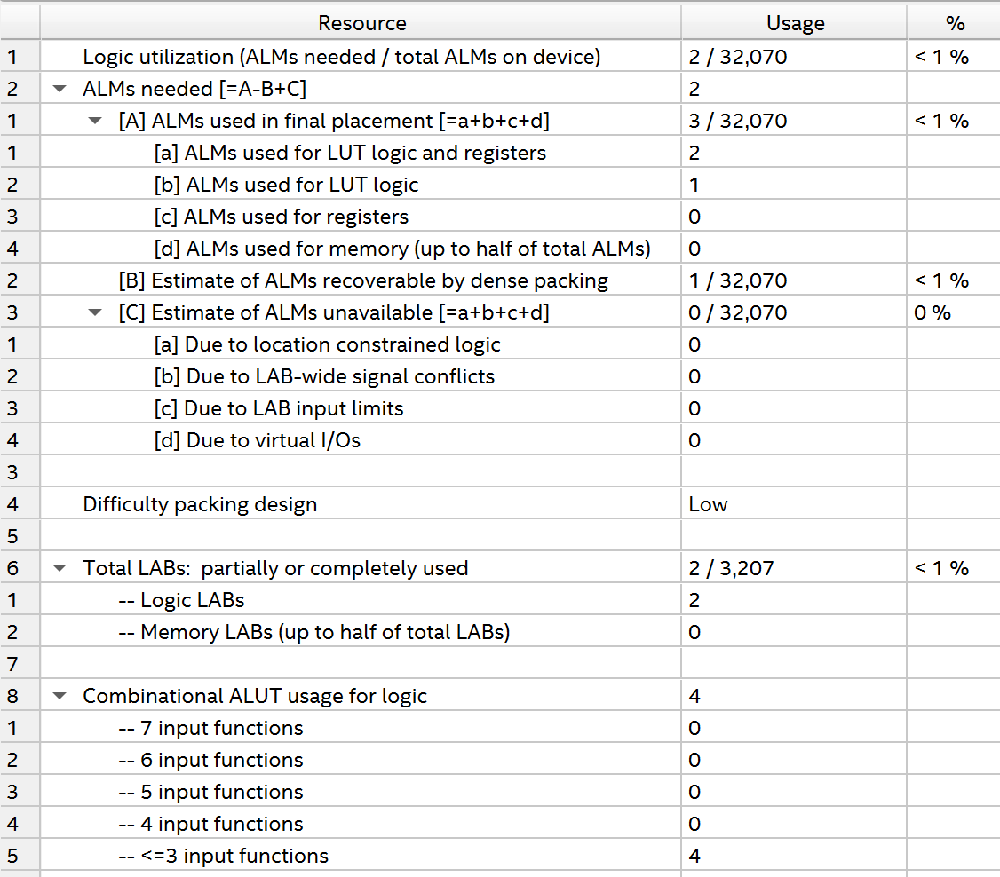

Auch hier sind 3 Register für den State entstanden

#### RTL

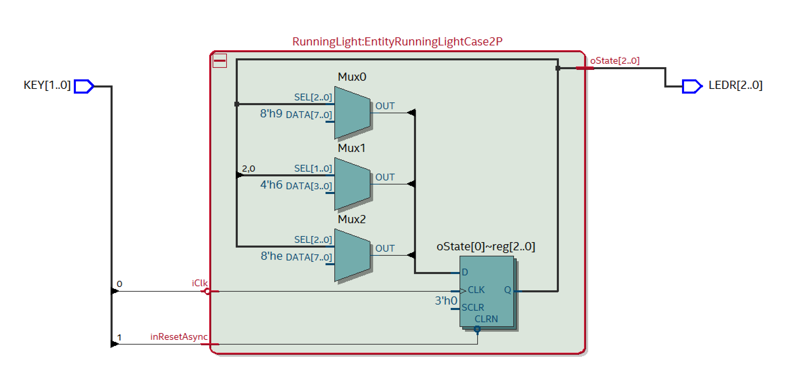

#### Technologiemap

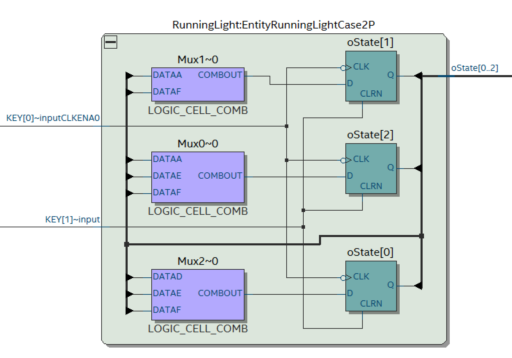

Auch hier entsteht die gleiche Hardware wie in den anderen Beschreibungen.

#### Warnings

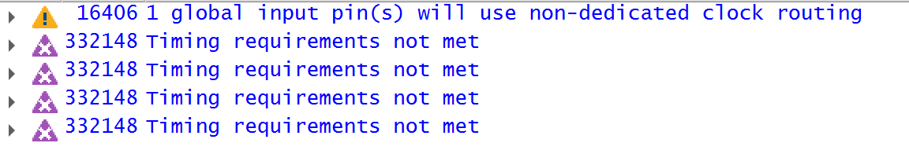

## Aufgabe 2 Speed of Light

### F MAX Timing Analyzer
Model Slow 85°C:

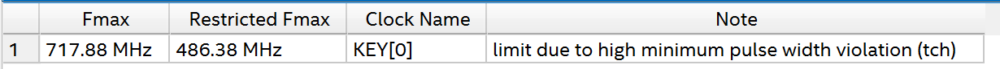

Im Timing Analyzer unter Report Fmax Summery ist die maximale Taktfrequenz des Designs zu sehen.
Hier wird eine Frequenz von 486Mhz angezeigt (Restricted FMAX).
Somit wäre ein Betrieb mit dem internen 50 Mhz Takt durchaus möglich.

Die Periodendauer eines Taktes mit der Frequenz \( f = 50\,\text{MHz} \) beträgt

\[
T = \frac{1}{f}
  = \frac{1}{50 \cdot 10^{6}\,\text{Hz}}
  = \frac{1}{5 \cdot 10^{7}}\,\text{s}
  = 0{,}2 \cdot 10^{-7}\,\text{s}
  = 2 \cdot 10^{-8}\,\text{s}
  = 20\,\text{ns}.
\]

Damit existiert jeder Zustand des Lauflichts nur für \(20\,\text{ns} \).

Daraus resultiert, dass das Blinken der LEDs sehr sehr schnell wäre. Dies wurde mit dem Auge nicht mehr als Blinken zu erkennen. Man würde nur ein LED leuchten sehen. 

#### FMAX vs Restricted FMAX
Da aus dem Kontext von Quartus nicht genau ermittelst werden kann wo hier der Unterschied zwischen den 2 FMAX Taktranten ist wurde hier eine Recherche vollzogen.

##### FMAX
Dies ist die maximal mögliche Taktrate, die sich ausschließlich aus den reinen Setup- und Hold-Pfad-Verzögerungen ergibt.

- Es berücksichtigt nur die kombinatorische Logik zwischen Registern.

##### FMAX Restricted 
Dies ist die real zulässige maximale Frequenz, nachdem zusätzliche Timing-Beschränkungen berücksichtigt wurden, darunter:

- Minimum pulse-width (t<sub>high</sub>, t<sub>low</sub>)
- Clock jitter
- Duty-Cycle-Beschränkungen
- Clock transfer limitations

#### Report Fmax Summary Quartus Doku

In der Quartus Doku wurde folgendes gefunden:

The Timing Analyzer's Reports > Datasheet > Report Fmax Summary command reports the maximum frequency of each clock in your design. The equivalent scripting command is report_clock_fmax_summary.

The Timing Analyzer computes fMAX for all paths where the same clock drives the source and destination registers or ports. The Timing Analyzer ignores paths of different clocks and generated clocks. For paths between a clock and its inversion, the Timing Analyzer computes fMAX as if the rising and falling edges scale along with fMAX, such that the duty cycle (in terms of a percentage) is maintained. You must constrain all clocks for accurate timing analysis.

The Restricted Fmax can indicate a "Limit due to hold check." Typically, hold checks do not limit the maximum frequency (fMAX) because these checks are for same-edge relationships, and therefore independent of clock frequency. An example of this occurs when launch equals zero and latch equals zero. However, with an inverted clock transfer, or a multicycle transfer (such as setup=2, hold=0), then the hold relationship is not a same-edge transfer and changes with the clock frequency.

Dies gibt auch einen Hinweis wo der Unterschied zwischen den 2 Angaben liegt.

## Aufgabe 3 Counter

>```vhdl
>architecture RTL of Counter is
>begin
>
>process (iClk,inResetAsync) is 
>begin
>
>  if(inResetAsync = not('1'))then
>    oCount <= (others => '0');
>  elsif(rising_edge(iClk)) then
>    oCount <= (oCount + 1) mod (2**gCountBitWidth);
>  end if;
>
>end process;
>
>end architecture RTL;

Hier wurde ein Counter mittels einem Process beschrieben.
Mittels **mod** Funktion, wie in der Angabe gefordert, wird der Überlauf von oCount verhindert.
Weiters wurde noch ein Resetsignal implementiert welches den Counter auf 0 zurücksetzt.

#### Berechnung der Bitbreite
In der Angabe wird gefordert, dass ein die Periodendauer des obersten Bits minimal 1 Sekunde lang dauert.

Gegeben ist ein Takt mit der Frequenz
\[
f_\text{clk} = 50\,\text{MHz} = 50 \cdot 10^{6}\,\text{Hz}.
\]

Das oberste Bit des Zählers soll nicht häufiger als einmal pro Sekunde von 0 -> 1 bzw. von 1 -> 0 wechseln, daher muss seine maximale Frequenz betragen:
\[
f_\text{MSB} \le 1\,\text{Hz}.
\]

Damit ergibt sich eine minimale Periodendauer des obersten Bits von
\[
T_\text{MSB} = \frac{1}{f_\text{MSB}}
             = \frac{1}{1\,\text{Hz}}
             = 1\,\text{s}.
\]

Die Anzahl der benötigten Zählerstände für eine Zeitdauer von \(1\,\text{s}\) beträgt
\[
N_\text{counts} = f_\text{clk} \cdot T_\text{MSB}
                = 50 \cdot 10^{6} \cdot 1
                = 50 \cdot 10^{6}.
\]

Gesucht ist nun die minimale Bitanzahl \(n\), mit der man mindestens den Zählerstand von \(50 \cdot 10^{6}\) darstellen kann.
Dazu muss gelten:

\[
2^{n} \ge 50 \cdot 10^{6}.
\]

Da der Überlauf auch eine Taktperiode beansprucht fällt hier das -1 weg. 
z.B. Counter mit Länge 1: maximaler Wert des Counter = 1;
Zustände des Counters: 0->1->0 Aus diesem Zusammenhang wird klar, dass immer \(2^n\) Perioden bis zum Zählerwert 0 vergehen.

Prüft man \(n = 26\), erhält man:
\[
2^{26} = 67\,108\,864 \ge 50\,000\,000.
\]

Damit ist die kleinste zulässige Bitbreite
\[
\boxed{n = 26}.
\]

Mit der Bitbreite von 26 ergibt sich eine Frequenz des MSB von:
\[
f_\text{MSB} = \frac{f_\text{clk}}{2^{n}}
                =  \frac{50 \cdot 10^{6}}{2^{26}}
                = 745 \text{mHz}.
\]
\[
T_\text{MSB} = \frac{1}{f_\text{MSB}}
             = \frac{1}{745\,\text{mHz}}
             = 1,34\,\text{s}.
\]

Die genaue Periodendauer für das oberste Bit beträgt bei einer Bitbreite von 26 Bit 1.34s.

### Simulation und Verifikation

>```vhdl
>architecture Testbench of Counter_TB is
>    constant cBitWidth   : natural := 26;
>    signal Clk           : std_ulogic := '0';
>    signal nResetAsync   : std_ulogic;
>    signal Counter       : unsigned(cBitWidth downto 1);
>begin
>
>Entity_Counter : entity work.Counter(RTL)
>generic map (
>    gCountBitWidth => cBitWidth
>)
>port map (
>    iClk         => Clk,
>    inResetAsync => nResetAsync,
>    oCount       => Counter
>);
>
>-- generate 50 Mhz Clock
>clkgen: clk <= not clk after 10 ns;
>  
>stimul: process is 
>begin
>    nResetAsync <= '0';
>    wait for 10 ns;
>    nResetAsync <= '1';
>    wait;
>end process;
>
>end Testbench;

Mittels dieser Testbench kann das Verhalten in der Waveform beobachtet werden.
Auch die korrekte Funktion des Counters kann mittels der Wave geprüft werden. Hier wird zuerst die Funktion des Resets geprüft.

#### Waveform
Hier ist das Reset-Verhalten in der Wave zu sehen.
.png)

Hier kann der Überlauf des 8Bit Counters zu sehen.
.png)

In der Simulation wurde die Bitbreite des Counters auf 8 Bit reduziert, da sonst die Simulationsdauer enorm lang wäre.

Für den 26 Bit Counter dauert ein Simulationszeitschritt von 100ms in Questasim auf meinem Laptop 26 Sekunden.
Um einen Überlauf des Counter zu simulieren müssen 1.34 Sekunden simuliert werden. 
Durch Hochrechnung wird hier von einer Rechenzeit der Simulation von 348 Sekunden also mehr als 5 Minuten ausgegangen!


### PCB Adapter

>```vhdl
>architecture Struct of CounterOnPCBDe1Soc is
>    constant cCounterWidth : natural := 26;
>    signal KeyPosLogic : std_ulogic_vector(KEY'range);   
>    signal Counter : unsigned(cCounterWidth downto 1);
>begin 
>
>-- Instantiate Entity ShiftRegister
>EntityCounter : entity work.Counter(RTL)
>generic map (
>    gCountBitWidth => cCounterWidth
>)
>port map (
>    iClk          => CLOCK_50,         
>    inResetAsync  => KeyPosLogic(0), 
>    oCount        => Counter
>);
> -- Assign the upper 10 bit of the Counter to the LEDs
>LEDR <= std_ulogic_vector(Counter(cCounterWidth downto cCounterWidth - LEDR'high));
>
>-- Convert Negative Logic from the board to pos logic
>KeyPosLogic <= not KEY;
>
>end Struct; 

Nun wird der Counter am Board mittels PCB Adapter realisiert.

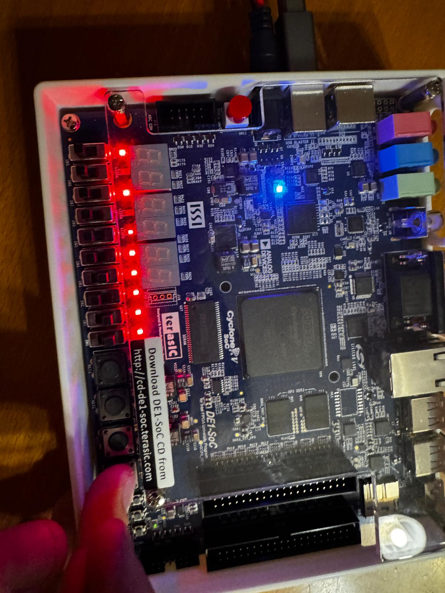

Das Design wurde nun aufs Board transferiert und mittels Stoppuhr die Frequenz des MSB geprüft.

### Anzahl der entstandenen FlipFlop

Wird die folgende Option im QSF File auskommentiert entstehen bei der Synthese mehr Flipflops als wirklich benötigt werden.

>set_global_assignment -name ALLOW_REGISTER_DUPLICATION OFF

Der Grund dafür ist, dass defaultmäßig das Design auf einen Targetclock von 1GHz optimiert wird zu synthetisieren. Aus diesem Grund werden Zusatz FlipFlops eingefügt um die Taktfrequenz zu erhöhen.

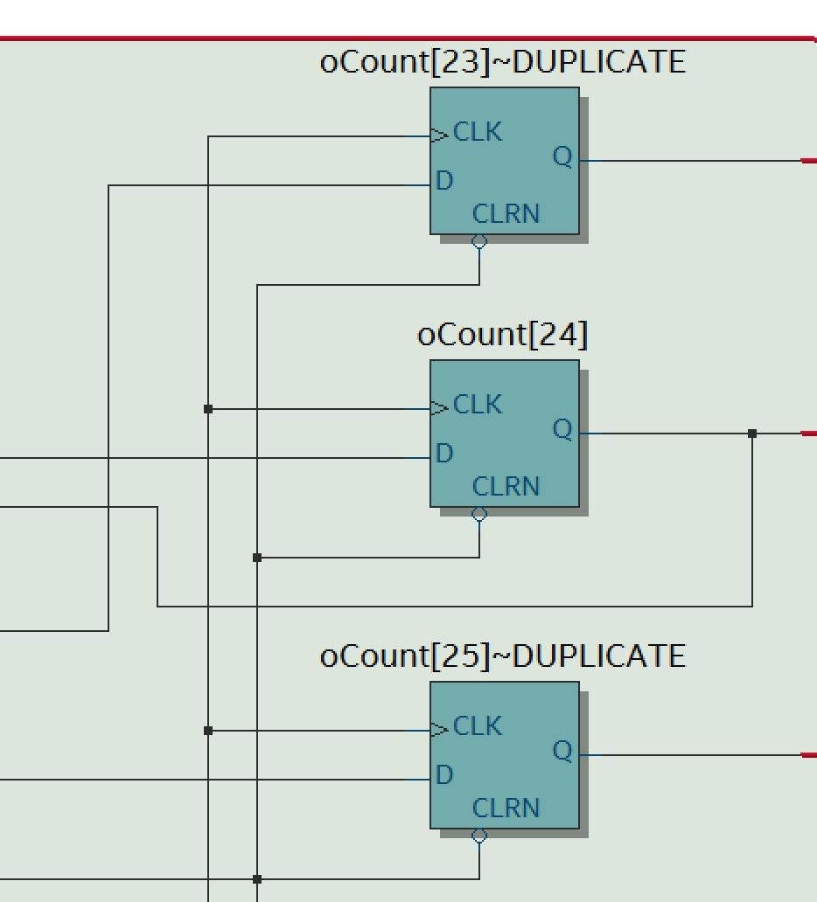

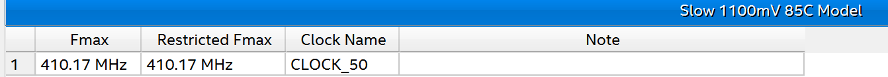

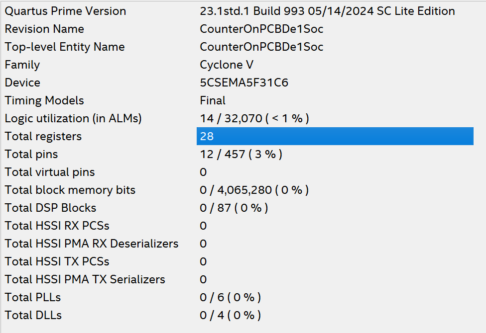

Hier wurde festgestellt das 28 statt den wirklich benötigten 26 Flipflops erstellt werden.

Wird die Option wieder aktiviert erhält man folgendes Ergebnis:

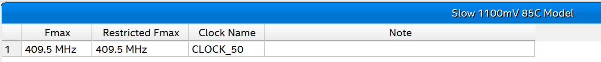

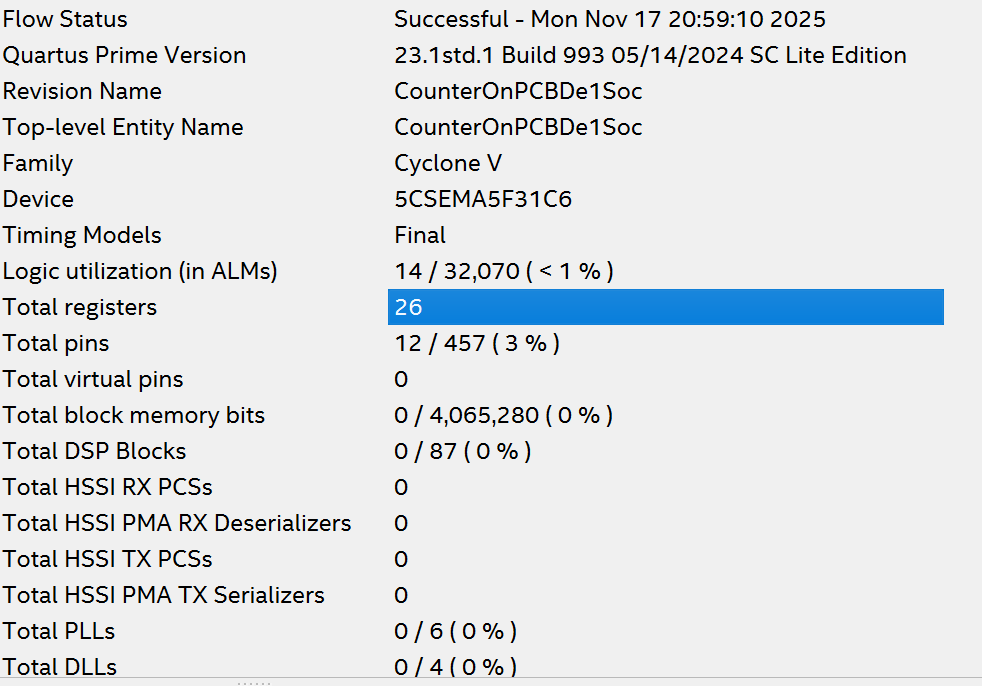

Nun entstehen 26 FlipFlops.
Jedoch ist auch die maximale Taktfrequenz geringfügig kleiner. Ca 600kHz weniger.

