# Übung 8 Simon Offenberger S2410306027  
## Aufgabe 1 Timing Analyse
### Berechnung der maximalen Durchlaufzeit

Für die Berechnung der maximalen Durchlaufzeit, muss von der Periodendauer des Taktes noch die Clock to Q Zeit und die Setup-Zeit abgezogen werden. 

$$
t_{\text{max}} = T_{\text{clk}} - t_{\text{clk}\rightarrow\text{Q}} - t_{\text{setup}}
$$

Diese Bedienung gilt allerdings nur wenn der Takt an jeden Flipflop der gleiche ist. 

### Berechnung der maximalen Zeit mit unterschiedlichen Takte

Soll nun die Berechnung für die maximale Zeit zwischen zwei Flip Flop mit unterschiedlichen Takten vollzogen werden, müssen Annahmen getroffen werden.

Die zwei Takte dürfen nicht völlig asynchron zueinander sein, ansonsten kann keine Aussage über eine maximale Durchlaufzeit einer Kombinatorik zwischen den 2 Flip Flops getroffen werden.

Sind die Takte jedoch fix durch eine Phasenbedingung oder durch einen Faktor zueinander Synchron, kann für die kürzeste Zeit zwischen den beiden Taktflanken, die längste zulässige Zeit für den kombinatorischen Pfad bestimmt werden.

### Counter: Timing Analyse 

Defaultmäßig wird von Quartus der Clock mit 1Ghz angenommen.
Diese Taktfrequenz kann jedoch vom Cyclone 5 nicht erreicht werden.
Dies ist im Fenster Clocks des Timing Analyzers zu sehen.

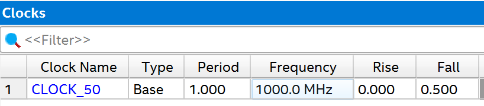

Die Info über das nicht Erreichen des Target Taktes wird in Form einer Critical Warning gemeldet.

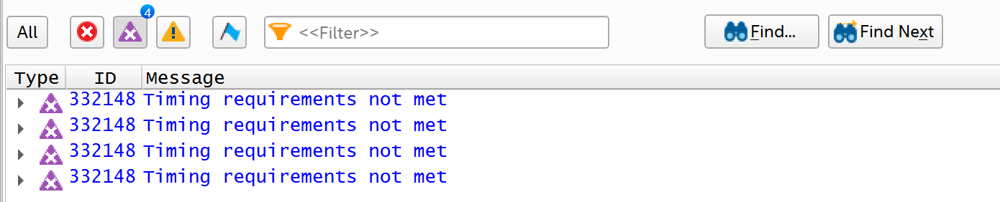

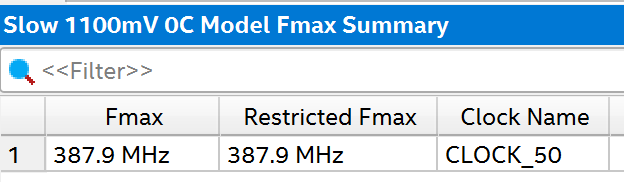
Die maximal erreichte Taktfrequenz kann im FMAX Summery abgelesen werden.
Hier wird gemeldet, dass eine maximale Frequenz von 387.9 MHz erreicht wird.

Nun kann Quartus über das SDC File vorgegeben werden wie schnell der Takt im Design ist.
Hier wird folgender Eintrag ins SDC File hinzugefügt:

>```TCL
>create_clock -name iClk -period 20 [get_ports {CLOCK_50}]
>derive_clock_uncertainty

### Unconstrained Paths
Nach einem weiteren Synthese-Durchlauf sind noch immer in Timing-Analyzer rot markierte Felder.
Diese Fehler beziehen sich auf die unconstrained Paths in der Timinganalyse.
Durch Aufklappen dieses Feldes lässt sich eine Zusammenfassung der unconstrained Paths anzeigen.

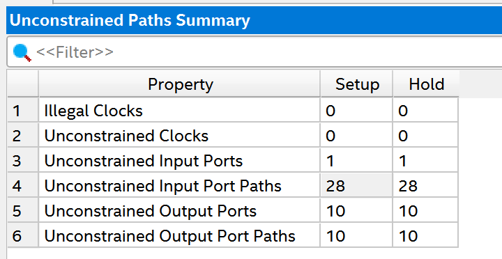

Hier ist ersichtlich, dass 1 Input Port bzw. 10 Output Ports noch unconstrained sind.
Diese lassen sich im Timing Analyser auch ermitteln.

#### Unconstrained Input Ports
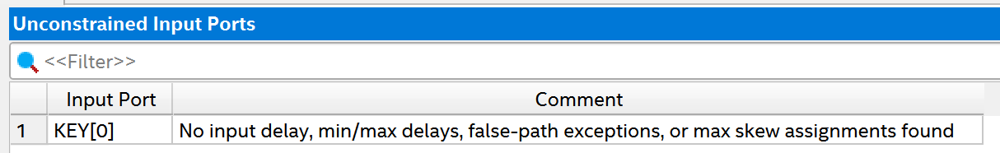

#### Unconstrained Output Ports


In diesen Reports wird auch angegeben welche Eigenschaften der Ports für die vollständige Timing Analyse fehlen!

## Aufgabe 2 Missbrauch des asynchronen Reset-Eingangs

Folgende Implementierung war in der Aufgabenstellung vorgegeben:

>```vhdl
>library ieee;
>use ieee.std_logic_1164.all;
>use ieee.numeric_std.all;
>use work.global.all;
>
>entity CounterAsyncZero is
>generic(
>gClkFrequency : natural := 50E6);
>port (
> inResetAsync : in std_ulogic;
> iClk : in std_ulogic;
> oCountedTo : out unsigned(LogDualis(gClkFrequency)-1 downto 0));
> end entity CounterAsyncZero;

>```vhdl
>architecture Rtl of CounterAsyncZero is
>signal Counter : unsigned(oCountedTo’range) := (others => ’0’);
>begin
>
>process (iClk, inResetAsync, Counter) is
>begin
>if inResetAsync = not(’1’) or to_integer(Counter)=gClkFrequency then
>Counter <= (others => ’0’);
>elsif rising_edge(iClk) then
> Counter <= Counter+1;
> end if;
> end process;
>
> oCountedTo <= Counter;
>
> end architecture Rtl;

### Mit welcher Rate (Anzahl pro Sekunden) tritt bei diesem Zähler der Wert 0 auf?

Durch Analyse des VHDL Codes lassen sich folgende Aussagen treffen:

- **Maximaler Zählerstand** = gClkFrequency -1 (Da bei gClkFrequency Wert ohne Delay der Reset angewandt wird)
- **Frequenz von iClk** lässt sich nicht eindeutig bestimmen, da der PCB Adapter nicht gegeben ist! Wird allerdings angenommen dass mit gClkFrequency die Frequenz von iClk gemeint ist so lässt sich dieser Wert auf 50MHz fixieren.
- **Reset Wert** = 0


Aus diesen Daten lässt sich die Frequenz des Zustandes oCountedTo = 0 ermitteln:

\[
f_{\text{Zero}} = \frac{f_{\text{Clk}}}{MaxCounterVal + 1 - CounterResetValue}
\]

\[
f_{\text{Zero}} = \frac{50 MHz}{50 *10^6 - 1 + 1 - 0} = \frac{50 * 10^6 Hz}{50 *10^6} = 1 Hz
\]

Somit beläuft sich die Frequenz mit der der Zustand oCountedTo = 0 auftritt auf 1 Hz.

Die 1Hz ergeben sich allerdings nur unter der Annahme dass die Kombinatorik ohne Verzögerungszeit arbeitet!
Ansonsten geschieht die Zuweisung Counter <= Counter +1 , Counter <= 0 (Reset durch erreichen des max Werts) nicht zeitgleich!  

### Simulation

In der Simulation wird bis zum Zeitpunkt des Überlaufs simuliert.
Hier wird in der List View die Zustände des Counters aufgelistet, hier sind auch die Delta Cycles abgebildet:

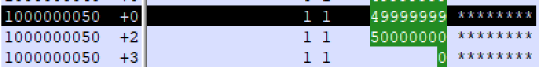

Hier tritt der Zwischenwert 50 000 000 auf.
Dieser Wert existiert in der Simulation genau für einen Delta Cycle.
In der Realität würde dieser Zwischenwert jedoch für die Verzögerungszeit der Zuweisung auftreten.

### Synthese

#### Warnings
Hier sind die Warnings die bei der direkten Synthese, also ohne Boardadpter, auftreten abgebildet.
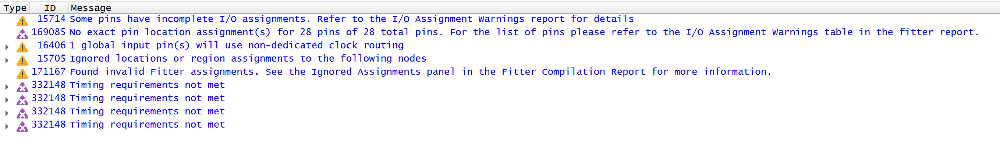

Hier entstehen nur Warnings bezüglich, den nicht angeschlossenen Ports und den nicht definierten Clock.
Also warnt hier Quartus nicht von dem Missbrauch des Reset Eingangs des Flipflops.

#### RTL Viewer
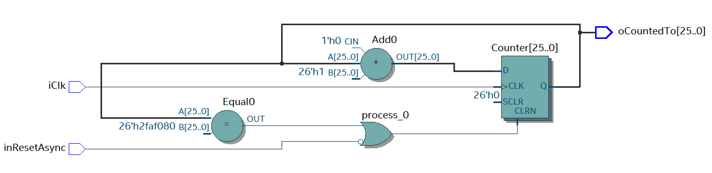

Im RTL-Viewer ist klar zu erkennen, dass hier der CLRN Eingang der FlipFlops nichtnur durch das inResetAsync Signal beeinflusst wird sondern auch durch den Ausgang des Equal Blocks. Dieser Block stellt die in der IF eingefügte Bedingung des Resets dar.

#### Warum darf das Clear Signal am Eingang der FlipFlops keine statischen Hazards aufweisen?
Durch einen statischen Hazard wurde z.B. der Clear Eingang der FlipFlops kurzzeitig aktiv werden und somit den Zählerstand wieder rücksetzen, obwohl dies nicht gefordert ist! Also wäre die Folge eine Fehlfunktion.

#### Garantieren VHDL-Entwurf bzw. Synthese diese Bedingung?
Damit diese Bedingung erfüllt ist müsste der Ausgang von Equal 0 frei von statischen Hazards sein. Dies kann jedoch nicht garantiert werden!

#### Timing Analyse

Die Timing Analyse git hier folgende Werte aus. Also kann der Timing Analyser diese Schaltung beurteilen.

.png)
.png)

#### Synchroner Entwurf
Nun wurde das Design von vorhin umgeändert auf einem synchronen Entwurf.
Hier wurde das Rücksetzen das Zählerwerts Synchron zum Takt vollzogen.

>```vhdl
>architecture Rtl of CounterSyncZero is
>  signal Counter : unsigned(oCountedTo'range) := (others => '0');
>begin
>
>  process (iClk, inResetAsync) is
>  begin
>    if inResetAsync = not('1') then
>      Counter <= (others => '0');
>    elsif rising_edge(iClk) then
>      if(to_integer(Counter+1) = gClkFrequency) then
>        Counter <= (others => '0');
>      else
>        Counter <= Counter + 1;
>      end if;
>    end if;
>  end process;
>
>  oCountedTo <= Counter;
>
>end architecture Rtl;


#### Simulation
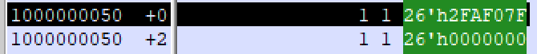
Hier kann im List Fenster der Simulation der Überlauf des Zählers beobachtet werden.
Auffällig ist, dass hier kein Zwischenwert beim Überlauf entsteht.

#### RTL Viewer

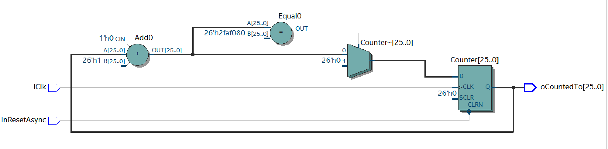

Im RTL-Viewer ist nun die Funktionalität des Überlaufes mithilfe des Multiplexers am Eingang der FlipFlops abgebildet. Hier wird abhängig vom Zählerstand der aktuelle Wert +1 oder 0 am Eingang der Flipflop angelegt.

## Aufgabe 3 Missbrauch von Takteingängen
Gegeben ist folgende Implementierung:

>```vhdl
>library ieee;
>use ieee.std_logic_1164.all;
>use ieee.numeric_std.all;
>
>entity CounterKeyEventZero is
>generic(
>-- Clock: 50 MHz : 26 bits are needed to make the MSB cycle >rough its
>-- pace in more than 1 s
>gCounterBitLength : natural := 26);
> port (
> inResetAsync : in std_ulogic;
> iClk : in std_ulogic;
> iKey : in std_ulogic;
> oCountedTo : out unsigned(gCounterBitLength-1 downto 0));
> end entity CounterKeyEventZero;

>```vhdl
>architecture Rtl of CounterKeyEventZero is
>
>signal Counter : unsigned(oCountedTo’range) := (others => ’0’);
>
>begin
>
>process (iClk, iKey, inResetAsync) is
>begin
>if inResetAsync = not(’1’) then
>
> Counter <= (others => ’0’);
> elsif rising_edge(iClk) then
> Counter <= Counter+1 mod 2**gCounterBitLength;
> elsif rising_edge(iKey) then
> Counter <= (others => ’0’);
> end if;
> end process;
>
> oCountedTo <= Counter;
>
> end architecture Rtl;

Hier wird zusätzlich zum Takt noch bei einer steigenden Flanke von iKey der Zählerstand verändert.

### Sythese 
Wird dieses Design in die Synthese geschickt erhält man von Quartus folgende Fehlermeldungen:
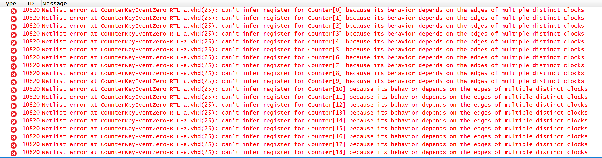

Hier wird von Quartus ausgegeben, dass für die Signale von counter[x] kein FlipFlop erzeugt werden kann, da dessen Wert abhängig von 2 unterschiedlichen Takte ist.

### Korrektes Design

Das Design wurde auf folgenden synchronen Entwurf geändert:

>```vhdl
>architecture Rtl of CounterKeyEventZeroSync is
>	
>	signal Counter     : unsigned(oCountedTo'range) := (others => '0');
>	signal NextCounter : unsigned(oCountedTo'range) := (others => '0');
>
>begin
>
>  process (iClk, inResetAsync) is
>  begin
>    if inResetAsync = not('1') then
>      Counter <= (others => '0');
>    elsif rising_edge(iClk) then
>        Counter <= NextCounter;
>    end if;
>  end process;
>
>process (iKey,Counter)
>begin
>
>  if(iKey = '1') then
>    NextCounter <= (others => '0');
>  else
>    NextCounter <= Counter + 1 mod 2 ** gCounterBitLength;
>  end if;
>  
>  end process;
>  
>oCountedTo <= Counter;
>  
>end architecture Rtl;

Hier wurde die Funktionalität des Resets über den Port iKey in einem eigenen Process ausgelagert. In diesem Process wird auch die Berechnung des nächsten Zählerwerts vollzogen.

## Aufgabe 4 Gated Clock

Hier wurde folgenden Implementierung in der Aufgabenstellung bereitgestellt.
Hierbei wird der Clock Eingang der Flipflops für das Einfrieren des Zählerwertes missbraucht.

>```vhdl
>library ieee;
>use ieee.std_logic_1164.all;
>use ieee.numeric_std.all;
>
>entity CounterGatedClk is
>generic(
>-- Clock: 50 MHz : 26 bits are needed to make the MSB cycle through its
>-- pace in more than 1 s
>gCounterBitLength : natural := 26);
> port (
> inResetAsync : in std_ulogic;
> iClk : in std_ulogic;
> iEnable : in std_ulogic;
> oCountedTo : out unsigned(gCounterBitLength-1 downto 0));
> end entity CounterGatedClk;

>```vhdl
>architecture Rtl of CounterGatedClk is
>
>signal Clk : std_ulogic;
>signal Counter : unsigned(oCountedTo’range) := (others => ’0’);
>
>begin
>
>Clk <= iClk when iEnable = ’1’ else
>’0’;
>
> process (Clk, inResetAsync) is
> begin
> if inResetAsync = not(’1’) then
>
> Counter <= (others => ’0’);
> elsif rising_edge(Clk) then
> Counter <= Counter+1 mod 2**gCounterBitLength;
> end if;
> end process;
>
> oCountedTo <= Counter;
>
> end architecture Rtl;

### Synthese 
Nun wurde das vorgegebene Design in die Synthese geschickt und das Ergebnis analysiert.

### RTL Viewer

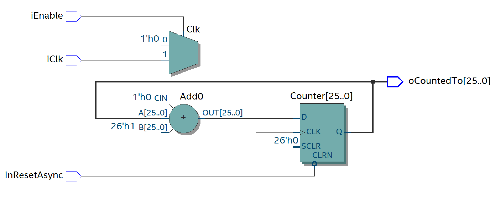

### Technologie Map

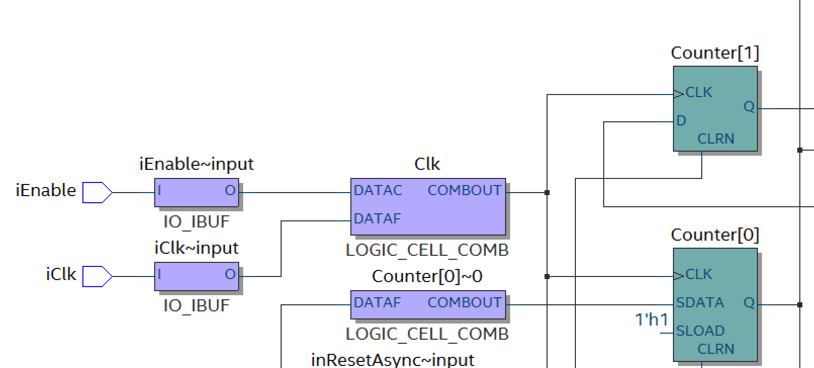

In den Ansichten des RTL Viewer und Technologie Map Viewer ist klar die kombinatorische Verknüpfung zwischen iClk und iEnable zu beobachten.
Die Steuerung des Clock Signals der Flip Flops wird in der Synthese mittels Multiplexer abgebildet.
### Warnings

Im folgenden Bild sind die von Quartus bei der Synthese generierten Warnings abgebildet.
Hier wurde das Design ohne PCB Adapter synthetisiert, deswegen entstehen hier auch Warnings zu den nicht definierten Ports.

Auffällig ist jedoch, dass Quartus keine Warning zum Clock Gating ausgibt!

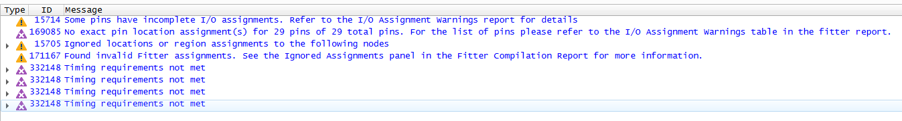

### Synchroner Enable

Hier wurde die Architektur folgendermaßen umkonstruiert.

>```vhdl
>architecture Rtl of CounterSyncEn is
>
>  signal Counter : unsigned(oCountedTo'range) := (others => '0');
>
>begin
>
>
>  process (iClk, inResetAsync) is
>  begin
>    if inResetAsync = not('1') then
>      Counter <= (others => '0');
>    elsif rising_edge(iClk) then
>      if(iEnable = '1') then
>        Counter <= Counter + 1 mod 2 ** gCounterBitLength;
>      else
>       Counter <= Counter;
>      end if;
>    end if;
>  end process;
>
>  oCountedTo <= Counter;
>
>end architecture Rtl;

Hier wird die Funktionalität des Enables mittels Zuweisung des aktuellen Zählerwerts, also einfrieren des Zählerwerts, oder mittels Zuweisung auf den nächsten Zählerwerts realisiert.

### Synthese 

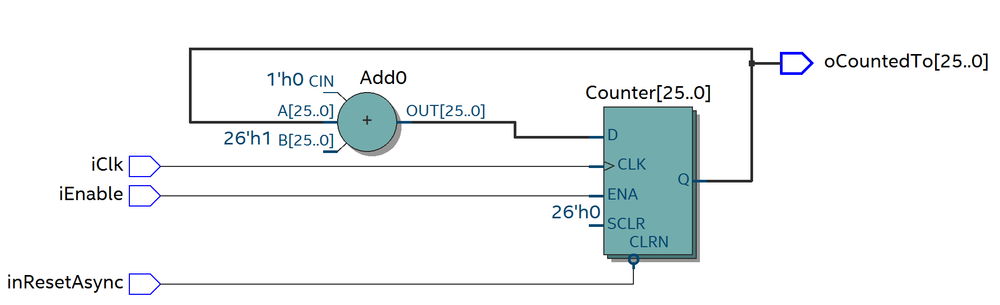

Im RTL Viewer ist zu erkennen, dass nun kein Gated Clock mehr verwendet wird.
Die Realisierung des Enables erfolgt über den Enable Eingang der Flip Flops.
