# Übung 9 Simon Offenberger S2410306027  
## Aufgabe 1 Strobe-Generator
In dieser Übung wurde zur vorgegeben Entity eine Architektur eines StrobeGenerators implementiert.
Diese ist unten abgebildet:

#### Entity
>```vhdl
>library ieee;
>use ieee.std_logic_1164.all;
>use ieee.numeric_std.all;
>use work.Global.all;
>
>entity StrobeGen is
>  generic (
>    gNrClkCycles : natural := 50E6);
>  port (
>    -- Sequential logic inside this unit
>    iClk : in std_ulogic;
>    inResetAsync : in std_ulogic;
>
>    -- Strobe with the above given cycle time
>    oStrobe : out std_ulogic);
>end StrobeGen;

#### Architektur

>```vhdl
>architecture RTL of StrobeGen is
>  constant gCountBitWidth : natural := LogDualis(gNrClkCycles);
>  signal Count : unsigned(gCountBitWidth - 1 downto 0);
>begin
>
>  process (iClk, inResetAsync) is
>  begin
>    if (inResetAsync = not('1')) then
>      Count <= (others => '0');
>      oStrobe <= '0';
>    elsif (rising_edge(iClk)) then
>      if (Count = gNrClkCycles - 1) then
>        Count <= (others => '0');
>        -- Generate strobe pulse
>        oStrobe <= '1';
>      else
>        Count <= Count + 1;
>        oStrobe <= '0';
>      end if;
>    end if;
>
>  end process;
>
>end architecture RTL;

Hier wurde der Zähler aus der vorigen Übung als Basis verwendet.
Für die Generierung des Strob-Signals wird hier der Zählerüberlauf verwendet.
Hier wird das Signal auf '1' gesetzt, bei jeden anderen Zyklus erhält das Signal den Wert '0'.
Somit ist sichergestellt, dass dieses Signal für maximal einer Periodendauer des Taktes aktiv ist.

### LogDualis Funktion
Für die Implementierung des Strobgenerators wird für die Bestimmung der Bitlänge des Counters die Funktion LogDualis benötigt. 
Diese Funktion berechnet den kleinsten exponenten von 2^n der die Darstellung der übergebenen Zahl ermöglicht.
In anderen Worten, die Funktion berechnet den Base 2 Logarithmus einer Zahl und rundet diesen immer auf die nächste ganze Zahl auf.

>```vhdl
>  -- Function LogDualis returns the logarithm of base 2 as an integer.
>  -- Although the implementation of this function was not done with synthesis
>  -- efficiency in mind, the function has to be synthesizable, because it is
>  -- often used in static calcualions.
>  function LogDualis(cNumber : natural) return natural is
>    variable vClimbUp : natural := 1;
>    variable vResult  : natural := 0;
>  begin
>    while vClimbUp < cNumber loop
>      vClimbUp := vClimbUp * 2;
>      vResult  := vResult+1;
>    end loop;
>    return vResult;
>  end LogDualis;

Oben ist diese Funktion aus dem Global Package abgebildet. 
Hier wird auch klar wie diese Funktion den Base 2 Logarithmus berechnet.
Es wird eine Schleife solange durchlaufen bis die n-te Potenz der Zahl 2 höher ist als cNumber.
Somit wird die geringste Potenz die diese Bedingung erfüllt ermittelt.
Dies entspricht Log Base 2 dessen Ergebnis immer aufgerundet wird.

#### Warum muss diese Funktion Synthetisierbar sein?
Diese Funktion muss deswegen synthetisierbare sein, da sie von Synthesetool ausgewertet werden muss.
Sie soll in Synthesefähigen Code auch verwendet werden können.
Außerdem muss diese Funktion in Hardware umgesetzt werden wenn keine Konstante als Parameter übergeben wird.

#### Warum muss diese Funktion nicht zwingend in Hardware effizient abbildbar sein?
Wird diese Funktion nur mit Konstanten verwendet, so wird deren Ergebnis schon im Schritt Elaboration in der Synthese ermittelt. Somit wird nur noch das Ergebnis dieser Funktion in der Synthese verwendet.
Dies ist möglich, da sich der Ergebnis Wert während dem Betrieb der Schaltung nicht mehr verändern kann!

#### Gibt es einen Unterschied zwischen Aufruf mit Konstanten zum Aufruf mit einem Signal?
Ja!
Wie oben schon beschrieben wird beim Aufruf mit einer Konstante der Wert schon während der Synthese ermittelt. 
Wird stattdessen diese Funktion mit einem Signal aufgerufen so kann dieser Schritt nicht während der Synthese vollzogen werden. Das heist die Funktion muss in Hardware abgebildet werden, da sich dessen Ergebnis während dem Betrieb der Schaltung ändern kann.

### Simulation und Verifikation

Nun wurde der Strobgenerator mittels Testbench simuliert und dessen Waveform analysiert.

#### Testbench

>```vhdl
>library ieee;
>use ieee.std_logic_1164.all;
>use ieee.numeric_std.all;
>
>entity StrobeGen_TB is
>end StrobeGen_TB;
>
>architecture Testbench of StrobeGen_TB is
>    constant cNumClkCycles : natural := 50; 
>    signal Clk           : std_ulogic := '0';
>    signal nResetAsync   : std_ulogic;
>    signal Strobe        : std_ulogic;
>begin
>
>Entity_StrobeGen : entity work.StrobeGen(RTL)
>generic map (
>    gNrClkCycles => cNumClkCycles
>)
>port map (
>    iClk         => Clk,
>    inResetAsync => nResetAsync,
>    oStrobe     => Strobe
>);
>
>-- generate 50 Mhz Clock
>clkgen: clk <= not clk after 10 ns;
>  
>stimul: process is 
>begin
>    nResetAsync <= '0';
>    wait for 50 ns;
>    nResetAsync <= '1';
>    wait;
>end process;
>
>end Testbench;

#### Wave

Da in der Testbench der Wert für cNumClkCycles = 50 gewählt wurde, wird für einen Takt 
von 50Mhz eine Strobfrequenz von 1Mhz erwartet.
Dies ist auch in der Wave zu beobachten. 1Mhz entspricht einer Periodendauer von 1µs.

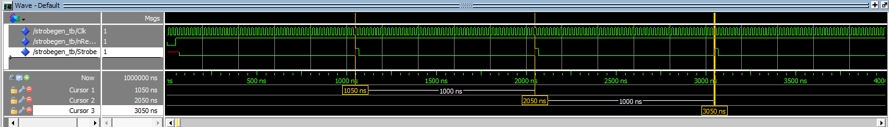


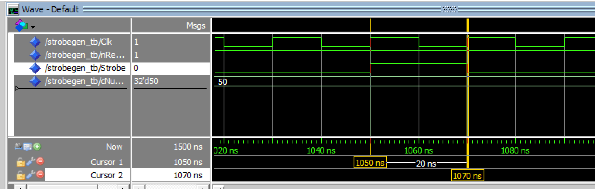

Im obigen Wave Window ist auch zusehen, dass das Strobsignal nur für genau eine Taktperiode aktiv ist.

### Synthese

#### Wieviele Flipflops werden Erwartet

- 1. n Flipflops für die n Bits des Zählers
- 2. 1 Flipflop für die Erzeugung des Strobsignals

In der Synthese wurde auch der Wert für cNumClkCycles = 50 gewählt.
Somit werden für die Darstellung vom Counter 6 bits, bzw. FlipFlops benötigt.
Puls 1 vom Stroboutput ergibt 7.

#### Ressource Summery auf der Synthese

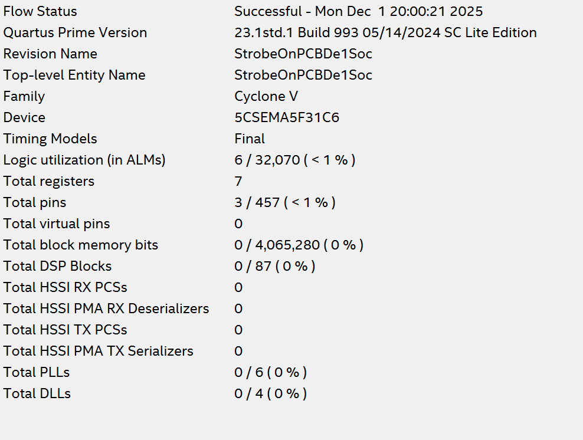

Die Ausgabe der Ressource Summery bestätigt die Vermutung, dass hier 7 Flipflops benötigt werden.

#### RTL Viewer

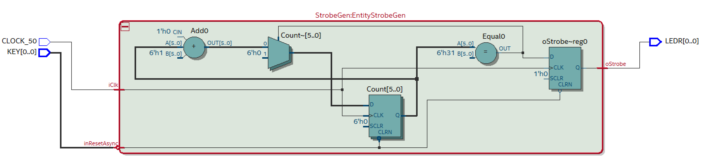

Im RTL Viewer ist klar zu erkennen, dass 6 FlipFlops für die Abbildung des Zählers und 1 Flipflop für das Strobsignal benötigt werden.

#### Technologie Map

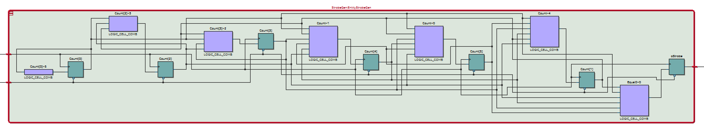

#### Hat es einen Sinn, diese Beschreibung auf dem Board zu testen?

Nein!

Denn die Zeitdauer für die das Strobsignal aktiv ist ist nur maximal eine Periode des Taktes CLOCK_50, also 20ns!!.
Bei so einem kurzem Intervall würde man das Blinken der LED nicht mehr erkennen.
Hier müsste eine sehr geringe "Taktteilung" verwendet werden also cNumClkCycles = 2 oder ähnliches um ein dimes Leuchte an einer LED zu erkennen. Aber die Verifikation am Board hat auch hier keinen Sinn!!.

## Aufgabe 2 Das wahre Lauflicht

### Erweitern der FSM Lauflicht

Nun wird die FSM des Lauflichts um den Eingang iEnalbe erweitert.
IEnalbe aktiviert bzw. deaktiviert die Stateüberführung in den nächsten Zustand.
An diesem Eingang wird später das Strobsignal angelegt.

#### Entitiy

>```vhdl
>library ieee;
>use ieee.std_logic_1164.all;
>
>entity RunningLight is
> port (
>  iClk         : in std_ulogic;
>  inResetAsync : in std_ulogic;
>  iEnable      : in std_ulogic;
>  oState       : out std_ulogic_vector(2 downto 0));
> end RunningLight;

#### Architektur

>```vhdl
>architecture RTL of RunningLight is
>  signal NextState : std_ulogic_vector(oState'range);
>  -- init state 
>  constant cStateAllOff : std_ulogic_vector(oState'range) >:= (others => '0');
>begin
>
>  -- State Register
>  process (iClk, inResetAsync) is
>  begin
>    if (inResetAsync = not('1')) then
>      oState <= cStateAllOff;
>    elsif (rising_edge(iClk)) then
>      if(iEnable = '0') then
>        oState <= oState; -- hold state when not enabled
>      else
>        oState <= NextState;
>      end if;
>    end if;
>  end process;
>
>  -- State Transition Process
>  NextStateLogic : process (oState,iEnable) is
>  begin
>
>    case oState is
>      when "000" => NextState <= "100";
>      when "100" => NextState <= "010";
>      when "010" => NextState <= "001";
>      when "001" => NextState <= "011";
>      when "011" => NextState <= "111";
>      when "111" => NextState <= "000";
>      when others => NextState <= "XXX";
>    end case;
>  end process;
>
>end architecture RTL;

Hier wurde, das Enable Signal so realisiert, dass bei inaktivem Enable der aktuelle State dem nächsten State zugewiesen wird. 

### Anbinden vom Strob-Generators an die Lauflicht FSM

>```vhdl
>architecture Testbench of RunningLight_TB is
>    signal Clk           : std_ulogic := '0';
>    signal State_Case2P  : std_ulogic_vector(2 downto 0);
>    signal nResetAsync   : std_ulogic;
>    signal StrobeSignal  : std_ulogic;
>begin
>
>Entity_RunningLight1 : entity work.RunningLight(RTL)
>port map (
>    iClk         => Clk,
>    inResetAsync => nResetAsync,
>    iEnable      => StrobeSignal,
>    oState       => State_Case2P
>);
>
>EntityStrobeGen : entity work.StrobeGen(RTL)
>generic map (
>    gNrClkCycles => 10
>)
>port map (
>    iClk          => Clk,         
>    inResetAsync  => nResetAsync,            
>    oStrobe       => StrobeSignal
>);

Hier wurde der Ausgang des Strobgenerators an den Enable Eingang der FSM angeschlossen.

###  Das Lauflicht wird mit jedem Strobe den Zustand genau einmal wechseln. Warum genau einmal?

Warum, das so ist sieht man am besten im List Windows des Simulators.

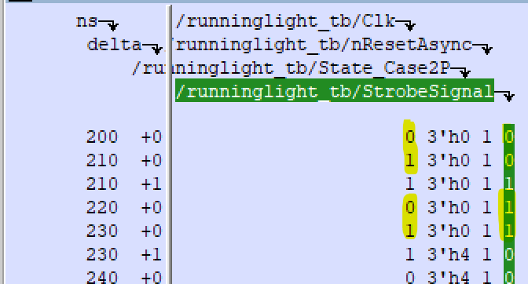

Hier ist genau die Phase im List Windows angezeigt in der das Strobe Signal aktiv wird. Es wird deutlich, dass bei aktivem Strobe nur genau eine Taktflanke am iClk auftritt. Aus diesem Grund wird genau 1 Zustandswechsel vollzogen.

### Simulation und Verifikation

Mittels der automatisierten Testbench aus der vorherigen Übung wurde nun die Funktion des System nachgewiesen.

>```vhdl
>library ieee;
>use ieee.std_logic_1164.all;
>use ieee.numeric_std.all;
>
>entity RunningLight_TB is
>end RunningLight_TB;
>
>architecture Testbench of RunningLight_TB is
>    signal Clk           : std_ulogic := '0';
>    signal State_Case2P  : std_ulogic_vector(2 downto 0);
>    signal nResetAsync   : std_ulogic;
>    signal StrobeSignal  : std_ulogic;
>begin
>
>Entity_RunningLight1 : entity work.RunningLight(RTL)
>port map (
>    iClk         => Clk,
>    inResetAsync => nResetAsync,
>    iEnable      => StrobeSignal,
>    oState       => State_Case2P
>);
>
>EntityStrobeGen : entity work.StrobeGen(RTL)
>generic map (
>    gNrClkCycles => 10
>)
>port map (
>    iClk          => Clk,         
>    inResetAsync  => nResetAsync,            
>    oStrobe       => StrobeSignal
>);
>
>
>clkgen: clk <= not clk after 10 ns;
>  
>stimul: process is 
>begin
>    nResetAsync <= '0';
>    wait for 10 ns;
>    nResetAsync <= '1';
>    wait;
>end process;
>
>
>verify_RST: postponed process (nResetAsync) is
>begin
>
>    if(nResetAsync = '0') then
>        assert(State_Case2P   = "000") report "Failed Reset in Arch: >TwoProcessCase!" severity failure;
>    end if;
>    
>end process;
>
>
>verify_Case2P: postponed process (State_Case2P) is
>    variable prevState : std_ulogic_vector(2 downto 0) := "000";
>begin
>
>    if(nResetAsync = not('0')) then
>        case prevState is
>            when "000"  =>  assert(State_Case2P = "100") report "Wrong >State in Arch: TwoProcessCase!" severity failure;
>            when "100"  =>  assert(State_Case2P = "010") report "Wrong >State in Arch: TwoProcessCase!" severity failure;
>            when "010"  =>  assert(State_Case2P = "001") report "Wrong >State in Arch: TwoProcessCase!" severity failure;
>            when "001"  =>  assert(State_Case2P = "011") report "Wrong >State in Arch: TwoProcessCase!" severity failure;
>            when "011"  =>  assert(State_Case2P = "111") report "Wrong >State in Arch: TwoProcessCase!" severity failure;
>            when others => null;
>        end case;
>    end if;
>
>    prevState := State_Case2P;
>
>end process;
>
>end Testbench;

#### Wave

Hier ist ersichtlich, dass nur Zustandswechsel bei aktivem Strobe vollzogen werden.

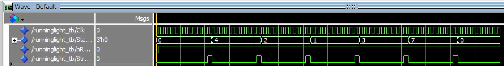

### Synthese

Das Lauflicht inklusive Strobegenerator wurden nun mittels BoardAdapter synthetisiert.

#### Wieviele Flipflops werden erwartet in der Synthese?
Für gNrClkCycles = 50E6.

1. Für den Counter werden 26 bits benötigt -> ceil(log2(50E6)) = 26
2. Für den Strobe Output wird 1 Flipflop benötigt.
3. Für die Abbildung des Zustands der FSM 3 FlipFlops

Also werden in Summe 30 FlipFlops erwartet.

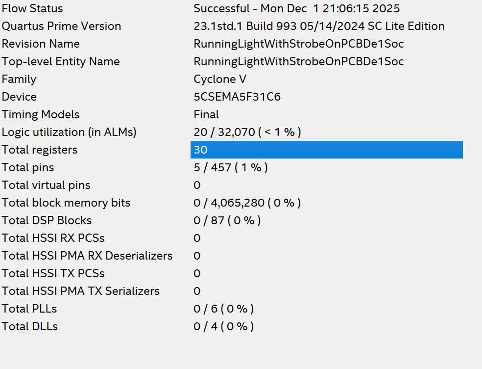

Hier bestätigt die Synthese die Erwartungen

#### RTL Viewer

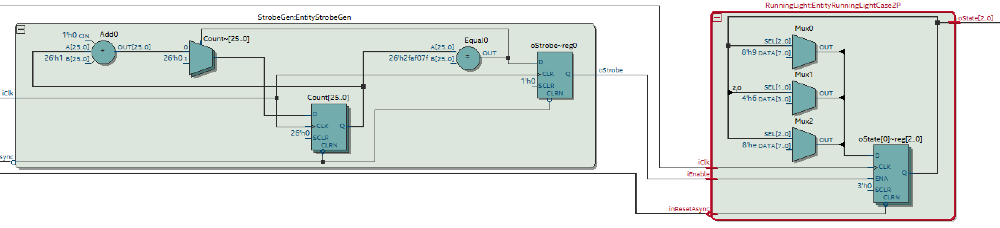

#### Technologie Map

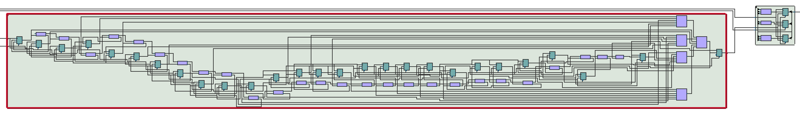

#### Design am Board

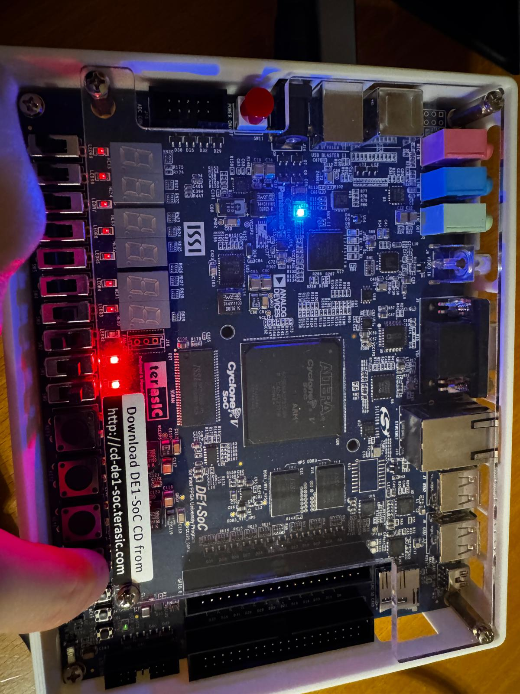

Hier wechselt der Zustand alle 1 Sekunde.

## Aufgabe 3 Asynchrone Eingänge
### Welche Vorkehrungen sind zu treffen beim Verwenden von asynchronen Signalen als Eingänge einer synchronen Schaltung?

Die asynchronen Signale müssen bevor diese an Bereiche der synchronen Schaltung angelegt werden einsynchronisiert werden.
Da diese durch ihre asynchrone Eigenschaft Mehrkomponentenübergänge erzeugen können!

### Synchronizer 

Für die Synchronisierung werden 2 Flipflop Stufen verwendet. Hierbei wird versucht, dass etwaige methastabilitäten nicht in den inneren Schaltungsteil vordringen, und zwischen den 2 FlipFlops wieder abklingen bevor eine 2. Taktflanke auftritt. 
Im wesentlichen handelt es sich hier um ein Schieberegister mit 2 Flipflops. Es können aber auch mehr Flipflops verwendet werden, um die Wahrscheinlichkeit, das das synchronisierte Signal methastabil ist zu verringern.

#### Entity
>```vhdl
>library ieee;
>use ieee.std_logic_1164.all;
>
>entity Sync is
>  generic (
>    gNumOfFFStages : natural := 2);
>  port (
>    iClk : in std_ulogic;
>    inResetAsync : in std_ulogic;
>    iAsync : in std_ulogic;
>    oSync : out std_ulogic);
>end Sync;

#### Architektur


>```vhdl
>architecture RTL of Sync is
>  signal MightMetha : std_ulogic_vector(gNumOfFFStages downto 1);
>begin
>
>
>process (iClk, inResetAsync) is
>  begin
>    if (inResetAsync = not('1')) then
>      MightMetha <= (others => '0');
>    elsif (rising_edge(iClk)) then
>      MightMetha <= MightMetha(gNumOfFFStages-1 downto MightMetha'low) & iAsync;
>    end if;
>end process;
>
>oSync <= MightMetha(MightMetha'high);
>
>end architecture RTL;

### Synthese

Bei der Synthese werden gNumOfFFStages an Flipflops erwartet.
Also mit gNumOfFFStages = 2 werden 2 Flipflops erwartet.

#### Ressource Summery

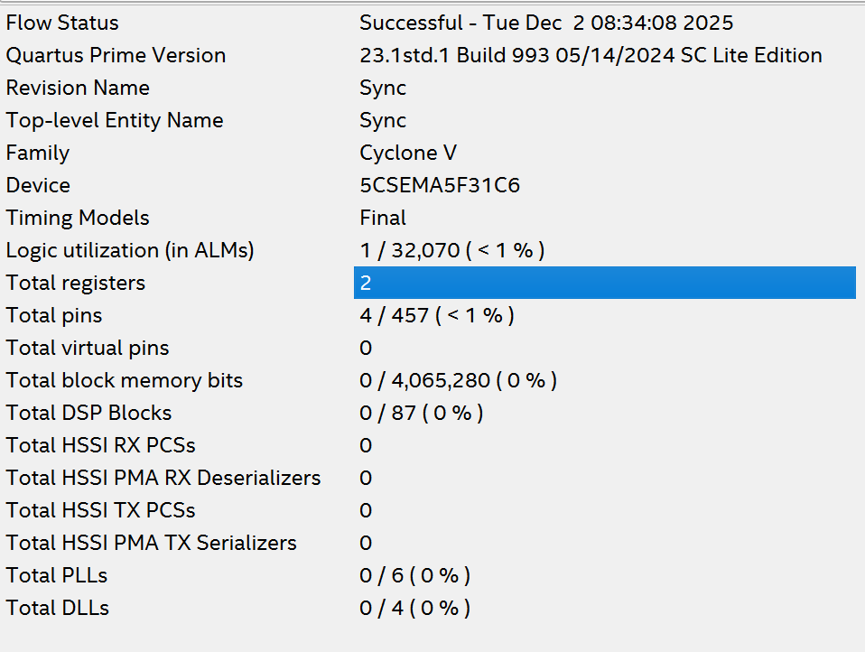

Hier bestätigt die Synthese die Erwartungen

#### RTL Viewer

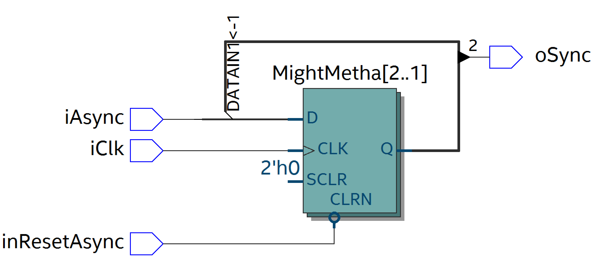

#### Technologie Map

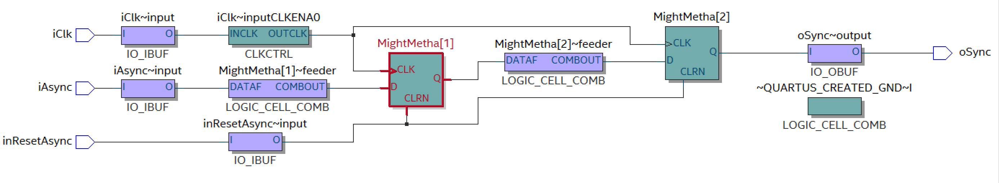

### Einzelschritt Taster als Takteingang

In einer der vorherigen Übungen wurde ein Tastersignal als Clock für die Schaltung verwendet. Handelt es sich hierbei nun um ein Asynchrones oder Synchrones Signal?

Asynchron bzw. synchron sind Eigenschaften, die sich immer auf ein globales Clock-Signal beziehen. In der Übung wurde aber das Tastersignal selbst als Clock benutzt. Damit gibt es keinen übergeordneten Takt, zu dem man das Signal einordnen könnte.

Daher macht die Frage in diesem Kontext eigentlich keinen Sinn:
Wenn der Taster der Clock ist, kann man nicht sinnvoll sagen, ob er asynchron oder synchron zu einem anderen Clock ist – weil es eben keinen anderen gibt. Der Taster ist schlicht der Takt der Schaltung.

### Running Light Only First Four States
Nun wurde das Lauflicht erweitert, dass beim Tastendruck nur die ersten 4 States durchlaufen werden.
Hierfür muss dieses Tastensignal einsynchronisiert werden !

#### Erweiterung der Architektur

>```vhdl
>architecture RTL of RunningLight is
>  signal NextState : std_ulogic_vector(oState'range);
>  -- init state 
>  constant cStateAllOff : std_ulogic_vector(oState'range) := (others => '0');
>begin
>
>  -- State Register
>  process (iClk, inResetAsync) is
>  begin
>    if (inResetAsync = not('1')) then
>      oState <= cStateAllOff;
>    elsif (rising_edge(iClk)) then
>      if(iEnable = '0') then
>        oState <= oState; -- hold state when not enabled
>      else
>        oState <= NextState;
>      end if;
>    end if;
>  end process;
>
>  -- State Transition Process
>  NextStateLogic : process (oState,iEnable,iOnlyFirstFour) is
>  begin
>
>    case oState is
>      when "000" => NextState <= "100";
>      when "100" => NextState <= "010";
>      when "010" => NextState <= "001";
>      when "001" => 
>        if(iOnlyFirstFour = '1') then
>          NextState <= "000"; -- continue with the First State
>        else
>          NextState <= "011"; -- continue with next State
>        end if;
>      when "011" => NextState <= "111";
>      when "111" => NextState <= "000";
>      when others => NextState <= "XXX";
>    end case;
>
>  end process;
>
>end architecture RTL;


#### Ressource Summery

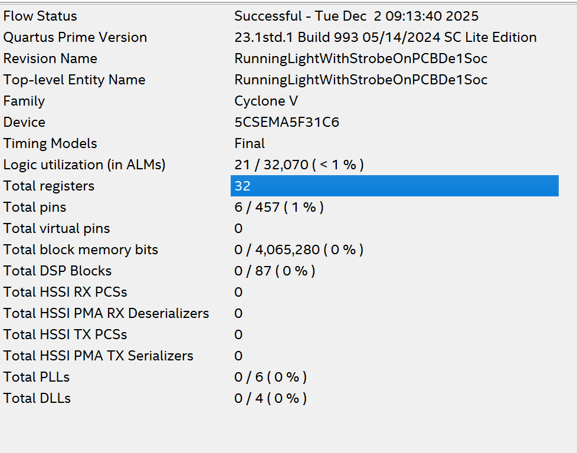

Durch die Erweiterung um den Eingang iOnlyFirstFour wird die Anzahl der Flipflops nicht beeinflusst.
Aus diesem Grund wird hier auch mit 32 Flipflops gerechnet.

#### RTL Viewer

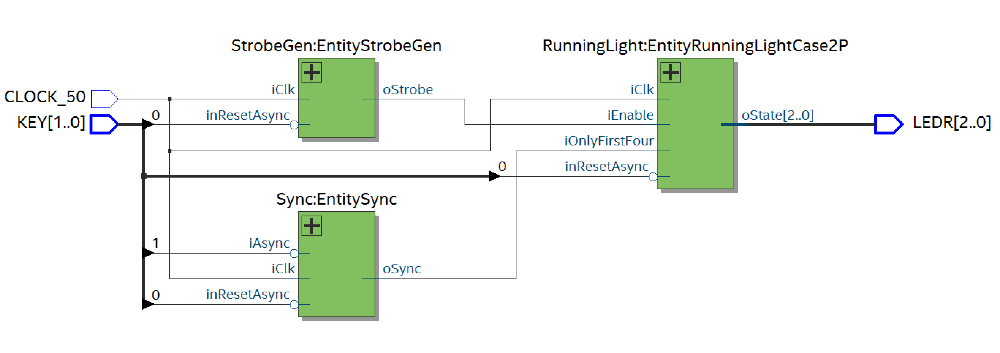

