# Übung 10 Simon Offenberger S2410306027  
## Aufgabe 1 Generierte Taktsignale

### Die Flanken des generierten Taktes werden stets zeitlich hinter den Flanken des ursprünglichen Taktes liegen. Warum?
Um diese Frage zu beantworten muss zurest verstanden werden wie ein abgeleiteter Takt erzeugt wird.
Hier gibt es die Möglichkeit zur Taktteilung mittels eines Counter.


Hier könnte zum Beispiel ein Bit es Counter Outputs als Taktquelle verwendet werden.
Der Ausgang des Counters ändert sich stets auf die Reaktion einer steigenden Flanke am Clock Eingang des Counter Register.
Der neue Zählwert ist nach T_Clock_to_Q am Ausgang sichtbar.

Dadurch sind die Taktflanken vom generierten Takt stets zeitlich hinter den Taktflanken des Ursprungstakts. 

Auch durch jede andere Art der Takterzeugung ist dies der Fall. Da die Abwandlung des Taktsignals Logik benötigt und diese Verzögerungen aufweist.

#### Hier ist die Antwort aus der Aufgabenstellung
(Wurde erst nachher gelesen).
Die Zeitbeziehung zwischen Ursprungstakt und generiertem Takt wird bereits durch die
Verzögerungszeiten bei der Taktgenerierung ungenau. Hinzu kommt, dass man nun einen
zweiten Clock Tree für den (bzw. jeden) neuen Takt benötigt, was bei wenigen Takten noch
möglich sein mag, jedoch nicht mehr bei wirklich vielen Takten. Die unterschiedlichen
Clock Trees werden untereinander selbstverständlich wiederum Zeitverschiebungen auf-
weisen.

### Timing Diagramm Aufgabe 1.2

>Besonders problematisch ist jedoch der Umstand zu sehen, dass die Taktflanken des sen-
>denden Systems nun knapp vor denen des empfangenden Systems liegen. Wie kann es
>hierdurch zu Problemen kommen? Verwenden Sie ein Timing-Diagramm zur Verdeutli-
>chung!


Aus dem Timing Diagramm wird klar, dass durch die verzögerten Taktflanken des Empfängers eine Setup bzw. Holdzeit Verletzung durch die Daten des Senders entsteht, je nachdem wie stark die Taktflanken verzögert zueinander sind und wie groß die T_Clock_to_Q ist.


## Aufgabe 2 Reaktionszeit-Spiel für zwei Personen

Zuerst wurde aus der Beschreibung ein Bubble Diagramm der FSM erstellt. Hier wurde die FSM als Moore FSM identifiziert. 

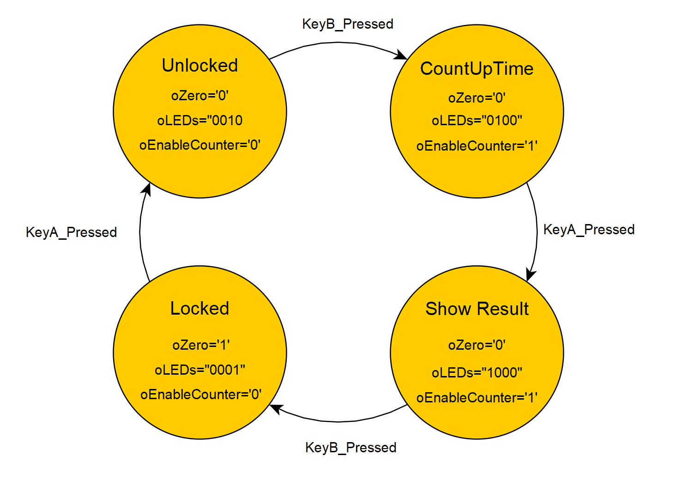

Aus der Beschreibung lässt sich ableiten, dass es sich hier um eine Moor FSM handelt. 
Da die Ausgänge in Abhängigkeit von den Zuständen beschalten werden, somit gilt y = f(State). 

#### Entity ReactionGameFSM

>```vhdl
>library ieee;
>use ieee.std_logic_1164.all;
>use work.Global.all;
>
>entity ReactionGameFSM is
> port (
>  iClk           : in std_ulogic;
>  inResetAsync   : in std_ulogic;
>  iEnable        : in std_ulogic;
>  iA_Sync        : in std_ulogic;
>  iB_Sync        : in std_ulogic;
>  oLEDs          : out std_ulogic_vector(3 downto 0);
>  oZero          : out std_ulogic;
>  oEnableCounter : out std_ulogic);
> end ReactionGameFSM;

#### Architektur ReactionGameFSM

>```vhdl
>architecture RTL of ReactionGameFSM is
>  signal NextState      : T_REACTION_TIME_GAME_STATE;  -- init state
>  signal State          : T_REACTION_TIME_GAME_STATE;  -- current state
>  constant cStateAllOff : T_REACTION_TIME_GAME_STATE := Locked; -- all leds off
>
>  constant cLEDOFF               : std_ulogic_vector>(oLEDs'range) := (others => '0');
>  constant cLED_LOCKED_INDEX     : integer := 0;
>  constant cLED_UNLOCKED_INDEX   : integer := 1;
>  constant cLED_COUNTUP_INDEX    : integer := 2;
>  constant cLED_SHOWRESULT_INDEX : integer := 3;
>begin
>
>  -- State Register
>  process (iClk, inResetAsync) is
>  begin
>    if (inResetAsync = not('1')) then
>      State <= Locked;
>    elsif (rising_edge(iClk)) then
>      if(iEnable = '0') then
>        State <= State; -- hold state when not enabled
>      else
>        State <= NextState;
>      end if;
>    end if;
>  end process;
>
>  -- State Transition Process
>  NextStateLogic : process (State,iEnable,iA_Sync,iB_Sync) >is
>  begin
>
>    NextState <= State;    -- default hold state
>    oLeds <= cLEDOFF;      -- default all leds off
>    oZero <= '0';          -- default zero off
>    oEnableCounter <= '0'; -- default counter disabled
>
>    case State is
>      when Locked => 
>        if(iA_Sync = '1') then
>          NextState <= Unlocked;
>        end if;
>        oZero <= '1';                    -- reset counters
>        oLeds(cLED_LOCKED_INDEX) <= '1'; -- indicate locked state
>        
>      when Unlocked =>
>        if(iB_Sync = '1') then
>          NextState <= CountUpTime;
>        end if;
>        oLeds(cLED_UNLOCKED_INDEX) <= '1'; -- indicate locked state
>        
>      when CountUpTime =>
>        oEnableCounter <= '1'; -- enable counter
>        if(iA_Sync = '1') then
>          NextState <= ShowResult;
>        end if;
>        oLeds(cLED_COUNTUP_INDEX) <= '1'; -- indicate locked state
>        
>      when ShowResult =>
>        if(iB_Sync = '1') then
>          NextState <= Locked;
>        end if;
>        oLeds(cLED_SHOWRESULT_INDEX) <= '1'; -- indicate locked state
>        
>      when others =>
>        NextState <= cStateAllOff;
>    end case;
>
>  end process;
>
>end architecture RTL;

Hier wurde die FSM mittels 2 Processes realisiert, somit entsteht eine klare Trennung zwischen StateRegister und NextState und Output Logik.
Für die Abbildung des States wurde ein Enum verwendet.

Auch in der Implementierung handelt es sich um eine Moor FSM.
(Output = f(State))

#### Simulation

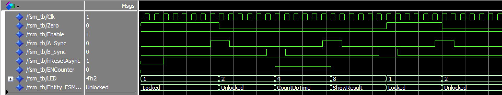

Die Funktion der FSM wurde mittels Simulation und Auswertung der Waveform kontrolliert.

#### RTL Viewer

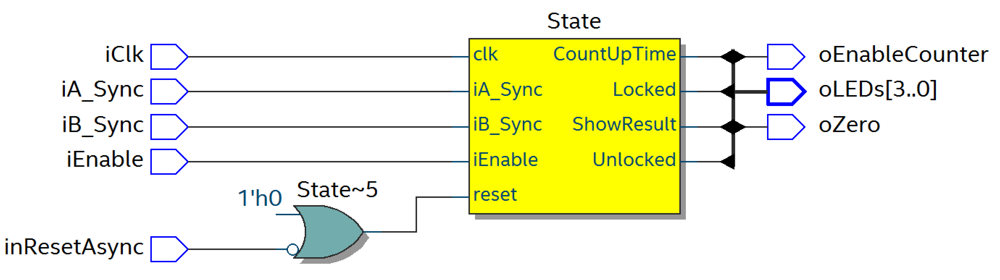

#### Ressource Summery

Die FSM benötigt folgende Ressourcen:

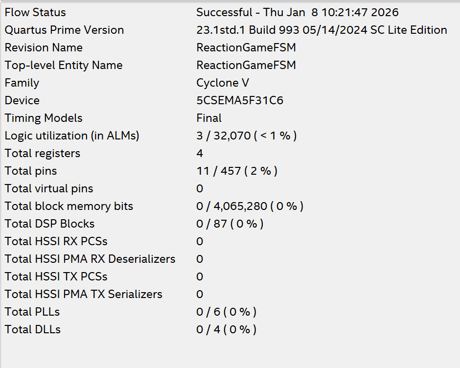

Für den State der FSM werden hier 4 Register verwendet.
Aus dieser Beobachtung lässt sich schließen, dass hier eine One Hot oder One Cold Codierung für den State verwendet wird.

#### FMAX FSM

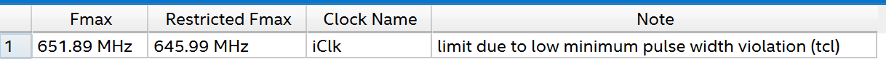

### Counter und Hex Decoder

#### Counter

#### Entity

>```vhdl
>library ieee;
>use ieee.std_logic_1164.all;
>use ieee.numeric_std.all;
>use work.Global.all;
>
>entity Counter is
>  generic(
>    gCounterOverflowVal : natural := 10
>  );
>  port (
>  iClk         : in  std_ulogic;
>  iEnable      : in  std_ulogic;
>  inResetAsync : in  std_ulogic;
>  iZero        : in  std_ulogic;
>  oOverflow    : out std_ulogic;
>  oCount       : out unsigned(LogDualis(gCounterOverflowVal) downto 1));
>end Counter;

#### Architektur

>```vhdl
>architecture RTL of Counter is
>begin
>
>  -- combinational logic for overflow output
>  oOverflow <= '1' when (iEnable = '1' and iZero = '0' and oCount = gCounterOverflowVal - 1) else '0';
>
>  process(iClk, inResetAsync) is
>  begin
>    -- asynchronous reset
>    if inResetAsync = not('1') then
>      oCount    <= (others => '0');
>
>    elsif rising_edge(iClk) then
>
>      if iZero = '1' then
>        oCount <= (others => '0');
>
>      elsif iEnable = '1' then
>        if oCount = gCounterOverflowVal - 1 then
>          oCount    <= (others => '0');
>        else
>          oCount <= oCount + 1;
>        end if;
>      end if;
>      
>    end if;
>  end process;
>end architecture RTL;

Der Counter wurde zusätzlich noch mit einem kombinatorischen Ausgangssignal ausgestattet welcher den Überlauf der Counters signalisiert. Dieser Ausgang wird für die Kaskadierung der Counter verwendet.
Weiters verfügt er noch über einen synchronen Zero Eingang, welcher den Counter auf den Wert 0 zurücksetzt. 

#### Hex Decoder

Die Entity und Architektur wurde von der 1. Übung HelloDE1SOC übernommen.

### Entity

>```vhdl
>library ieee;
>use ieee.std_logic_1164.all;
>
>entity Hex2SevenSegment is
>  port (
>    iHexValue : in  std_ulogic_vector(3 downto 0);
>    o7SegCode : out std_ulogic_vector(6 downto 0));
>end Hex2SevenSegment;

#### Architektur

>```vhdl
>architecture Rtl of Hex2SevenSegment is
>
>-- ---------------------------------------------------------------------------
>-- Conversion HEX-Value to low active 7-segment value
>-- ---------------------------------------------------------------------------
>
>  function ToSevSeg(cValue : std_ulogic_vector(3 downto 0))
>    return std_ulogic_vector is
>  begin
>
>    case cValue(3 downto 0) is
>      when "0000" => return "0111111";
>      when "0001" => return "0000110";
>      when "0010" => return "1011011";
>      when "0011" => return "1001111";
>      when "0100" => return "1100110";
>      when "0101" => return "1101101";
>      when "0110" => return "1111101";
>      when "0111" => return "0000111";
>      when "1000" => return "1111111";
>      when "1001" => return "1101111";
>      when "1010" => return "1110111";
>      when "1011" => return "1111100";
>      when "1100" => return "0111001";
>      when "1101" => return "1011110";
>      when "1110" => return "1111001";
>      when "1111" => return "1110001";
>      when others => return "XXXXXXX";
>    end case;
>  end ToSevSeg;
>
>begin
>
>-- ---------------------------------------------------------------------------
>-- Decode input value to 7-Segment code
>-- ---------------------------------------------------------------------------
>  o7SegCode <= ToSevSeg(iHexValue);
>
>end Rtl;

#### Simulation

Hier ist in der Waveform das Verhalten des Counter mit angeschlossener Anzeige zu sehen.

Auffällig ist hier das Verhalten des Overflow Signals.
Hier wird für 2 Deltacycles ein Impuls auf dieser Leitung generiert. 

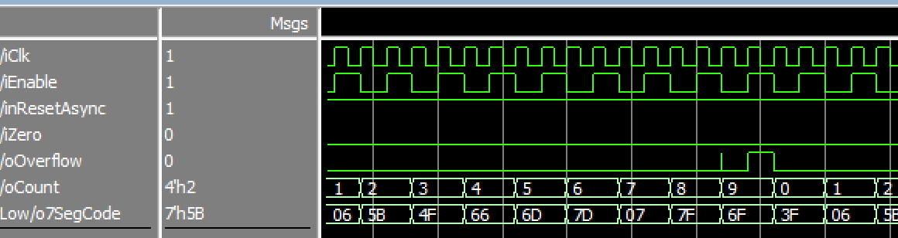

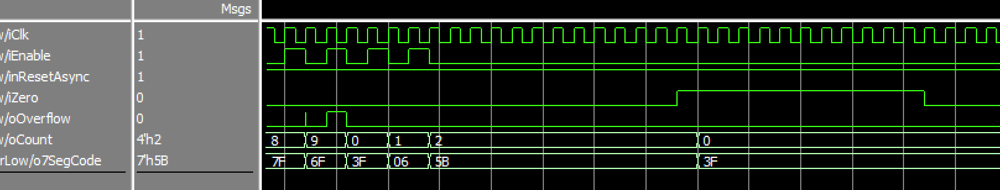

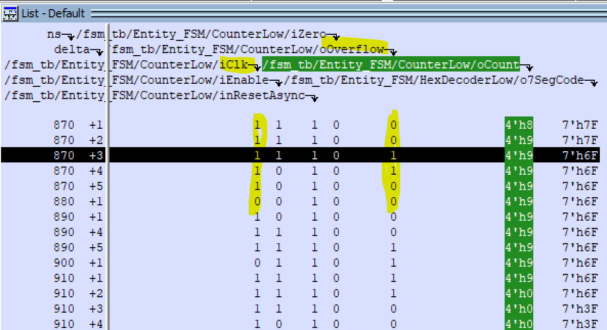

Durch Betrachtung der List View wird ersichtlich, dass der kurze Impuls auf der Overflow Leitung für 2 Deltacycles aktiv ist. Der Impuls tritt nicht bei der steigenden Flanke des Clocks auf und hat somit keine Auswirkung auf das Verhalten. 

#### Ressourcen Verbrauch Counter

#### RTL Viewer


#### Ressource Summery

Hier werden 4 Register benötigt, für die 4 Bits zur Abbildung des maximalen Zählerwerts 9. 

.png)

#### FMAX FSM


#### Ressourcen Verbrauch Hex Decoder

#### RTL Viewer


#### Ressource Summery


### Edge Detection

Diese Entity wird benötigt um eine Flankenerkennung der Tasten zu ermöglichen.

#### Entity

>```vhdl
>library ieee;
>use ieee.std_logic_1164.all;
>
>entity EdgeDetection is
>  port (
>    iClk : in std_ulogic;
>    inResetAsync : in std_ulogic;
>    iEnable : in std_ulogic;
>    iSync : in std_ulogic;
>    oEdge : out std_ulogic);
>end EdgeDetection;

#### Architektur

>```vhdl
>architecture RTL of EdgeDetection is
>  signal SyncPrev : std_ulogic;
>begin
>
>process (iClk, inResetAsync) is
>  begin
>    -- asynchronous reset
>    if (inResetAsync = not('1')) then
>      SyncPrev <= '0';
>
>    elsif (rising_edge(iClk)) then
>      if(iEnable = '1') then
>        SyncPrev <= iSync;
>      else
>        SyncPrev <= SyncPrev;
>      end if;
>    end if;
>end process;
>
>-- combinational logic for edge detection
>oEdge <= '1' when (iSync = '1' and SyncPrev = '0') else '0';
>
>end architecture RTL;

#### RTL Viewer

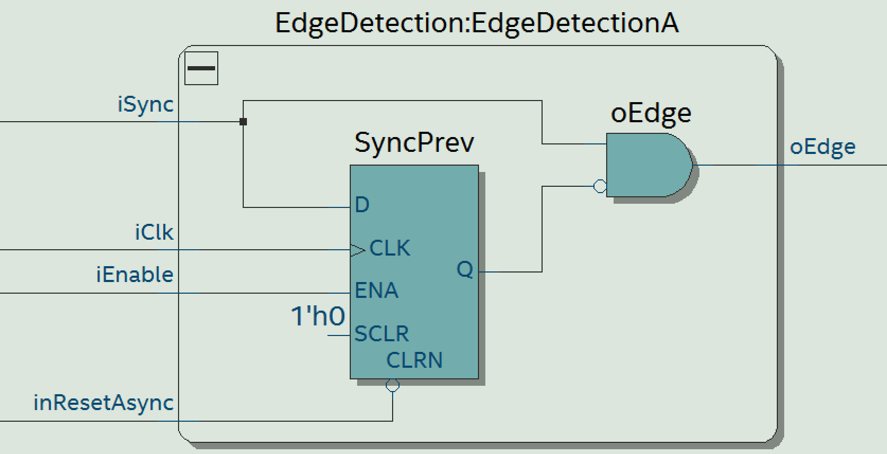

### Reaction Game Struct

Nun wurden alle Komponenten des Reaktionszeitspiels in eine Struktur zusammengefasst und untereinander verschalten.

#### Entity

>```vhdl
>library ieee;
>use ieee.std_logic_1164.all;
>use ieee.numeric_std.all;
>use work.Global.all;
>
>entity ReactionGameStruct is
>  generic (
>    gClockFrequency    : natural := 50E6);
> port (
>  iClk         : in std_ulogic;
>  inResetAsync : in std_ulogic;
>  iA_Sync      : in std_ulogic;
>  iB_Sync      : in std_ulogic;
>  oLEDs        : out std_ulogic_vector(3 downto 0);
>  oHEX1        : out std_ulogic_vector(6 downto 0);
>  oHEX2        : out std_ulogic_vector(6 downto 0);
>  oHEX3        : out std_ulogic_vector(6 downto 0)
>  );
> end ReactionGameStruct;

#### Architektur

>```vhdl
>architecture struct of ReactionGameStruct is
>
> constant cCounterFrequency : natural := 1E3; -- 1 kHz Counter Frequency
> 
>  -- Edge Detection for the A and B Key
>  signal AEdge          : std_ulogic;
>  signal BEdge          : std_ulogic;
>
>  signal nResetAsync    : std_logic;
>  signal Clk            : std_logic;
>  signal Enable         : std_logic;
>  signal StrobeEnable   : std_logic;
>  
>  signal Zero           : std_logic;
>  signal EnableCounter  : std_logic;
>
>  signal CounterOutputLow  : unsigned(3 downto 0);
>  signal CounterOutputMid  : unsigned(3 downto 0);
>  signal CounterOutputHigh : unsigned(3 downto 0);
>
>  -- Overflow Signals for cascaded counters
>  signal CounterLowOverflow  : std_ulogic;
>  signal CounterMidOverflow  : std_ulogic;
>  signal CounterHighOverflow : std_ulogic;
>
>begin
>
>nResetAsync <= inResetAsync;
>Clk         <= iClk;
>Enable      <= StrobeEnable;
>
>EdgeDetectionA : entity work.EdgeDetection(RTL)
>  port map (
>    iClk => Clk,
>    inResetAsync => nResetAsync,
>    iEnable => StrobeEnable,
>    iSync => iA_Sync,
>    oEdge => AEdge
>);
>
>EdgeDetectionB : entity work.EdgeDetection(RTL)
>  port map (
>    iClk => Clk,
>    inResetAsync => nResetAsync,
>    iEnable => StrobeEnable,
>    iSync => iB_Sync,
>    oEdge => BEdge
>  );
>
>StrobeGen : entity work.StrobeGen(RTL)
>  generic map(
>    gClkFrequency    => gClockFrequency,
>    gStrobeFrequency => cCounterFrequency
>  )
>  port map (
>    iClk         => Clk,
>    inResetAsync => nResetAsync, 
>    oStrobe      => StrobeEnable
>);
>
>-- Instantiate Entity
>EntityReactionFSM : entity work.ReactionGameFSM(RTL)
>port map (
>    iClk           => Clk,         
>    inResetAsync   => nResetAsync,    
>    iA_Sync        => AEdge,        
>    iB_Sync        => BEdge,        
>    iEnable        => Enable,
>    oLEDs          => oLEDs,
>    oEnableCounter => EnableCounter,
>    oZero          => Zero
>);
>
>CounterLow: entity work.Counter(RTL)
>  port map (
>    iClk         => Clk,
>    iEnable      => EnableCounter and Enable,
>    inResetAsync => nResetAsync,
>    iZero        => Zero,
>    oCount       => CounterOutputLow,
>    oOverflow    => CounterLowOverflow
>);
>  
>CounterMid: entity work.Counter(RTL)
>  port map (
>    iClk         => Clk,
>    iEnable      => CounterLowOverflow  and EnableCounter,
>    inResetAsync => nResetAsync,
>    iZero        => Zero,
>    oCount       => CounterOutputMid,
>    oOverflow    => CounterMidOverflow
>);
>
>CounterHigh: entity work.Counter(RTL)
>  port map (
>    iClk         => Clk,
>    iEnable      => CounterMidOverflow  and EnableCounter,
>    inResetAsync => nResetAsync,
>    iZero        => Zero,
>    oCount       => CounterOutputHigh,
>    oOverflow    => CounterHighOverflow
>);
>
>HexDecoderLow: entity work.Hex2SevenSegment(Rtl)
>  port map(
>    iHexValue     => std_ulogic_vector(CounterOutputLow),
>    o7SegCode     => oHEX1
>);
>
>HexDecoderMid: entity work.Hex2SevenSegment(Rtl)
>  port map(
>    iHexValue     => std_ulogic_vector(CounterOutputMid),
>    o7SegCode     => oHEX2
>);
>
>HexDecoderHigh: entity work.Hex2SevenSegment(Rtl)
>  port map(
>    iHexValue     => std_ulogic_vector(CounterOutputHigh),
>    o7SegCode     => oHEX3
>);
>
>end architecture struct;


#### Simulation

.png)
.png)

Mittels Analyse der Waveform wurde die Funktion des Spiels nachgewiesen.

#### Synthese Game Struct

#### RTL Viewer

.png)

.png)

#### Ressource Summery

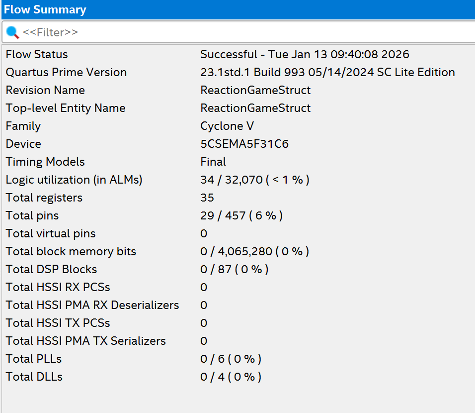

#### FMAX FSM

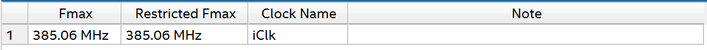


### Board Adapter

#### Entity

>```vhdl
>library ieee;
>use ieee.std_logic_1164.all;
>use ieee.numeric_std.all;
>use work.Global.all;
>
>entity ReactionGameOnDE1SOC is
>  generic (
>    gClockFrequency    : natural := 50E6);
> port (
>  CLOCK_50    : in std_ulogic;
>  SW          : in std_ulogic_vector(0 downto 0);
>  KEY         : in std_ulogic_vector(1 downto 0);
>  LEDR        : out std_ulogic_vector(3 downto 0);
>  HEX0        : out std_ulogic_vector(6 downto 0);
>  HEX1        : out std_ulogic_vector(6 downto 0);
>  HEX2        : out std_ulogic_vector(6 downto 0)
>  );
> end ReactionGameOnDE1SOC;

#### Architektur

>```vhdl
>architecture struct of ReactionGameOnDE1SOC is
>
>signal KeyPosLogic : std_ulogic_vector(KEY'range);    -- Signal for Positive Logic Keys
>signal HEX0_PosLogic : std_ulogic_vector(HEX0'range); -- Signal for Positive Logic HEX0
>signal HEX1_PosLogic : std_ulogic_vector(HEX1'range); -- Signal for Positive Logic HEX1
>signal HEX2_PosLogic : std_ulogic_vector(HEX2'range); -- Signal for Positive Logic HEX2
>signal StrobeSignal : std_ulogic;
>
>signal A_KeySync : std_ulogic;    -- Synchronized A Key Signal
>signal B_KeySync : std_ulogic;    -- Synchronized B Key Signal
>
>begin
>
>-- Instantiate Entity for the FSM of the Reaction Game
>EntityReactionGame : entity work.ReactionGameStruct(struct)
>  generic map (
>    gClockFrequency    => gClockFrequency
>    )
> port map (
>  iClk         => CLOCK_50,
>  inResetAsync => SW(0),
>  iA_Sync      => A_KeySync,
>  iB_Sync      => B_KeySync,
>  oLEDs        => LEDR,
>  oHEX1        => HEX0_PosLogic,
>  oHEX2        => HEX1_PosLogic,
>  oHEX3        => HEX2_PosLogic
>  );
>
>-- Instantiate Entity for Key Synchronization A
>EntitySyncA : entity work.Sync(RTL)
>port map (
>    iClk          => CLOCK_50,         
>    inResetAsync  => SW(0),    
>    iAsync        => KeyPosLogic(0),        
>    oSync        => A_KeySync
>);
>
>-- Instantiate Entity for Key Synchronization B
>EntitySyncB : entity work.Sync(RTL)
>port map (
>    iClk          => CLOCK_50,         
>    inResetAsync  => SW(0),    
>    iAsync        => KeyPosLogic(1),        
>    oSync         => B_KeySync
>);
>
>-- Convert Positive Logic to Negative Logic for the board
>HEX0 <= not HEX0_PosLogic;
>HEX1 <= not HEX1_PosLogic;
>HEX2 <= not HEX2_PosLogic;
>
>-- Convert Negative Logic from the board to pos logic
>KeyPosLogic <= not KEY;
>
>end architecture struct;

#### Synthese Game Struct

#### RTL Viewer
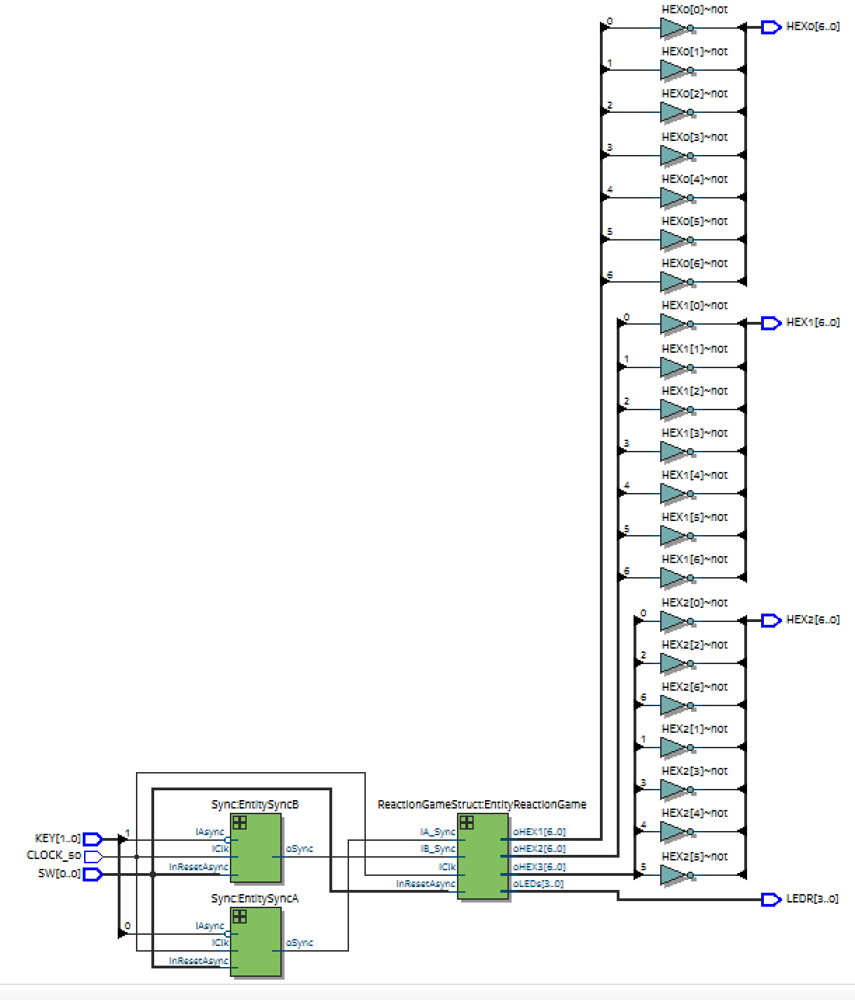

#### Ressource Summery


#### FMAX FSM

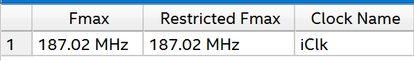