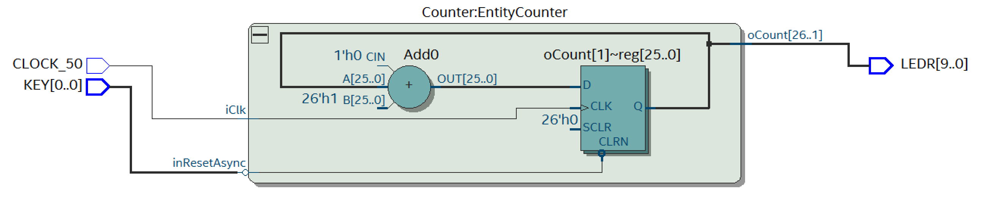
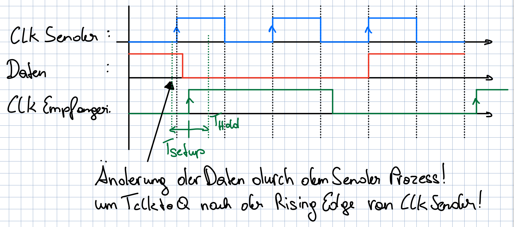

# Übung 10 Simon Offenberger S2410306027  
## Aufgabe 1 Generierte Taktsignale

### Die Flanken des generierten Taktes werden stets zeitlich hinter den Flanken des ursprünglichen Taktes liegen. Warum?
Um diese Frage zu beantworten muss zurest verstanden werden wie ein abgeleiteter Takt erzeugt wird.
Hier gibt es die Möglichkeit zur Taktteilung mittels eines Counter.

Hier könnte zum Beispiel ein Bit es Counter Outputs als Taktquelle verwendet werden.
Der Ausgang des Counters ändert sich stets auf die Reaktion einer steigenden Flanke am Clock Eingang des Counter Register.
Der neue Zählwert ist nach T_Clock_to_Q am Ausgang sichtbar.

Dadurch sind die Taktflanken vom generierten Takt stets zeitlich hinter den Taktflanken des Ursprungstakts. 

Auch durch jede andere art der Takterzeugung ist dies der Fall. Da die Abwandlung des Taktsignals Logik benötigt und dies Verzögerungen aufweist.

#### Hier ist die Antwort aus der Aufgabenstellung
(Wurde erst nachher gelesen, leider).
Die Zeitbeziehung zwischen Ursprungstakt und generiertem Takt wird bereits durch die
Verzögerungszeiten bei der Taktgenerierung ungenau. Hinzu kommt, dass man nun einen
zweiten Clock Tree für den (bzw. jeden) neuen Takt benötigt, was bei wenigen Takten noch
möglich sein mag, jedoch nicht mehr bei wirklich vielen Takten. Die unterschiedlichen
Clock Trees werden untereinander selbstverständlich wiederum Zeitverschiebungen auf-
weisen.

### Timing Diagramm Aufgabe 1.2

>Besonders problematisch ist jedoch der Umstand zu sehen, dass die Taktflanken des sen-
>denden Systems nun knapp vor denen des empfangenden Systems liegen. Wie kann es
>hierdurch zu Problemen kommen? Verwenden Sie ein Timing-Diagramm zur Verdeutli-
>chung!

Hier ist das Timing Diagramm zum in der Aufgabenstellung beschriebenen Fall aufgezeichnet.

Aus dem Timing Diagramm wird klar, dass durch die verzögerten Taktflanken des Empfängers eine Setup bzw. Holdzeit Verletzung durch die Daten des Senders entsteht. Je nachdem wie stark die Taktflanken verzögert zueinander sind und wie groß die T_Clock_to_Q ist.

## Aufgabe 2 Reaktionszeit-Spiel für zwei Personen

